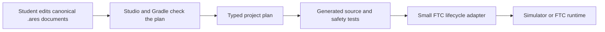

# Start a clean FTC project

## Purpose and prerequisites

ARES Robotics Studio can create a clean FTC project without copying another robot's mechanisms,
field setup, calibration, or tuning. In this lesson, you will set the robot's identity and learn
which files are plans, generated results, or runtime connectors. Complete [The ARES Software
Workspace](/academy/ares-workspace-map?path=robotics-foundations) first.

The starter is simulation-first. Its sample size and tuning let the software run in simulation.
They are not measurements from your physical robot. Its provenance blocks physical deployment.
A deployable team project also needs real hardware records and commissioning evidence.

## Vocabulary

- **Project identity:** the team, season, robot ID, display name, and league for one robot project.
- **Canonical:** the agreed source that students and Studio edit.
- **Descriptor:** a structured `.ares` document that describes part of the robot.
- **Generated output:** code or tests made from the canonical project documents.
- **Authoring model:** the rule for whether Studio, Kotlin, or both own robot behavior.
- **Provenance:** a record of the exact starter archive used to create the project.
- **Staging folder:** a temporary folder used while Studio checks a new workspace.

## Three file jobs

| Job | Example path | What you should do |
| --- | --- | --- |
| Team plan | `.ares/project.json` or `.ares/drivetrains/*.aresdrivetrain` | Review and edit through Studio or the documented file format. |
| Generated result | `TeamCode/build/generated/ares` | Inspect it when debugging, but do not edit it. A later build may replace it. |
| Runtime connector | `TeamCode/src/main` | Read how the generated project joins the FTC OpMode lifecycle. Follow the selected authoring model before changing it. |

In a GUI-owned starter, the canonical `.ares` documents own the robot plan. Gradle turns that plan
into typed source and safety tests. The small lifecycle adapter connects that generated project to
the FTC SDK.

## Worked example

Mina creates a project for team 12345 and names the robot “Practice Bot.” Studio writes the new
identity to `.ares/project.json`. It also updates the project, drivebase, tuning profile, action
catalog, and autonomous catalog IDs so they belong to the new robot. It does not rewrite Kotlin
source while it personalizes the starter.

Mina finds a generated motor constant under `TeamCode/build/generated/ares`. She does not edit it.
She returns to the canonical drivebase document, reviews the motor name, and runs **Verify & build**.
The build then makes matching source and safety tests from the saved plan.

## Visual model

## Hands-on activity

1. Open workspace setup and choose **Create a new robot**.
2. Choose FTC. Read the exact starter name and ARES version shown by Studio.
3. Select an existing parent folder, then enter a new folder name.
4. Enter the team number, season, stable robot ID, and display name.
5. Review the choices, then create the workspace.
6. Open **Project Identity** and find the current authoring model.
7. Open **Drivebase Builder** and locate `fl`, `fr`, `rl`, `rr`, and `imu`.
8. Find `.ares/project.json` and one drivebase descriptor. Do not edit build output.
9. Run **Verify & build** and read the result.

Use the diagnostic below to sort example settings by the document that should own them. This is a
conceptual model. It does not inspect your project, discover devices, or prove that wiring is safe.

<hardwaretopologydiagnostic />

Make an **Edit / Generated / Runtime connector** table. Add two real paths from your project to each
column. For each path, explain why it belongs there.

## Checkpoints

Confirm the final folder did not exist before creation. Studio creates a private staging folder,
checks the project there, and moves the completed folder into place. It never merges the starter
into an old folder. If creation fails, the requested final folder should remain absent.

Confirm `.ares/project.json` is the single project-identity source. The current FTC starter uses
schema 4 and the `GUI_OWNED` authoring model. Unsupported or damaged project documents should stop
with an error instead of being guessed or silently changed.

Confirm the starter is still generic. It begins with a mecanum drivebase and four motor names:
`fl`, `fr`, `rl`, and `rr`. It also has one Control Hub IMU named `imu`, one drive-recovery action,
and empty mechanism and routine catalogs. Empty catalogs are useful here. They do not pretend that
another season's mechanisms belong to your robot.

Confirm that student verification and website publication are separate. Students may inspect the
source, run the build and simulator, and carry out the team's safe physical verification process.
Only a website post enters Lead Coach review before publication. The reference starter's deployment
block still stays in place. A deployable team project also needs real hardware records and
commissioning evidence.

## Troubleshooting

If project creation fails, read the exact download, hash, extraction, or validation error. The
requested final folder should not contain a half-created project.

If **Verify & build** replaces a file you changed, check whether you edited generated output. Move
the change to a canonical `.ares` document or a documented code extension point.

If the simulator drives in the wrong direction, do not copy another team's constants. Check the
canonical motor names and directions, then collect simulation evidence. Measure and test the real
robot separately before physical use.

If hardware addresses conflict, use Hardware Setup to compare the canonical documents. The screen
can find descriptor conflicts, but it cannot prove that wiring, calibration, or robot behavior is
correct.

## Evidence artifact

Submit a project identity card with the team, season, robot ID, display name, league, and authoring
model. Do not include secrets or private student information.

Add your six-path table. For each path, explain who owns it and whether a later generation step may
replace it. Finish with one sentence that separates a simulation default from a measured robot fact.

## Short assessment

1. Which file owns project identity?
2. Why does Studio use a staging folder?
3. What may happen if you edit generated source?
4. What does a clean FTC starter leave empty on purpose?
5. Why are starter geometry and tuning not facts about your robot?
6. What work may students verify, and which work enters Lead Coach review?

## Extension challenge

Compare GUI-owned, code-first, and hybrid authoring. Choose one small mechanism and describe which
files would own it under each model. Explain how you would stop two tools from writing the same
output.

Inspect `.ares/template-provenance.json`. Record the starter ID, revision, archive SHA-256, ARES
version, and deployment policy. Explain how that record helps your team reproduce or investigate a
project later.

## Related and next

Continue with [Run Your First FTC
Simulation](/academy/run-first-ftc-simulation?path=ftc-robot-with-ares). Then use [Map FTC Controls
Through Redux](/academy/ftc-starter-controller-bindings?path=ftc-robot-with-ares) to connect a
driver request to generated behavior.
