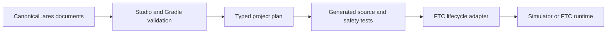

# Start an FTC project without old robot assumptions

## Purpose and prerequisites

ARES Robotics Studio can create a clean FTC project without copying another robot's mechanisms,
field files, calibration, or tuning. This lesson teaches you to set project identity and tell saved
robot plans from generated results. Complete [The ARES Software
Workspace](/academy/ares-workspace-map?path=robotics-foundations) first.

The starter is simulation-first. Its sample size and tuning help software run in simulation, but
they are not measurements from your physical robot.

## Vocabulary

- **Project identity:** the team, season, robot ID, friendly name, league, and authoring model.
- **Canonical:** the agreed source that people and tools edit.
- **Descriptor:** a structured `.ares` document that describes part of the robot.
- **Generated output:** code or tests created from canonical project documents.
- **Authoring model:** the rule for whether Studio, Kotlin, or both own robot behavior.
- **Provenance:** a record of which reviewed starter version and archive created the project.
- **Staging folder:** a private temporary folder used before a new workspace is published.

## Worked example

Mina creates a project for team 12345 and names the robot “Practice Bot.” Studio writes that identity
to `.ares/project.json`. It also rebinds stable project and drivebase identifiers to the new team,
league, season, and robot. It does not rewrite Kotlin source during personalization.

Mina finds a generated motor constant under `TeamCode/build/generated/ares`. She does not edit it.
Instead, she returns to the canonical drivebase document, changes the reviewed motor name, and runs
**Verify & build**. Generation now produces matching source and safety tests from one saved plan.

## Visual model

The adapter is small on purpose. In the clean starter, the generated controller binding document
owns normal periodic driver behavior.

## Hands-on activity

1. Open workspace setup and choose **Create a new robot**.
2. Choose FTC and read the exact starter name and ARES version shown by Studio.
3. Select an existing parent folder and enter a new folder name.
4. Enter the team number, season, stable robot ID, and friendly name.
5. Review the choices, then create the workspace.
6. Open **Project Identity** and identify the current authoring model.
7. Open **Drivebase Builder** and locate `fl`, `fr`, `rl`, `rr`, and the `imu` entry.
8. Find `.ares/project.json` and one drivebase descriptor. Do not edit generated build output.
9. Run **Verify & build** and read the result.

Use the diagnostic below to sort example settings by the document that should own them. It is a
conceptual model. It does not inspect your project, discover devices, or validate physical wiring.

<hardwaretopologydiagnostic />

Make an **Edit / Generated / Runtime** table. Add two real paths from your project to each column.

## Checkpoints

Confirm the destination did not already exist. Studio creates in a private staging folder and moves
the complete project into place only after validation. It does not merge into an old folder.

Confirm `.ares/project.json` is the single identity source. Drivebase and tuning documents refer to
the same identity graph. Unsupported schemas should fail closed instead of becoming guessed legacy
data.

Confirm the starter remains generic. It begins with a mecanum declaration, four motors, one Control
Hub IMU, a drive-recovery action, and empty mechanism and routine catalogs. Empty is truthful; do
not fill those catalogs with copied season logic.

## Troubleshooting

If project creation fails, read the exact verification or extraction error. The requested final
folder should remain absent after a failed staged creation.

If **Verify & build** changes a file you edited, check whether you edited generated output. Move the
change into a canonical `.ares` document or an approved code extension point.

If the simulator drives in the wrong direction, do not copy another team's constants. Check the
canonical motor names and direction choices, then collect simulation evidence. Physical direction
still requires testing on your own robot.

If hardware addresses conflict, use Hardware Setup to compare the canonical documents. The screen
can find descriptor conflicts, but it cannot prove that wiring or calibration is correct.

## Evidence artifact

Submit a project identity card with the team, season, robot ID, friendly name, league, and authoring
model. Do not include secrets or private student information.

Add your six-path table. For each path, explain who owns it and whether a later generation step may
replace it. Finish with one sentence that separates a simulation default from a measured robot fact.

## Short assessment

1. Which file owns project identity?
2. Why does Studio use a staging folder?
3. What can happen if you edit generated source?
4. What does a clean FTC starter intentionally leave empty?
5. Why are starter geometry and tuning not facts about your robot?

## Extension challenge

Compare GUI-owned, code-first, and hybrid authoring. Choose one small mechanism and describe which
files would own it under each model. Explain how you would avoid two owners writing the same output.

Inspect `.ares/template-provenance.json`. Record the starter ID, revision, archive hash, and ARES
version. Explain how that record helps your team reproduce or investigate a project later.

## Related and next

Continue with [Run Your First FTC
Simulation](/academy/run-first-ftc-simulation?path=ftc-robot-with-ares). Then use [Map FTC Controls
Through Redux](/academy/ftc-starter-controller-bindings?path=ftc-robot-with-ares) to connect a
driver request to generated behavior.
