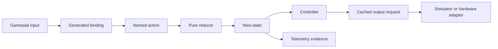

# Map FTC controls through Redux

## Purpose and prerequisites

A controller button should describe what the driver wants. It should not power a motor by itself.
This lab teaches you to trace one FTC input through a generated binding, a Redux action, robot
state, a controller, and the simulator adapter. Complete [Start an FTC Project Without Inherited
Robot Assumptions](/academy/ftc-starter-project-identity?path=ftc-robot-with-ares) and [Run Your
First FTC Simulation](/academy/run-first-ftc-simulation?path=ftc-robot-with-ares) first.

Use Local Sim. The activity can support a software-flow claim, but it cannot verify a physical
gamepad, motor, or wiring connection.

## Vocabulary

- **Binding:** a saved rule that maps an input to a named action.
- **Action:** a message describing an event or requested state change.
- **Reducer:** a pure function that returns new state from old state and an action.
- **State:** the current software facts used to make decisions.
- **Controller:** logic that reads state and requests a bounded output.
- **Adapter:** the simulator or hardware-specific code that applies an output.
- **TeleOp:** the FTC operating mode used for driver-controlled operation.

## Worked example

The team wants one button to toggle rotation lock. In **Controller Bindings**, a student maps the
button to the named Toggle action. When pressed, the binding dispatches an action. The reducer
returns state with the requested setting changed. The drive controller reads that state during the
robot loop and chooses its output. The simulator adapter applies that request to the model.

The button never writes a motor value directly. If required pose data is stale or invalid, a safety
rule may reject or disable the assist. That rejection is useful evidence about the system. Removing
the check would hide the real cause.

## Visual model

The clean starter's `ARESStarterTeleOp` is intentionally small. Its generated binding document
owns periodic driver behavior, while the lifecycle adapter connects that behavior to FTC.

## Hands-on activity

1. Open **Controller Bindings** in ARES Robotics Studio.
2. Choose one drive-assist action, such as Enable, Disable, or Toggle.
3. Select a simulated button that is not already assigned.
4. Save the binding document and inspect its change list.
5. Run **Verify & build** so generation and tests use the new canonical binding.
6. Start Local Sim, select the generated TeleOp, and send INIT and START.
7. Arm local control and record the related state or telemetry value.
8. Press the button once, release it, and record the new value.
9. Press it again if the action is a toggle. Record the result.
10. Release all controls, send STOP, and end the simulator process.

Use the tracer below to practice action and state order. It is a code-derived learning model. It
does not read your binding document, run your reducer, or command a robot.

<reduxstatetracer />

Write the real action and state names from your run beside the matching steps in the tracer.

## Checkpoints

Confirm the binding uses a named generated action. A raw motor command in the input layer skips the
shared state and safety boundaries.

Confirm one press creates the expected number of events. A toggle usually needs an edge, not a new
toggle on every fast robot-loop frame while the button remains held.

Confirm the state change before looking for motion. Some actions change a mode or assist without
moving the robot. Telemetry should show the requested and active states when those differ.

Confirm the TeleOp lifecycle. A connected simulator that has not received START will not process
normal driver control.

## Troubleshooting

If the build fails after saving, read the generated binding validation message. Look for duplicate
buttons, missing action IDs, or a binding that refers to a removed capability.

If the button produces no state change, confirm the correct controller and profile are active.
Then confirm INIT, START, and arm control occurred in that order.

If one press flips state many times, inspect whether the binding triggers on the held level instead
of the press edge. Do not add a random delay; choose the correct input event.

If state changes but output does not, check the controller's safety conditions and evidence topics.
Stale or invalid pose can make an assist fail closed. Record that reason rather than bypassing it.

## Evidence artifact

Submit a six-step trace with the real input, binding, action, reducer result, controller decision,
and simulator output or state evidence. Add the topic name and before/after values.

Mark the evidence level as **source**, **build**, **simulation**, or **physical** for each claim.
This lesson should end with source, build, and simulation evidence only. Add one sentence naming the
physical fact that still has not been tested.

## Short assessment

1. Why should a button dispatch an action instead of powering a motor?
2. What does a reducer return?
3. Which part reads state and chooses an output request?
4. Why can a safety rejection be useful evidence?
5. What lifecycle stages are needed before simulated driver input works?

## Extension challenge

Create separate Enable and Disable bindings instead of Toggle. Predict how the resulting state
trace differs. Test both in Local Sim and compare which design is easier for a driver to understand.

Then choose one analog stick input. Describe where deadband, scaling, or a response curve should be
applied. Keep the action's meaning clear and avoid mixing screen-only values with robot state.

## Related and next

Continue with [Follow a Robot Request from Input to
Output](/academy/robot-input-to-output?path=programming-with-ares) for the complete robot-loop model.
Then build a bounded routine in [Build and Verify Your First FTC Autonomous
Routine](/academy/ftc-starter-first-autonomous?path=ftc-robot-with-ares).
