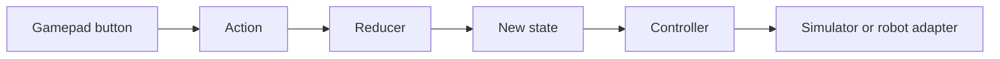

# Map FTC controls through Redux

A controller button should describe what the driver wants. It should not reach around the robot
software and power a motor by itself. ARES sends that button choice through Redux so the whole
system can see one clear state.

## What you will learn

- how a button becomes an action;
- how an action changes state; and
- how to check the result in simulation.

## Guided exercise

1. Open **Controller Bindings** in ARES Robotics Studio.
2. Choose one drive-assist action such as **Enable**, **Disable**, or **Toggle**.
3. Map the action to a simulated button that is not already in use.
4. Save the binding document and inspect its change list.
5. Regenerate the project and run **Verify & build**.
6. Start Local Simulator and choose the generated TeleOp.
7. Send **INIT**, then **START**, and arm local control.
8. Press the button once. Watch the related state or telemetry value.
9. Release all controls and stop the OpMode.

The button should dispatch an action. It should not write directly to a motor. A safety check may
reject an action when needed sensor data is old or invalid. That rejection is useful evidence. Do
not bypass it just to make a demo move.

## Draw the evidence

Copy the diagram and write the real name you observed under each box. If you cannot find a box in
the evidence, mark it with a question instead of guessing.

## Check your understanding

1. What is the difference between an action and robot state?
2. Why does the controller read state instead of the button powering a motor?
3. What should you do when a safety check rejects the action?
