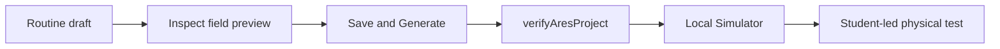

# Build and verify your first FTC autonomous routine

## Purpose and prerequisites

In this lesson, you will build one short autonomous routine in ARES Robotics Studio. You will check
the draft, generate the project, and test it in Local Simulator. The starter blocks motion until a
real routine is added. This safe default keeps an empty project from pretending it can drive.

Before starting, complete [Map FTC Controls Through Redux](/academy/ftc-starter-controller-bindings?path=ftc-robot-with-ares)
and [Use Units and Coordinate Frames](/academy/robot-coordinate-contracts?path=controls-localization-autonomous).
You need a local FTC Starter project and ARES Robotics Studio 2.0.1.

## Vocabulary

- **Routine:** an ordered or grouped set of robot steps.
- **Drive goal:** a target pose stored as a step inside a routine.
- **Starting pose:** the robot position and heading before the routine begins.
- **Waypoint:** a named point that helps describe a route.
- **Clearance:** open space between the robot and an obstacle.
- **Canonical file:** the main project file that Git tracks as the source of truth.
- **Generated code:** Kotlin created from checked ARES project files.
- **Fail closed:** stop or block when required information is missing or invalid.

## Worked example

Imagine a robot that starts at `(0.50 m, 0.50 m)`. Its first goal is `(1.25 m, 0.50 m)`.
The move is 0.75 m in a straight line. A student chooses the **Safe** motion preset and keeps the
heading fixed. The field preview shows the whole robot footprint inside the field.

That preview is useful evidence, but it has limits. It does not prove wheel grip, motor direction,
or obstacle clearance on a physical field. Those claims need later tests at the correct boundary.

## Visual model

ARES uses one routine format. A drive goal is one step inside that routine. Starting pose and match
selection belong to the routine's **Autonomous entry** settings.

## Hands-on activity

1. Open the FTC Starter repository as the project root in ARES Robotics Studio.
2. Open **Autonomous Builder** and choose **Start guided first routine**.
3. Name one intended move using plain language.
4. Enter a starting pose and one goal in meters and counter-clockwise degrees.
5. Keep the first move between 0.10 m and 2.00 m.
6. Choose the **Safe** motion preset.
7. Record whether alliance mirroring is allowed.
8. Inspect the field preview and the **Needs attention** card.
9. Apply the guide, then review the unsaved draft.
10. Enable **Autonomous entry** only if this routine should appear in the match selector.
11. Choose **Save and Generate**.
12. Review the `.aresroutine`, autonomous catalog, and generated Kotlin changes.
13. Run `verifyAresProject` and the simulator tests.
14. Start the generated autonomous OpMode in Local Simulator.
15. Compare the planned path, simulated pose, and estimated pose.

Use the concept lab below before saving. Move the goal until the line clears the circle. Then make
the robot radius larger and observe the required margin.

<autonomouspathlab />

This lab uses an invented field, one line, and one circle. It does not read your project or validate
a robot. The ARES runtime uses richer path and costmap checks. Your project preview, generated tests,
simulator evidence, and physical tests remain separate gates.

Next, compare a short and long move with bounded speed and acceleration.

<motionprofilelab />

This second model explains smooth reference motion. It does not follow your field route or model the
robot. Record what each lab can show and what it cannot show.

## Checkpoints

- Before saving: Does the preview keep the full robot footprint inside the field?
- After generation: Did the canonical files and generated Kotlin change together?
- Before simulation: Does `verifyAresProject` pass without stale-code errors?
- During simulation: Do the planned, simulated, and estimated paths agree?
- Before physical motion: Has a student checked the real field, robot, and stop controls?

## Troubleshooting

| Symptom | Check |
| --- | --- |
| No actions appear | Open the repository root and inspect `.ares/action-catalog.json`. |
| Routine will not save | Fix missing references, invalid numbers, recursion, resources, or field bounds. |
| Autonomous does not appear | Enable its autonomous entry and check the autonomous catalog. |
| Generated project is stale | Use **Save and Generate**, then review the new files. |
| Robot takes the mirrored route twice | Keep alliance mirroring at one named control boundary. |
| Simulator paths disagree | Save the time, signal names, and mismatch before changing code. |

If loading or running fails, the drivebase must stay stopped. Do not hide a mismatch by changing
only the display.

## Evidence artifact

Create a short evidence packet with:

- the routine name and intended move;
- a screenshot of the reviewed field preview;
- the changed canonical and generated file names;
- the `verifyAresProject` result;
- one simulator screenshot or log reference;
- one observation about path agreement; and
- one limit that still needs a physical test.

Students may verify robot functionality using the team's normal safety procedure. Website posts use
a separate Lead Coach editorial workflow before publication.

## Short assessment

1. Why does the empty starter block autonomous motion?
2. What is the difference between applying the guide and choosing **Save and Generate**?
3. Name two checks that happen before generated code can run.
4. What evidence may show that a coordinate frame is wrong?
5. Why can a clear path in the concept lab still fail on a real robot?

## Extension challenge

Add a second bounded drive goal or one typed mechanism action. Predict what should happen before you
run it. Save the new evidence beside your first trial. If the prediction and result differ, keep both
records and write the smallest next test.

## Related and next

Review [Plan Smooth Motion with Limits](/academy/controls-motion-profiles?path=controls-localization-autonomous)
when you need better setpoints. Continue to [Estimate Motion with Encoders and Odometry](/academy/controls-odometry?path=controls-localization-autonomous)
to compare commanded movement with measured movement. Use Local Simulator before any student-led
physical verification.
