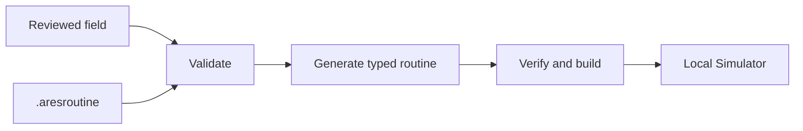

# Add and verify your first FTC autonomous routine

The new starter has no autonomous routine. If you try to start one, it blocks safely. You must add
a real `.aresroutine` before the robot has a path to follow.

## What you will learn

- how one routine moves from Studio to simulation;
- which checks happen before the routine runs; and
- how to record a mismatch instead of hiding it.

## Build a small routine

1. Import or create the reviewed field and AprilTag map for the season.
2. Create a `.aresroutine` with a still start and one short, bounded move.
3. Check that every waypoint uses real numbers and stays inside the field.
4. Check that every task and resource name has been declared.
5. Make sure the end of one path piece meets the start of the next piece.
6. Inspect the generated ownership plan.
7. Regenerate the project and run `verifyAresProject` plus the simulator tests.
8. Start the generated autonomous OpMode in Local Simulator.
9. Compare the planned path, simulated robot, and estimated pose.
10. Stop the OpMode and save your notes.

If the three paths do not agree, write down the time and type of mismatch. Do not change the display
just to make it look correct. The drivebase must stop when loading or running the routine fails.

## One mirror only

ARES may mirror a path once for the other alliance. The screen also changes field points into pixel
positions for drawing. That screen change is not a second path mirror and must not be saved as robot
coordinates.

## Check your understanding

1. Why does the empty starter block autonomous motion?
2. Name two checks that happen before code is generated.
3. What evidence would show that a coordinate frame may be wrong?
