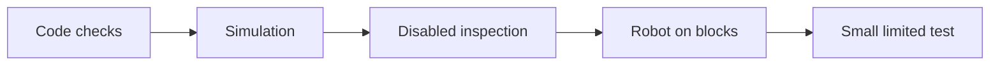

# Commission an FTC Starter robot safely

**Commissioning** means checking new robot software and hardware in small, safe steps. A simulator
can show that the software flow makes sense. It cannot prove that wires, motor directions, or limits
are correct on a real robot.

Students can run and document this activity by following the team's robot-safety procedure.

## The evidence ladder

Do not skip a step because a later step looks more exciting.

## Student commissioning checklist

1. Place the robot on stable blocks and remove game pieces.
2. Keep the Driver Station disabled. Make sure the emergency stop is easy to reach.
3. Replace sample size and tuning values with measurements from this robot.
4. Match the Robot Controller names to the canonical device names.
5. Check wiring, device addresses, limits, neutral modes, and safe outputs.
6. Use hold-to-run tests to check one motor at a time. Confirm its corner and direction.
7. Measure camera position and angle. Use the official season AprilTag map.
8. Calibrate encoder distance and controls in small steps. Record each measurement.
9. Regenerate and run verification, unit tests, and simulator tests.
10. Build the APK again before a limited floor test.

Stop if the robot moves in an unexpected way, a device gets hot, a wire pulls tight, or a safety
state is unclear. Return to the last step with good evidence.

## Make an evidence table

Use columns for **check**, **expected**, **observed**, **pass or stop**, and **next action**. Photos may
help show wiring and setup, but they do not replace measured results.

## Check your understanding

1. Why does a successful simulation not prove motor direction?
2. Why do we test one device at a time?
3. What should happen after an unexpected result?
