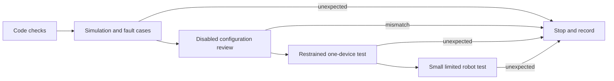

# Commission an FTC Starter robot safely

## Purpose and prerequisites

**Commissioning** means checking new robot software and hardware in small, safe steps. A simulator
can show that the software flow makes sense. It cannot prove that wires, motor directions, sensor
signs, limits, friction, or clearances are correct on a real robot.

Complete [Simulation Is Not Hardware Validation](/academy/simulation-is-not-hardware-validation?path=testing-debugging-commissioning)
and [Build and Verify Your First FTC Autonomous Routine](/academy/ftc-starter-first-autonomous?path=ftc-robot-with-ares)
first. Students can run, observe, and document this activity by following the team's robot-safety
procedure. Website posts still use the separate Lead Coach review workflow.

## Vocabulary

- **Commissioning:** a planned series of checks for a new or changed robot system.
- **Evidence level:** what a check can and cannot prove.
- **Configuration review:** a comparison of names, addresses, directions, limits, and wiring plans.
- **Physical validation:** a recorded real-robot procedure with an observed result and limits.
- **Inventory hash:** a fingerprint of the exact reviewed hardware inventory.
- **Stale evidence:** a result that no longer matches the current configuration.
- **Hold-to-run:** motion continues only while the operator holds the control.
- **Neutral output:** a command that requests no actuator motion.
- **Stop condition:** a fact that ends the test immediately.

## Worked example

A student changes the configured direction for one drive motor. The unit tests and Local Simulator
still pass. Those results support the software flow, but they do not prove the real wheel turns in
the expected direction. The direction change also means an earlier physical record may no longer
describe the current inventory.

The student starts again at the evidence boundary affected by the change. They review the exact
hardware-map name and direction while the robot is disabled. They place the robot on stable blocks,
remove game pieces, and keep the stop control ready. The first motion request is one small,
hold-to-run command for one motor. The observer records expected direction, observed direction, and
the next action. If the result is wrong, the test stops. The team fixes the cause and repeats the
bounded check instead of continuing to a floor test.

The pinned Studio guide names four separate evidence levels: simulation verified, configuration
reviewed, ready for physical validation, and physically validated. A green result at one level does
not silently grant the next level.

## Visual model

Do not skip a step because a later step looks more exciting. Configuration review and physical
validation are different records. Studio's displayed subsystem pulse is an unarmed proposal; the
review page does not move a physical mechanism.

## Hands-on activity

1. Choose one bounded robot system, such as one drive motor or one sensor.
2. Write the exact expected behavior and stop conditions before connecting to hardware.
3. Run the required build, verification, and focused tests.
4. Run the applicable deterministic simulation and fault cases.
5. Keep the Driver Station disabled. Compare names, addresses, directions, units, limits, neutral
   behavior, and required/optional policy with the current project records.
6. Compare the physical labels and wiring with the reviewed inventory. Record unknown facts.
7. Prepare a stable, restrained setup. Remove game pieces and keep the stop control easy to reach.
8. Test only one device with a small hold-to-run command through the team's approved procedure.
9. Record expected, observed, pass or stop, and next action.
10. Continue only when the evidence supports the next boundary. Stop after any unexpected result.
11. Repeat tests affected by every later configuration or hardware change.

Use the checklist lab to practice choosing the next boundary before touching a robot.

<commissioningchecklistlab />

Try selecting only simulation. Then add configuration review but leave stop readiness incomplete.
Explain why the lab still blocks motion. Finally, mark an unexpected result and observe that it
overrides the other checks.

## Checkpoints

- Is the test limited to one named system and one expected behavior?
- Are stop conditions written before motion begins?
- Are code, simulation, configuration, and physical evidence kept separate?
- Is the configuration tied to the current inventory rather than an older copy?
- Is the first physical request restrained, small, and hold-to-run?
- Does any unexpected result stop the procedure and remain visible?
- Does the evidence record include an observer, result, limit, and next action?

## Troubleshooting

| Symptom | Check |
| --- | --- |
| Simulation passes but a wheel turns backward | Stop. Check the physical motor, configured name, direction, gearing, and sign contract. |
| Code cannot find a device | Keep disabled. Compare hardware-map name, parent hub, port, address, and required policy. |
| A prior green result disappeared | Check whether the current inventory hash changed and made the evidence stale. |
| Mechanism moves when disabled | Stop power according to the team procedure. Inspect neutral and disabled output before another test. |
| Sensor value changes in the wrong direction | Keep actuators neutral. Check unit, sign, mounting, identity, and the one owned refresh point. |
| Current rises or a device gets hot | Stop immediately. Do not continue from software evidence alone. |
| Test notes say only “works” | Add setup, expected result, observation, limits, and the exact source version. |

## Evidence artifact

Create a commissioning packet for one bounded system. Include the source commit, project identity,
inventory fingerprint, test owner, observer, date, setup photo if approved, stop conditions, and the
evidence table below.

| Check | Expected | Observed | Evidence level | Pass or stop | Next action |
| --- | --- | --- | --- | --- | --- |
| Example: left-front direction | Wheel surface moves forward during a small restrained request | Record during test | Physical, bounded | Pass or stop | Continue or repair |

Photos can show wiring, labels, and setup. They do not replace measured results. Never publish a
student image or identifying information unless the normal website approval and media-consent rules
allow it.

## Short assessment

1. Why does successful simulation not prove motor direction?
2. What is the difference between configuration review and physical validation?
3. Why should the first motion test use one device and hold-to-run control?
4. What should happen after an unexpected result?
5. Why can a configuration change make old evidence stale?

## Extension challenge

Write a fault-injection table for the chosen system. Include an invalid sensor, stale value, failed
write, unconfigured device, and disabled state when those cases apply. Predict the safe output for
each case. Run only hardware-free tests first. Mark which results need a separate physical check and
why.

## Related and next

Use [USB, I2C, CAN, Addresses, and Device Identity](/academy/electrical-buses-addresses?path=electrical-systems-diagnostics)
when configuration identity is unclear. Continue to fault trees, log replay, and SysId only after
those lessons have source review. A successful commissioning packet can become evidence for a later
capstone, but it proves only the exact recorded procedure.
