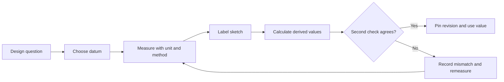

# Measure, sketch, and record a design

## Purpose and prerequisites

A useful robot design starts with a question, measurements, and a record another student can check.
This lesson teaches a small design notebook entry before choosing tools or making a part. Complete
[Use Rates and Units to Describe Motion](/academy/rates-units-and-motion?path=math-for-robotics)
first. No powered robot is needed.

The pinned ARES hardware workflow asks students to measure drivebase geometry, camera position and
angle, mechanism limits, and other facts from the exact robot. The drivetrain contract also keeps
geometry in canonical project records. A copied value from a different robot is not a measurement
of this one.

## Vocabulary

- **Requirement:** what the design must do.
- **Constraint:** a limit the design must obey.
- **Datum:** a chosen reference point, edge, plane, or axis.
- **Dimension:** a measured distance, angle, or size.
- **Unit:** the scale attached to a number.
- **Tolerance:** the allowed difference from a target value.
- **Sketch:** a drawing that communicates shape and relationships.
- **Revision:** a named version of a design record.
- **Assumption:** an idea treated as true until evidence confirms or rejects it.
- **Traceability:** a way to connect a value to its source and later decision.

## Worked example

A student needs the distance between two wheel-contact centers. They choose the robot centerline as a
datum and measure each wheel center from it. The left value is `0.182 m` and the right value is
`0.181 m`. The full measured distance is:

```text
0.182 m + 0.181 m = 0.363 m
```

The notebook does not silently round that to a copied “standard” width. It records the measured
values, tool, units, date, robot revision, and where the wheel centers were identified. It can also
state an uncertainty, such as “each center estimate is within about 1 mm,” if that estimate came
from the actual method.

The student then sketches the top view. Arrows point from the centerline datum to both wheel centers.
The calculated full distance is labeled as a result, not a separate measurement. This lets another
student repeat the work and find a disagreement.

## Visual model



The diagram is a record flow, not a measuring instrument. It does not set the correct tool,
tolerance, or league limit for a real part.

## Measurement uncertainty is not tolerance

These two ideas answer different questions:

- **Measurement uncertainty** describes what the measuring method may not resolve. For example,
  estimating a wheel center by eye may make a result uncertain by about 1 mm.
- **Design tolerance** describes the range a design or approved source allows. It must come from the
  design need, drawing, process, or manufacturer—not from a guess about the tool.

Do not copy an uncertainty estimate into a tolerance field. Keep the raw readings, method, and
uncertainty in the notebook. Record an allowed tolerance only when its source is known.

### Practice a calculated stack

The lab below uses made-up millimeter values. Before changing a number, label it as a nominal design
value or an allowed tolerance; none of the starting values are measurements of the team robot. Change
one nominal length, then change one allowed tolerance. Record which input changed the center of the
range and which changed its width.

<tolerancestacklab />

The result is arithmetic evidence only. It does not replace the physical measurements, datum sketch,
uncertainty note, or approved tolerance source in your notebook.

## Hands-on activity

1. Pick one safe, unpowered object such as a loose bracket, wheel, or practice frame member.
2. Write one question that a dimension can answer.
3. Choose and mark a repeatable datum.
4. Choose a measuring tool that can reach the feature without forcing or bending anything.
5. Record the tool name and smallest marked division you can honestly read.
6. Measure the feature twice without looking at the first result.
7. Ask another student to repeat the measurement from the written method.
8. Record all results, including disagreement. Do not average values just to hide a mismatch.
9. Draw a simple view and label the datum, measured dimension, unit, and direction.
10. Calculate one derived value only if the design question needs it.
11. Add revision name, date, source object, and student initials or a non-identifying team role.
12. Write the next action: accept for this draft, measure with a better method, or request a source.

If approved team measurement photos are available, add one that shows the datum and tool without
faces, names, school records, screens, or other private details. Until such a photo is approved, use
the described diagram and keep the media request open. Do not substitute a fabricated team image.

## Checkpoints

- Does the entry begin with a question rather than an unexplained number?
- Is the datum visible in words and in the sketch?
- Does every number include a unit?
- Are measured and calculated values labeled differently?
- Could another student repeat the method?
- Is disagreement preserved instead of erased?
- Is the record tied to one robot or part revision?
- Are unknown facts still marked unknown?

## Troubleshooting

| Symptom | Check |
| --- | --- |
| Two students measure from different places | Name and mark one shared datum before measuring again. |
| Value changes when the tool moves | Check tool angle, contact pressure, feature edges, and whether the part bends. |
| Sketch is neat but cannot be built | Add the missing view, datum, dimensions, units, and relationship between holes or edges. |
| A calculated value looks like a measurement | Label the inputs, formula, and result separately. |
| Old value returns after a design change | Give the new record a revision and link it to the changed part. |
| A value came from another robot | Mark it as a reference only, then measure the exact robot before configuration. |
| The required precision is unclear | Stop and request the part, manufacturer, or process tolerance from an approved source. |

## Evidence artifact

Submit one design notebook page with a title, purpose, requirement, constraint, datum, and labeled
sketch. Include two personal measurements, one independent repeat, units, method, value labels,
uncertainty note, revision, and next action.

Add a trace table with columns for value, source, date, method, unit, revision, and where the value is
used. If the value later enters an ARES drivebase or subsystem document, link the canonical field to
this record. A source link proves where a code field is defined; the notebook proves how this robot's
value was obtained.

Current ARES drivetrain authoring stores measured geometry in SI units and links accepted calibration
evidence by project-relative path and SHA-256. Keep the original readings and method in the notebook,
then record the reviewed SI value and its evidence link in the canonical `.aresdrivetrain` document.
Do not maintain a second untracked copy of the geometry just for simulation.

## Short assessment

1. What makes a datum useful?
2. Why must a number include a unit?
3. How is a measured value different from a calculated value?
4. Why should another student repeat the method?
5. What should happen when two careful measurements disagree?

## Extension challenge

Make a second sketch from a different view. Identify one dimension that cannot be understood from
the first view alone. Create a revision comparison that highlights the one changed value and every
downstream field it affects. Do not overwrite the first record.

Reopen the Tolerance Stack Lab above with three values from a paper design exercise. State the source
of each allowed tolerance and explain why the arithmetic still cannot approve a CAD model, process,
or real part.

## Related and next

Continue with [From a CAD Model to a Buildable Part](/academy/mechanical-cad-fabrication?path=mechanical-design-fabrication).
Use the measurement record in
[Compare Mecanum, Differential, and Swerve Drivetrains](/academy/mechanical-drivetrains?path=mechanical-design-fabrication)
when evaluating geometry. Return to hardware setup before entering a measured value into a real
project.
