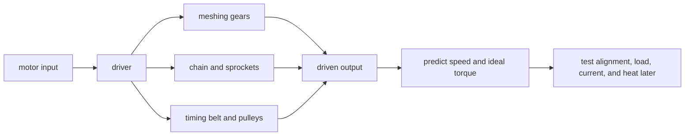

# Gears, sprockets, belts, speed, and torque

Robot mechanisms move power from a motor to a wheel, arm, intake, or elevator. The parts between the
motor and output change where the motion goes. They can also trade speed for ideal torque. A good
design starts with a needed output, not with a favorite part.

## Purpose and prerequisites

The purpose is to compare gears, sprockets with chain, and timing pulleys with belts. You will use an
ideal ratio to predict output motion. Complete [Use rates and units to describe
motion](/academy/rates-units-and-motion?path=math-for-robotics) first. You should know how to divide
and how to keep units beside a value.

This lesson uses a concept model and a paper design. It does not ask you to build or run a physical
mechanism. Physical work comes later with the correct tools, guards, current limits, and test area.

## Vocabulary

- **Power transmission:** parts that carry motion and force from an input to an output.
- **Driver:** the gear, sprocket, or pulley that receives input motion.
- **Driven:** the part that receives motion from the driver.
- **Gear:** a toothed wheel that meshes directly with another gear.
- **Sprocket:** a toothed wheel made to engage a chain.
- **Timing pulley:** a pulley with teeth that engage a matching timing belt.
- **Ratio:** a comparison between driver and driven sizes.
- **Torque:** a turning effect around an axis.
- **Backlash:** small free motion between mating parts when direction changes.

## Worked example

A motor turns a 15-tooth driver gear at 300 RPM. The driver turns a 45-tooth driven gear. Divide the
driver teeth by the driven teeth to find output turns per input turn.

```text
output turns per input turn = 15 ÷ 45 = 0.33
ideal output speed = 300 RPM × 0.33 = 100 RPM
ideal torque multiplier = 45 ÷ 15 = 3
```

The output is slower, but its ideal torque is three times the input torque. “Ideal” matters. Friction,
part flex, poor alignment, motor heating, and battery limits reduce real performance. The calculation
is a prediction to test, not a finished hardware claim.

If the 45-tooth gear becomes the driver, the direction of the trade changes. The output turns faster,
but the ideal torque multiplier becomes less than one. Write which part is the driver before doing
any ratio math.

## Visual model



Direct gears need their shafts placed at the correct center distance. Chain and timing belts can
connect shafts that are farther apart. These choices affect layout, service, tension, and protection.
The ratio math still begins with the driver and driven tooth counts.

## Hands-on activity

Use the explorer below. Set the driver to 15 teeth, the driven gear to 45 teeth, and input speed to
300 RPM. Record all three outputs. Reset the model. Swap the driver and driven sizes, then record the
new result.

<mechanismratioexplorer />

Next, draw three paper layouts for one motor and one output shaft. Layout A uses two direct gears.
Layout B uses two sprockets and a chain. Layout C uses two timing pulleys and a belt. Label the driver,
driven part, shaft locations, and direction of output rotation.

Choose one layout for a made-up requirement. The output shaft is 30 centimeters from the motor and
needs one-third of the motor speed. Explain the ratio you would start with. Then explain why the
layout still needs exact part dimensions and physical checks before anyone builds it.

## Checkpoints

After each ratio, confirm that the driver and driven labels did not switch. Multiply input RPM by
output turns per input turn. The unit should still be RPM. If a larger driven part makes the output
faster in your answer, check the division order.

After each sketch, trace one continuous path from motor to output. Every shaft must be supported.
Every flexible loop must have a plan for tension. A sketch may be simple, but it must show enough for
another student to understand the motion path.

## Troubleshooting

If two students get inverse answers, compare which part each student called the driver. If the
calculated speed has no unit, return to the known values and add RPM. If a decimal feels unclear,
write the result as a fraction of one output turn per input turn.

If the paper layout cannot fit, do not change the ratio without noticing. A different tooth count can
change both ratio and part size. Record the design need, check available part dimensions later, and
revise the layout with evidence.

If a real mechanism later binds, slips, skips, heats, or draws too much current, the ideal ratio is
not proof that the build is correct. Stop the test and inspect alignment, support, tension, load, and
the applicable electrical and mechanical limits.

## Evidence artifact

Submit the two explorer records and three labeled layout sketches. Add a short decision note with
the required output speed, chosen transmission type, starting ratio, and two facts still needed.
Examples of missing facts include exact center distance, available tooth counts, load, part rating,
or allowed package size.

The artifact should let another student repeat your ideal calculation. It should also make the model
limit visible. Do not claim that the paper design has passed a physical load, safety, or durability
test.

## Short assessment

1. What is the difference between a driver and a driven part?
2. A 20-tooth driver turns a 60-tooth driven gear at 180 RPM. What is ideal output RPM?
3. What is the ideal torque multiplier in that example?
4. Name one layout reason to consider chain or a timing belt instead of direct gears.
5. Name two real effects that the ideal model leaves out.

The numeric answers are 60 RPM and an ideal multiplier of three. Your layout and model-limit answers
should use facts from the lesson rather than a claim that one transmission is always best.

## Extension challenge

Find three different tooth-count pairs that all create a 3-to-1 reduction. Compare the total tooth
counts. Predict which pairs may need more package space, but label that statement as a prediction.
Exact size depends on the real parts.

Then create a two-stage ideal reduction. Multiply the stage ratios to find the total ratio. Keep the
calculation separate from any claim about strength, efficiency, or safe motor load.

Apply one of your ratios to an arm, elevator, or intake roller with the explorer below. Compare how
the same output rotation becomes angle or ideal surface travel. Keep this optional extension separate
from a claim about linkage shape, clearance, load, current, or real robot behavior.

<mechanismmotionexplorer />

## Related and next

Continue with [Build Motion with Arms, Elevators, Intakes, and Linkages](/academy/mechanical-mechanisms?path=mechanical-design-fabrication).
Use [The ARES Software Workspace](/academy/ares-workspace-map?path=robotics-foundations)
to see where a verified drivebase description belongs. The software can record a selected drivebase,
but it cannot replace physical dimensions, assembly checks, or student test evidence.
