# Choose and use common robot tools

## Purpose and prerequisites

A tool is chosen for a clear task, material, size, and work area. Safe planning uses current
instructions for the exact tool. It does not depend on a tool that looks similar.

In this lesson, you will build a paper preflight for a made-up task. Complete [Measure, Sketch, and
Record a Design](/academy/mechanical-measurement-design-notebook?path=mechanical-design-fabrication)
first. You will not operate, plug in, charge, sharpen, adjust, or test a real tool.

The lesson does not replace manufacturer instructions, team training, or the team's current shop
process. Official tool guidance and authentic team photos remain open source requests.

## Vocabulary

- **Task:** one bounded change or measurement that needs to be made.
- **Workpiece:** the part or material being measured, held, shaped, or joined.
- **Workholding:** a method that supports and controls the workpiece.
- **Instruction source:** current guidance for the exact tool, accessory, and task.
- **Guard:** a device that separates a person from a hazard when used as designed.
- **Protective equipment:** equipment required by current instructions and the team process.
- **Energy isolation:** keeping electrical, battery, spring, gravity, or other stored energy controlled.
- **Pre-use inspection:** a check of the exact tool and setup before work begins.
- **Stop condition:** a fact that ends the task before risk grows.
- **Post-task check:** inspection of the part, tool, area, and record after the task.

## Worked example

A made-up bracket needs one hole located from a measured edge. “Use a drill” is not a complete plan.
The plan must name the exact task, material, thickness, hole location, and required result. It must
also identify an available tool and current instructions that cover that exact setup.

The paper preflight then records workholding, support, the clear work area, required training and
protection, energy isolation, tool condition, stop conditions, and the post-task check. It does not
guess a speed, bit, clamp, or protective item. Those choices depend on current sources, the exact
tool, material, and team process.

ARES hardware workflows follow a similar evidence boundary. A Hardware Setup review can confirm a
recorded configuration, but it cannot prove physical construction. A commissioning checklist can
order a later physical test, but it does not grant permission to skip the real setup and inspection.

## Visual model

```mermaid
%% aria: A bounded task and exact workpiece lead to an available exact tool, current approved instructions, workholding and clear-area plan, training and protective requirements, isolation and stop conditions, then a post-task inspection. Missing evidence returns the plan to review before work starts.
flowchart LR
  T["bounded task"] --> W["exact workpiece"]
  W --> E["exact available tool"]
  E --> I["current approved instructions"]
  I --> H["workholding and clear area"]
  H --> P["training and protection"]
  P --> S["isolation and stop conditions"]
  S --> C["post-task check"]
```

Common task categories include measuring and marking, holding and supporting, shaping material,
assembling joints, and preparing electrical connections. A category is not a tool recommendation.
The exact choice must come from the actual work, available equipment, and approved guidance.

## Hands-on activity

1. Choose one paper-only task: measure, hold, shape, assemble, or prepare a connection.
2. Describe the made-up workpiece, material, size, and required result.
3. Select the task category in the lab.
4. Record the suggested review path. Do not treat it as a tool choice.
5. Name one exact available tool only if it appears in the current team inventory.
6. Write the manufacturer and team sources that must be attached.
7. Draw the workpiece, support, workholding, and clear work area.
8. Leave training and protective details open until the approved sources are read.
9. Record every energy source that needs control.
10. Write three stop conditions and a post-task inspection.
11. Check each box only when the paper packet contains the evidence.
12. Stop at the first missing item and revise the packet.
13. Ask another student to locate every source and boundary.

<toolchoicescenarios />

The completed result means the paper preflight can enter team-process review. It does not mean a
student is trained, the setup is safe, or work may begin.

## Checkpoints

- Is the task limited to one clear result?
- Are the workpiece material and size recorded?
- Is the exact tool identified from the current inventory?
- Are current instructions attached for the exact tool and task?
- Does the drawing show support, workholding, and a clear area?
- Are training and protective needs copied from approved sources rather than memory?
- Are stored energy and stop conditions visible?
- Does the plan include a post-task check and evidence record?

## Troubleshooting

| Symptom | Check |
| --- | --- |
| The plan says only “use a saw” | Return to the exact task, material, tool identity, and approved instructions. |
| A tool is chosen because it is nearby | Confirm that the exact tool is approved for the task and material. |
| The workpiece can move | Stop the paper plan and resolve support and workholding through current guidance. |
| Protective steps come from memory | Attach the current source for the exact setup. |
| The robot battery remains connected | Keep robot and stored energy isolated under the current team procedure. |
| A student feels unsure during setup | Stop. Uncertainty is a stop condition, not a reason to continue. |
| The part is changed without a record | Add dimensions, revision, observed result, and post-task inspection. |

## Evidence artifact

Submit the made-up task, workpiece description, task category, exact-tool request, source list,
work-area drawing, isolation plan, training and protection request, stop conditions, and post-task
check.

Mark the packet **paper preflight only**. Do not claim training, safe setup, completed work, or tool
approval. Authentic team photos and official guidance remain open and must not be replaced by fake
shop images.

## Short assessment

1. Why is a task category not a tool recommendation?
2. What facts describe a workpiece?
3. Why must instructions match the exact tool and task?
4. What belongs in an energy-isolation record?
5. Name three reasons to stop before or during a task.

Good answers connect the exact task, tool identity, source, setup, training, protection, isolation,
inspection, and evidence record.

## Extension challenge

Create two paper plans for the same made-up bracket task. In one plan, change the material. List
which evidence must be reviewed again. Do not decide that the same tool or setup still applies.

Use the lab inside the CAD lesson before proposing fabrication. Explain why a complete CAD model
cannot approve a tool, process, or work area.

## Related and next

Use [From a CAD Model to a Buildable Part](/academy/mechanical-cad-fabrication?path=mechanical-design-fabrication)
to connect a revisioned model to an evidence-backed process request. Continue later with fasteners
after manufacturer sources are reviewed. Use [Wire, Connectors, Polarity, and Strain Relief](/academy/electrical-wiring-connectors?path=electrical-systems-diagnostics)
for a separate isolated electrical plan.
