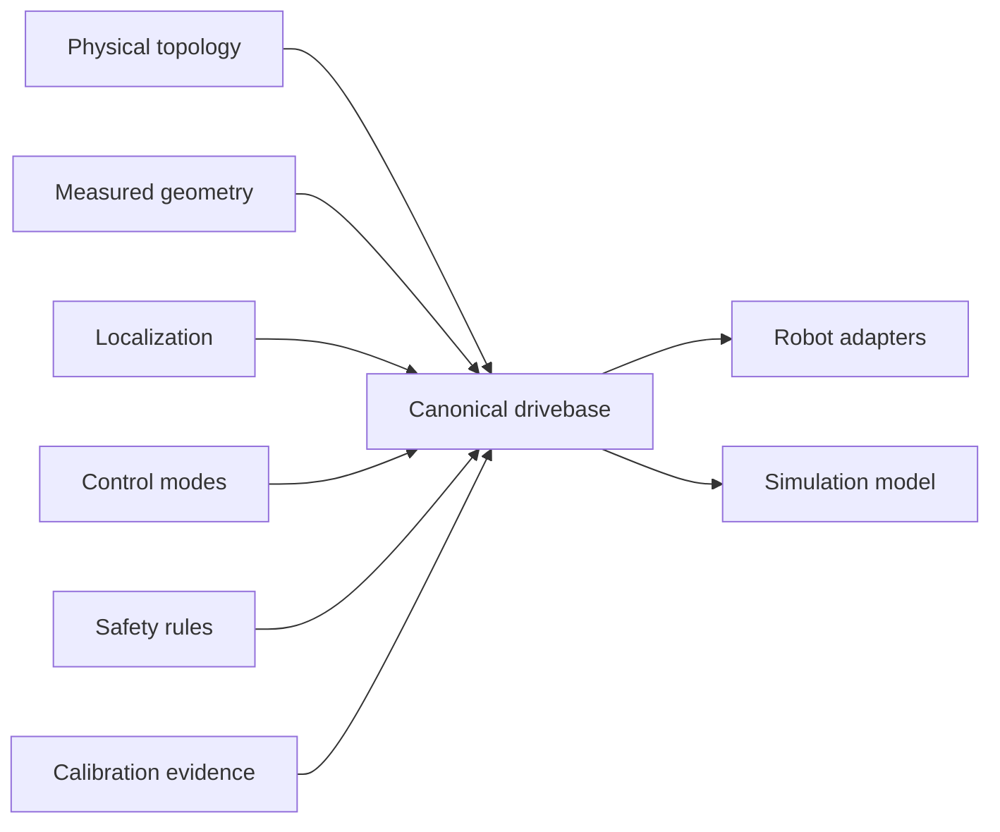

# Compare mecanum, differential, and swerve drivetrains

## Purpose and prerequisites

A drivetrain is more than a set of wheels. It joins physical layout, measured geometry,
localization, control, safety, simulation, and calibration. In this lesson, you will compare the
four ARES starting points and build an evidence list before choosing one.

Complete [Gears, Sprockets, Belts, Speed, and Torque](/academy/mechanical-gears-sprockets-belts?path=mechanical-design-fabrication)
and [Robot Coordinates Without Guesswork](/academy/robot-coordinate-contracts?path=controls-localization-autonomous).
You can complete the comparison without a powered robot.

## Vocabulary

- **Drivetrain:** the robot system that creates and measures chassis motion.
- **Topology:** the physical grouping and connection of wheels, motors, and modules.
- **Mecanum:** four angled-roller wheels that can create forward, sideways, and turning motion.
- **Differential drive:** left and right wheel groups that move forward, backward, and turn.
- **Swerve:** modules that each control wheel speed and wheel angle.
- **Geometry:** measured wheel size, track width, wheelbase, and module positions.
- **Localization:** estimating the robot's position and heading from sensors.
- **Provenance:** the source and review record behind a measured or generated value.

## Worked example

An FTC robot needs sideways motion and uses four mecanum wheels. The `FTC_MECANUM` starting point
matches that physical layout. The team still must name each motor, measure geometry, choose a
heading and odometry source, define safe neutral, and check wheel direction.

An FRC robot uses four CTRE swerve modules. The `FRC_CTRE_SWERVE` starting point records each drive
motor, steer motor, encoder, and module position. Its vendor `TunerConstants.java` file stays
read-only. ARES records its path and hash. Importing that file does not prove CAN wiring, encoder
offsets, or physical calibration.

A differential robot groups left and right hardware. It does not create direct sideways wheel
motion. An advanced custom drive must state its own topology and math while meeting the same common
safety and simulation rules.

## Visual model

Robot and simulation must use the same canonical geometry and reviewed tuning. A second hidden set
of simulator constants is not valid parity.

## Hands-on activity

1. Open the pinned drivebase authoring contract.
2. List the four supported starting points.
3. Draw each physical wheel or module grouping from above.
4. Mark robot X forward and Y left on every drawing.
5. State which layouts can create direct sideways wheel motion.
6. List the measured geometry needed by each layout.
7. Name one odometry source and one CCW-positive heading source for a practice design.
8. Add safe neutral, feedback freshness, current validity, and fault recovery to the design record.
9. Use the lab below to compare the starting points and mark missing facts.
10. Write which facts need source checks, simulation, or later physical observation.

<drivetrainchoicelab />

The lab does not pick a winner. The right topology depends on real goals, parts, rules, skills,
time, and evidence.

## Checkpoints

- Does the starting point match the real wheel and module layout?
- Are physical names separate from stable component IDs?
- Are wheel size, track width, wheelbase, and module positions measured in SI units?
- Is heading defined as counter-clockwise positive in robot code?
- Does simulation use the same geometry and profile as the robot?
- Are unsupported or missing facts blocked instead of guessed?

## Troubleshooting

| Symptom | Check |
| --- | --- |
| Robot moves sideways when forward is requested | Check wheel order, inversion, and coordinate signs. |
| Estimated distance has the wrong scale | Check wheel size, ratio, encoder units, and calibration evidence. |
| Swerve module points the wrong way | Check module order, position, steer offset, and encoder identity. |
| Differential sides fight each other | Check leaders, followers, mounting reversal, and side grouping. |
| Simulator works with different constants | Remove the second constant set and use the canonical contract. |
| Vendor import has warnings | Resolve each field by source or measurement before saving. |
| A checkbox says complete but evidence is missing | Treat the mark as a note, not validation. |

## Evidence artifact

Create a drivetrain decision table. Compare the four starting points by physical grouping, supported
motion, measured geometry, localization, control needs, safety work, simulation needs, build effort,
and open questions. Add pinned sources for every technical claim.

For the chosen practice design, draw a top view with stable component names and measured points.
Create a claim ledger for document validation, pure direction math, code generation, unit tests,
simulation, and physical wheel checks. Leave physical rows empty until students run them.

Students may verify wheel direction through the team's normal safety procedure. Start disabled,
raise or restrain the robot safely, use a small held command, and keep a stop control ready. Test one
wheel or module at a time. Record the observed direction and stop result.

## Short assessment

1. Why is a drivetrain more than its wheel type?
2. Which starting point groups hardware into left and right sides?
3. Why must vendor-generated constants keep provenance?
4. Why should robot and simulation share canonical geometry?
5. What facts remain unknown after pure drive-mixing math passes?

## Extension challenge

Choose two starting points for the same game task. Create a tradeoff matrix without claiming one is
always better. Include sideways motion, turning, traction assumptions, controls, sensors, repair
work, software effort, and test evidence. Mark every assumption that needs a real part, field, or
rule check.

Then use the load-path explorer with the front-contact scenario. Trace the conceptual route through
mounts, frame members, joints, and wheel-ground support for each starting point. The result does not
calculate impact, strength, traction, or stability and cannot approve a chassis.

<loadpathexplorer />

## Related and next

Use [Drivebase, Swerve, and Kinematics Contracts](/docs/swerve-and-kinematics) for the advanced
reference. Review [Frames, Bracing, and Load Paths](/academy/mechanical-structure-load-paths?path=mechanical-design-fabrication)
for the full conceptual evidence activity. Continue to mechanisms, CAD, fabrication, electrical
power, and careful commissioning.
