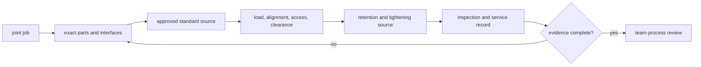

# Fasteners, threads, and keeping parts together

## Purpose and prerequisites

A robot joint should start with a job, not a bin of hardware. The joint may hold two parts still,
keep a panel aligned, allow a pivot to move, or open often for service. Those jobs need different
evidence.

In this lesson, you will make a paper joint record. Complete [Choose and Use Common Robot
Tools](/academy/mechanical-tools-safe-work?path=mechanical-design-fabrication) first. You will not
tighten, loosen, assemble, or test a real joint.

Manufacturer references for exact thread, material, torque, and retention claims remain an open
source request. The lesson will not invent those values.

## Vocabulary

- **Fastener:** hardware that joins or retains parts.
- **Bolt:** an externally threaded fastener commonly used with a nut or threaded feature.
- **Screw:** an externally threaded fastener that forms or uses mating threads.
- **Nut:** a part with internal threads that mates with an external thread.
- **Washer:** a separate part placed under a head or nut for a source-defined job.
- **Thread standard:** the named system that defines thread shape and dimensions.
- **Clamping force:** force that presses joined parts together after correct tightening.
- **Tension:** a pulling load along a fastener or part.
- **Shear:** a load that tries to slide joined parts past each other.
- **Retention:** a source-backed way to keep parts from separating or changing position.
- **Serviceability:** how easily a joint can be inspected, opened, repaired, and restored.

## Worked example

A made-up cover must open after each practice. Two holes align with threaded features below it. A
student cannot choose a fastener from the picture alone. The record first names the cover, base,
materials, thicknesses, hole locations, required access, and how often the cover opens.

The record then requests the exact fastener standard, mating-thread source, required engagement,
retention method, tightening rule, and inspection method. It also draws the expected load direction
and nearby clearance. If a source is missing, the proposal stops at that item.

ARES commissioning guidance follows the same evidence boundary. A software test can show that logic
runs. It cannot prove that a joint is compatible, tight, aligned, undamaged, or ready for motion.

## Visual model

The diagram organizes questions. It does not calculate joint strength or tell a student which
fastener, washer, retention method, or torque to use.

## Hands-on activity

1. Choose one made-up joint: removable panel, fixed bracket, rotating pivot, or service cover.
2. Write one sentence explaining the joint's job.
3. State whether the parts must stay fixed, align repeatedly, or move relative to each other.
4. Draw the exact joined parts and label materials, thicknesses, holes, and revision.
5. Add arrows for expected tension, shear, or an unknown load direction.
6. Mark tool access, nearby wires, moving parts, and clearance.
7. Select the matching review path in the lab.
8. Create a source request for the exact proposed fastener and mating interface.
9. Leave thread, engagement, material, retention, and torque blank until an approved source supports them.
10. Write how the joint would be inspected, marked, rechecked, and serviced.
11. Check only the evidence that exists in the paper packet.
12. Stop at the first missing item and revise the packet.
13. Ask another student to trace each claim back to its source.

<fastenerchoicelab />

A complete result means the paper record can enter the team's normal review. It does not mean the
joint design is correct or that assembly may begin.

## Checkpoints

- Does the record start with the joint's job?
- Are exact parts, materials, thicknesses, holes, and revision named?
- Are fixed and moving interfaces clearly separated?
- Does the drawing show load direction, alignment, access, and clearance?
- Is the exact thread standard supported by a current source?
- Are mating and retention claims sourced instead of guessed?
- Is any tightening value tied to the exact hardware and source?
- Does the plan include inspection, marking, recheck, and service?

## Troubleshooting

| Symptom | Check |
| --- | --- |
| Parts look aligned only after tightening | Stop. Recheck hole location, datums, and whether tightening is hiding a mismatch. |
| Two threads look alike | Treat appearance as insufficient. Identify both exact standards from approved sources. |
| A pivot no longer moves | Review whether the proposal clamps the moving interface instead of retaining it. |
| A joint becomes loose | Stop use and record the observation. Do not add an invented torque or retention method. |
| A tool cannot reach the joint | Record the access problem before choosing hardware or changing a part. |
| A wire or moving part is close | Add clearance and routing to the joint record before physical work. |
| A fastener is replaced with a similar one | Reopen compatibility, material, tightening, and inspection evidence. |

## Evidence artifact

Submit one joint card with purpose, exact parts, revision, fixed or moving interfaces, load arrows,
alignment, access, clearance, and service need. Add a claim table for thread standard, mating
interface, engagement, material, retention, tightening, inspection, and recheck.

Each table row must contain a pinned approved source or say **open**. Label the card **paper joint
proposal only**. Do not claim strength, compatibility, correct torque, completed assembly, or
physical readiness.

## Short assessment

1. Why should a joint start with a job instead of a fastener?
2. How are tension and shear different?
3. Why can two similar-looking threads still be incompatible?
4. Why does a rotating pivot need a different record from a fixed bracket?
5. What should happen when a tightening source is missing?

Good answers connect the joint job, exact interfaces, load, clearance, approved sources,
inspection, service, and evidence limits.

## Extension challenge

Compare two paper concepts for the same removable cover. One uses separate threaded hardware; the
other uses a source-approved captive solution. Do not choose a winner. List the evidence each idea
needs for alignment, loss prevention, access, service, and inspection.

Then revise the cover thickness in your drawing. Mark every fastener claim that must be checked
again. Explain why a CAD change can invalidate a once-complete joint record.

## Related and next

Continue with [Frames, Bracing, and Load Paths](/academy/mechanical-structure-load-paths?path=mechanical-design-fabrication)
to see how forces move through joined parts. Use [From a CAD Model to a Buildable
Part](/academy/mechanical-cad-fabrication?path=mechanical-design-fabrication) when the exact interfaces
are ready for a revisioned model. Manufacturer references remain required before making exact
fastener, retention, or tightening claims.
