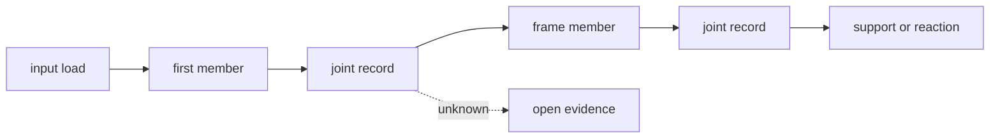

# Frames, bracing, and load paths

## Purpose and prerequisites

A robot structure gives forces a route through members and joints to a support. That route is called
a load path. A strong-looking frame can still have an open path, a weak connection, a large offset,
or missing evidence.

In this lesson, you will trace conceptual force routes on paper. Complete [Fasteners, Threads, and
Keeping Parts Together](/academy/mechanical-fasteners?path=mechanical-design-fabrication) first. You
will not load, lift, hang, strike, or drive a real robot.

Authentic team structure photos remain an open request. The diagrams and interactive routes are
generic teaching models, not pictures of an ARES robot.

## Vocabulary

- **Structure:** connected parts that hold shape and carry loads.
- **Frame:** the main structure that supports robot systems.
- **Member:** one beam, rail, plate, tube, or other structural part.
- **Brace:** a member added to control motion or help carry a load.
- **Load:** a force or moment applied to a part or system.
- **Load path:** the route a load follows through members and joints.
- **Reaction:** a support force or moment that balances the model.
- **Tension:** a pulling action along a member.
- **Compression:** a pushing action along a member.
- **Bending:** a change in shape caused by loads across a member.
- **Offset:** distance between a load line and the support path.
- **Open point:** a place where evidence or a physical connection is missing.

## Worked example

A made-up arm holds a payload. The paper path begins at the payload, crosses the arm link and pivot,
enters the mechanism mount, passes into the frame, and ends at the wheel-ground support. Each joint
gets its own evidence record.

If the arm sits far outside the frame, the path has an offset. The sketch marks that offset instead
of calling the frame strong. A brace may create another route, but a line on paper does not prove
the brace, joint, or frame can carry the load.

ARES hardware review asks students to confirm exact geometry, limits, current behavior, neutral
behavior, and restrained tests. Those checks still do not replace structural sources, inspection,
or a bounded physical test plan for the actual build.

## Visual model

A load path is not always straight. Turns and offsets can change what members and joints experience.
This lesson marks those places but does not calculate stress, deflection, or capacity.

## Hands-on activity

1. Choose a made-up scenario in the explorer.
2. Copy its four conceptual stages onto paper.
3. Draw where the force enters and add a direction arrow.
4. Name every proposed member in order. Do not jump from the load straight to the frame.
5. Draw a dot at every connection between parts.
6. Link each dot to a joint evidence card from the fastener lesson.
7. Name the support or reaction boundary where the path ends.
8. Circle every turn, offset, or place where direction changes.
9. Mark the first unsupported claim or unknown connection as **open**.
10. Add nearby wires, moving parts, access, and clearance boundaries.
11. Write one inspection need and the smallest later evidence step.
12. Check each box only when the paper packet contains that record.
13. Ask another student to trace the route without your help.

<loadpathexplorer />

The completed result means the conceptual path is documented. It does not mean the members, joints,
supports, or whole robot are strong enough.

## Checkpoints

- Is the input location and direction clear?
- Can another student trace every member in order?
- Does each connection link to a joint record?
- Is the support or reaction boundary named?
- Are turns and offsets visible?
- Is missing evidence marked open instead of skipped?
- Are access, clearance, and nearby systems recorded?
- Does the later test plan avoid a claim of current physical approval?

## Troubleshooting

| Symptom | Check |
| --- | --- |
| The arrow jumps from a mechanism to the floor | Add every mount, frame member, joint, wheel, or support in between. |
| A brace is drawn but not connected | Mark both end joints and link their evidence records. |
| The sketch calls a member “strong” | Replace the claim with material, geometry, source, calculation, inspection, and test requests. |
| A large offset is hidden | Draw the real distance between the load line and support route. |
| Two paths share one joint | Mark the combined location as an open analysis question. |
| The frame twists in a later observation | Stop loading and record the observation. Do not use this concept model to diagnose a cause. |
| A photo is used as proof | A photo can document shape and condition, but not hidden material, capacity, or safe loading. |

## Evidence artifact

Submit one load-path sheet with scenario, input arrow, ordered members, joint links, direction changes,
offsets, support boundary, clearance, and the first open point. Add a claim ledger for geometry,
material, connections, expected loads, calculation, inspection, and physical test evidence.

Label the sheet **conceptual route only**. Do not claim calculated strength, stiffness, impact
survival, fatigue life, stability, safe lifting, or safe driving. Authentic photos can be added only
after the team supplies approved images with accurate labels and no private information.

## Short assessment

1. What is a load path?
2. Why does every joint belong in the path record?
3. What is a reaction boundary?
4. Why should offsets be marked?
5. What does a complete conceptual route still fail to prove?

Good answers trace the route from input to support and keep strength, stiffness, stability, and
physical approval as separate evidence questions.

## Extension challenge

Draw two paper routes for the same side mechanism. Add a diagonal brace to the second route. Compare
the members, joints, access, and open questions without saying which design is stronger.

Then choose the drivetrain front-contact scenario. Explain how bumper or guard mounts, chassis
members, joints, and wheel-ground support form a conceptual chain. List the real sources,
measurements, calculations, inspection, and tests still needed.

## Related and next

Continue with [Gears, Sprockets, Belts, Speed, and Torque](/academy/mechanical-gears-sprockets-belts?path=mechanical-design-fabrication)
to study an ideal motion and torque ratio. Use [Compare Mecanum, Differential, and Swerve
Drivetrains](/academy/mechanical-drivetrains?path=mechanical-design-fabrication) to connect a frame
layout to canonical geometry. Return to the fastener lesson whenever a path crosses a joint.
