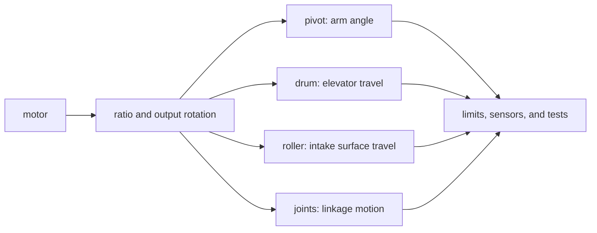

# Build motion with arms, elevators, intakes, and linkages

## Purpose and prerequisites

A mechanism changes motor rotation into useful robot motion. An arm turns through an angle. An
elevator moves a carriage along a guide. An intake roller pulls a game piece. A linkage connects
moving parts so one motion creates another.

In this lesson, you will match a task to a mechanism, predict ideal motion, and write the facts that
still need tests. Complete [Gears, Sprockets, Belts, Speed, and Torque](/academy/mechanical-gears-sprockets-belts?path=mechanical-design-fabrication)
and [Compare Mecanum, Differential, and Swerve Drivetrains](/academy/mechanical-drivetrains?path=mechanical-design-fabrication)
first. The activity uses a concept model. It does not move a robot.

## Vocabulary

- **Mechanism:** parts that work together to create a useful motion.
- **Arm:** a link that turns around a pivot.
- **Elevator:** a carriage that moves along one or more guides.
- **Intake:** a system that brings a game piece into the robot.
- **Roller:** a turning cylinder or wheel that contacts an object.
- **Linkage:** connected links and joints that transfer motion.
- **Reduction:** a ratio that makes the output turn fewer times than the motor.
- **Radius:** the distance from an axis to a cable, belt, or contact surface.
- **Hard stop:** a physical boundary that blocks more travel.
- **Soft limit:** a software boundary that prevents a command past an allowed position.

## Worked example

A motor turns two rotations. A 4:1 reduction means the motor turns four times for one output turn.

```text
output rotations = 2 motor rotations ÷ 4 = 0.5 rotation
arm angle change = 0.5 × 360 degrees = 180 degrees
```

The same half rotation can wind cable on an elevator drum. If the drum radius is `0.04 m`, its ideal
travel is the circumference times the number of turns.

```text
ideal travel = 0.5 × 2 × pi × 0.04 m = about 0.13 m
```

These answers are starting predictions. The arm result ignores gravity and linkage shape. The
elevator result ignores cable layers, stretch, slip, and the end of travel. Neither answer selects a
motor, proves clearance, or sets a safe limit.

## Visual model



ARES keeps mechanism choices explicit. A simple roller needs a safe neutral and bounded output. An
arm or elevator needs position units, feedback health, soft limits, and configuration checks. A
homed mechanism also needs a known reference before position commands are trusted.

## Hands-on activity

1. Choose a made-up task: lift an object, turn an arm, or pull an object across a floor.
2. Write the required output motion and its unit.
3. Choose arm, elevator, roller, or linkage as a starting idea.
4. Draw the motor, transmission, output axis, moving part, and expected direction.
5. Mark a possible hard stop and a place where a position or limit sensor could go.
6. Use the explorer with two motor turns and a 4:1 reduction.
7. Record the output rotation and the mechanism-specific result.
8. Change only the ratio to 8:1. Record what changes and what stays unknown.
9. Make a table with three columns: calculated, needs source evidence, and needs physical testing.
10. Write one smallest safe test for a future real mechanism. Do not perform that test in this lesson.

<mechanismmotionexplorer />

For a linkage, use the explorer only for its first rotating input. Real linkage motion depends on
link lengths, joint locations, and geometry. Draw those unknowns instead of guessing them.

## Checkpoints

- Is every motion value paired with rotations, degrees, or meters?
- Did you divide motor turns by motor turns per mechanism turn?
- Did you measure radius from the output axis to the working surface?
- Does the drawing show the moving part and its possible travel boundary?
- Are calculated claims separate from simulated or physically observed claims?
- Did you leave real motor load, current, strength, and clearance open for later evidence?

## Troubleshooting

| Symptom | Check |
| --- | --- |
| The output moves farther after adding reduction | Check whether the ratio was divided instead of multiplied. |
| Elevator travel is much too large | Confirm radius, diameter, meters, and cable layers. |
| Arm math looks correct but the sketch collides | Ratio math does not check shape or clearance. Revise the layout. |
| A roller spins but may not move an object | Contact, compression, material, slip, and speed still need evidence. |
| A linkage path is unclear | Mark each fixed pivot, moving joint, and link length. Use a geometry model later. |
| The real system reaches an unexpected boundary | Stop output. Inspect limits, sensor validity, units, and the test plan. |

## Evidence artifact

Submit the labeled mechanism sketch, two explorer records, and the three-column evidence table. Add a
short design note. It must name the intended task, output unit, starting ratio, possible stop, sensor
idea, safe neutral, and three unknown facts.

Label the explorer result **calculated ideal motion**. Do not label it tested, simulated in ARES, or
observed on a robot. An authentic team photo could improve this lesson later. The open media request
requires an approved image with ownership and context; a fake or unlabeled mechanism image is not a
substitute.

## Short assessment

1. How does an arm differ from an elevator?
2. Why does an intake roller need more evidence than its ideal surface travel?
3. A motor turns six times through a 3:1 reduction. How many times does the output turn?
4. What two extra facts make linkage motion different from simple output rotation?
5. Name one hard stop, one soft limit, and one feedback check for a practice design.

The numeric answer is two output rotations. Other answers should connect mechanism shape, limits,
sensors, and evidence without claiming that the concept model proves hardware behavior.

## Extension challenge

Create two starting ideas for the same task. For example, compare an arm and an elevator that place
an object at the same height. Give each idea one useful feature, one hazard, and three missing facts.
Then choose the smallest software or paper test that would reduce one unknown without moving hardware.

Use the evidence sorter below for each idea. It can turn a motion need into a motor, gearmotor, or
servo review path. It cannot choose a part or prove that either mechanism is safe.

<motorservoselector />

## Related and next

Use [Author a Code-First or Hybrid Subsystem](/academy/programming-code-subsystem?path=programming-with-ares)
to map the mechanism into state, control, IO, simulation, lifecycle, and tests. Use [Choose Motors,
Gearmotors, and Servos](/academy/electrical-motors-servos?path=electrical-systems-diagnostics) to build
the full actuator evidence record. A software description can record units and limits, but students
must still verify the real mechanism with the team process.
