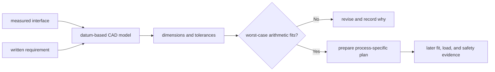

# From a CAD model to a buildable part

## Purpose and prerequisites

A computer-aided design, or CAD, model can describe shape and dimensions. A real part must also fit
other parts, match a known revision, and be made by a suitable process. “It looks right on screen” is
not enough evidence.

In this lesson, you will turn a measured interface into a simple part plan. You will also check how
small allowed size changes can add together. Complete [Measure, Sketch, and Record a Design](/academy/mechanical-measurement-design-notebook?path=mechanical-design-fabrication)
and [Build Motion with Arms, Elevators, Intakes, and Linkages](/academy/mechanical-mechanisms?path=mechanical-design-fabrication)
first. You will not operate a machine or make a team part in this activity.

## Vocabulary

- **CAD:** software used to describe a part or assembly with geometry and dimensions.
- **Interface:** a place where one part must meet, clear, or connect to another part.
- **Nominal dimension:** the intended size written on the design.
- **Tolerance:** an allowed change from the nominal size.
- **Tolerance stack:** the combined effect of several allowed size changes.
- **Clearance:** space between parts that should not touch.
- **Interference:** overlap between parts that prevents the planned fit or motion.
- **Datum:** a repeatable starting feature for measurements and dimensions.
- **Revision:** one named version of a design and its evidence.
- **Fabrication process:** the method used to make a part from material.

## Worked example

Three lesson blocks sit in one line. Their nominal lengths are `40 mm`, `30 mm`, and `20 mm`. Each
length may change by `0.2 mm` in either direction.

```text
nominal total = 40 + 30 + 20 = 90 mm
total plus-or-minus range = 0.2 + 0.2 + 0.2 = 0.6 mm
worst-case total = 89.4 mm to 90.6 mm
```

If the required total range is `89 mm` to `91 mm`, this arithmetic check fits. If the requirement is
`89.5 mm` to `90.5 mm`, it does not fit. That result does not prove three real parts will assemble.
Hole position, angle, surface shape, process error, and measurement uncertainty are still missing.

## Visual model



ARES stores drivebase geometry in one canonical drivebase document. Wheel radius, track width, and
wheelbase are entered in meters after measurement. A vendor file or visual preview can help with
authoring, but its source path and hash stay part of the evidence. Importing data is not proof that a
real part was measured or calibrated.

## Hands-on activity

1. Choose a made-up flat bracket that joins two practice blocks. Do not copy a claimed team part.
2. Write one requirement, such as “the three lengths must total 89 to 91 millimeters.”
3. Draw the interface and choose one edge as a datum.
4. Add three nominal lengths and a plus-or-minus tolerance to each length.
5. Enter those six values in the lab below.
6. Enter the required minimum and maximum.
7. Record the nominal total, worst-case total range, and displayed result.
8. Change only one tolerance. Explain why the combined range changed.
9. Add one hole to the sketch, but do not invent a precise hole tolerance. Mark it as an open fact.
10. List the process, material, tool access, edge finish, and inspection method as facts still needed.
11. Give the draft a revision name and record which one value changed in a second revision.
12. State the later evidence needed before the part could be accepted on a robot.

<tolerancestacklab />

The lab checks only a one-direction sum. A real CAD review also checks every mating feature, moving
envelope, fastener access, sharp edge, material, and process rule.

## Checkpoints

- Does the design begin with a written interface requirement?
- Is every dimension tied to a clear datum and unit?
- Are nominal values separate from allowed changes?
- Does the stack use the worst direction for every included tolerance?
- Are holes, angles, and clearances left open unless they have sources?
- Is the CAD revision linked to the measurement revision?
- Are process and physical-test claims clearly withheld?

## Troubleshooting

| Symptom | Check |
| --- | --- |
| The nominal total fits but the worst case does not | Add every plus-or-minus value, then revise the design or requirement. |
| A dimension moves when another feature changes | Check the datum and whether the design is fully constrained. |
| The model fits but a hole may miss | A length stack does not check hole position or angle. Add a separate sourced requirement. |
| Two files have the same name but different shapes | Add a revision, date, source, and comparison. Never overwrite the evidence trail. |
| The chosen process cannot reach a feature | Change the part or process plan after reviewing real capabilities and safety guidance. |
| A printed or cut sample flexes | Record the observation. Material, shape, load, and process need a new analysis. |

## Evidence artifact

Submit two revisioned sketches or CAD screenshots of the invented bracket. Include the requirement,
datum, nominal dimensions, allowed changes, open facts, and the tolerance-lab records. Add a short
review table with columns for claim, source, calculation, inspection method, and current evidence
level.

Do not use a screenshot as proof that a real part exists. This lesson still needs approved team CAD
screenshots paired with matching fabricated-part photos. The tracked media request stays open until
the team supplies those artifacts with ownership, revision, and safe context.

## Short assessment

1. What is the difference between a nominal dimension and a tolerance?
2. Why can three small tolerances matter when parts meet?
3. What does a datum do?
4. Why does a passing length stack not prove hole alignment?
5. Name four facts needed before a real fabrication process is approved.

Good answers keep arithmetic, CAD review, process planning, inspection, and physical evidence as
different steps. A clean screen image is not a fit test or a safety result.

## Extension challenge

Reverse the requirement. Choose a required range first, then find three nominal values and equal
tolerances whose worst-case sum fits. Reduce one tolerance and explain which real process or
measurement evidence would be needed to justify that tighter value.

Create a change-impact list for one revised dimension. Include the mating part, ARES geometry field,
simulation profile, drawing, fabrication file, and physical inspection record when each applies.

## Related and next

Return to [Measure, Sketch, and Record a Design](/academy/mechanical-measurement-design-notebook?path=mechanical-design-fabrication)
when an interface lacks a repeatable measurement. Use [Compare Mecanum, Differential, and Swerve
Drivetrains](/academy/mechanical-drivetrains?path=mechanical-design-fabrication) to see why canonical
geometry and source identity matter. Tools, fasteners, and structure lessons remain blocked on their
official guidance or authentic team examples.
