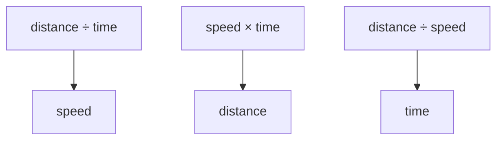

# Use rates and units to describe motion

A rate compares two measurements. Speed is a rate because it compares distance with time. You can
use the same math for a walking experiment, a toy car, or a competition robot.

## What you will learn

- how to calculate average speed;
- why every measurement needs a unit; and
- how to spot an answer that does not make sense.

## The rate triangle



If a student walks 6 meters in 4 seconds, the average speed is:

```text
speed = 6 meters ÷ 4 seconds = 1.5 meters per second
```

The words “per second” matter. A number without its unit does not tell the full story.

## Try a no-robot experiment

You need a tape measure, a timer, paper, and a clear walking area.

1. Mark a start and finish that are 5 meters apart.
2. Predict how many seconds a normal walk will take.
3. Walk the course while a partner times it.
4. Repeat three times without running.
5. Calculate the speed for each trial.
6. Add the three speeds and divide by three to find the mean speed.
7. Compare the prediction, each trial, and the mean.

Use a location away from traffic and other hazards. Stop if the path is wet, blocked, or unsafe.

## Check the units

A robot project may use meters, radians, seconds, and meters per second. Mixing centimeters with
meters can make a result 100 times too large or too small. Write the unit beside every value before
you calculate.

## Check your understanding

1. A cart travels 3 meters in 2 seconds. What is its average speed?
2. Why is “1.5” not a complete speed answer?
3. What could cause three walking trials to have different times?
