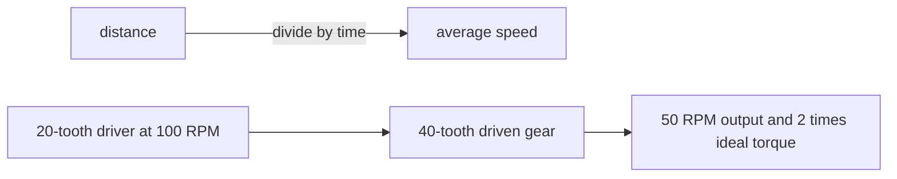

# Use rates and units to describe motion

A rate compares two measurements. Speed compares distance with time. A gear ratio compares the
turns of one gear with the turns of another. These ideas help us predict robot motion before we test
it. In this lesson, you will calculate a rate, explore a gear ratio, and collect evidence from a safe
walking test.

## Purpose and prerequisites

The purpose is to connect a math rule with motion you can measure. You should be able to divide
whole numbers and decimals. You should also know how to measure meters and seconds. You do not need
a robot for this lesson.

By the end, you can:

- calculate average speed with a unit;
- explain how a gear ratio changes ideal speed and torque;
- check whether an answer is reasonable; and
- record enough evidence for another student to repeat your work.

## Vocabulary

- **Rate:** a comparison between two measurements.
- **Distance:** how far an object travels.
- **Time:** how long an action takes.
- **Average speed:** total distance divided by total time.
- **RPM:** revolutions, or full turns, per minute.
- **Driver gear:** the gear that receives the input motion.
- **Driven gear:** the gear turned by the driver gear.
- **Ideal torque multiplier:** a math estimate of how a ratio changes turning force before losses.

Say each unit when you read a result. “One point five meters per second” gives more information than
“one point five.”

## Worked example

Mia walks 6 meters in 4 seconds. She writes the known values first:

```text
distance = 6 meters
time = 4 seconds
speed = distance ÷ time
speed = 6 meters ÷ 4 seconds
speed = 1.5 meters per second
```

Mia checks the result. A speed of 1.5 meters per second is a quick walk, so the answer is reasonable.
An answer of 150 meters per second would not match the test. That large answer may come from mixing
centimeters and meters.

Now suppose a 20-tooth gear drives a 40-tooth gear. The driver turns twice while the larger gear
turns once. If the driver turns at 100 RPM, the ideal output speed is 50 RPM. The larger driven gear
has an ideal torque multiplier of two. Real gears lose some energy, so measured torque will be lower.

## Visual model



The two examples use the same habit. Name each measurement, keep its unit, apply one rule, and check
the result against the real situation.

## Hands-on activity

First, use the model below. It is designed for a keyboard, touch screen, mouse, or trackpad. Start
with the default values. Record the output speed and ideal torque. Change only the driven gear to 20
teeth. Then change only the driver gear to 40 teeth. Use Reset before each new comparison.

<mechanismratioexplorer />

Next, run a no-robot walking test. You need a tape measure, a timer, paper, and a clear walking area.

1. Mark a start and finish that are 5 meters apart.
2. Predict how many seconds a normal walk will take.
3. Walk the course while a partner times it.
4. Repeat three times without running.
5. Calculate the speed for each trial.
6. Add the three speeds and divide by three to find the mean speed.
7. Compare the prediction, each trial, and the mean.

Use a location away from traffic and other hazards. Stop if the path is wet, blocked, crowded, or
unsafe. Students can complete and verify this measurement activity by following these limits.

## Checkpoints

Pause after the first calculation. Your answer must include distance divided by time and a speed
unit. Pause after the gear model. A larger driven gear should lower output speed and raise ideal
torque. Pause after the walking trials. The three results should be close, but they do not need to be
identical.

Ask a partner to trace one calculation. They should be able to point to the distance, time, math
operation, and final unit. If any part is missing, repair the record before moving on.

## Troubleshooting

If the speed is far too large, check whether you mixed centimeters and meters. If the speed is
negative, check your subtraction or data entry. Distance and elapsed time should be positive in this
activity. If every walking time is exactly the same, make sure the timer recorded enough decimal
places.

If the gear result feels backward, name the two gears. The driver receives the input. The driven gear
provides the output. A 20-tooth driver moving a 40-tooth driven gear gives one-half turn at the output
for each input turn.

## Evidence artifact

Create one table with these columns: trial, distance, time, calculated speed, and observation. Add
three walking trials. Under the table, add two gear model setups with their output speed and ideal
torque. Finish with a two-sentence claim about the pattern you observed.

Do not write only the final answer. Another student should be able to repeat your steps and find the
same pattern. This evidence proves that you completed the math activity. It does not prove that a
physical robot mechanism is safe, strong, or ready to run.

## Short assessment

1. A cart travels 3 meters in 2 seconds. What is its average speed with a unit?
2. Why is “1.5” not a complete speed answer?
3. What happens to ideal output speed when the driven gear becomes larger?
4. Name one reason a real gear system will not match the ideal torque value.
5. What evidence would let another student repeat your walking test?

Check your answers after you finish. The first answer is 1.5 meters per second. The others should use
your own clear words and evidence from the lesson.

## Extension challenge

Design a ratio that turns a 120 RPM input into an ideal 60 RPM output. Find two different pairs of
gear tooth counts that make the same ratio. Explain why both pairs give the same ideal speed. Then
name one practical reason a builder might choose one pair instead of the other.

For a deeper challenge, predict the distance traveled by a wheel in ten turns. You need the wheel
circumference and the number of turns. Keep every unit visible in your calculation.

## Related and next

Continue with [Read a telemetry graph](/academy/read-a-telemetry-graph?path=math-for-robotics).
That lesson shows how to describe a pattern before guessing its cause. You can also return to this
explorer when a later mechanical lesson asks you to compare speed and torque.
