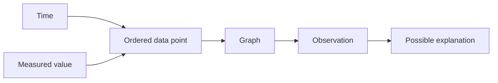

# Read a telemetry graph like a scientist

A telemetry graph shows how a measured value changes with time. You do not need a robot to learn
the skill. Any time-based data can become a graph, such as room temperature, walking speed, or
battery voltage.

## What you will learn

- how to read axes and units;
- how to find a trend, peak, and unusual point; and
- how to separate an observation from a guess.

## Read in this order

1. Read the title. It should name the thing being measured.
2. Read the horizontal axis. It often shows time.
3. Read the vertical axis and its unit.
4. Find the lowest and highest values.
5. Look for a trend, flat section, sudden jump, or missing section.
6. Write what you can see before writing why it may have happened.

“Voltage fell from 13 volts to 12 volts” is an observation. “The motor caused the drop” is a
possible explanation. You need more evidence before treating the explanation as a fact.

## Make a paper graph

Record the room temperature once every minute for five minutes, or use another safe measurement.
Draw time on the horizontal axis and the measurement on the vertical axis. Include a title, units,
and one point for every reading. Connect points only if the order between them matters.

Circle any unusual point. Check the original note before deleting it. An unusual point may be a
mistake, but it may also reveal something important.

## Check your understanding

1. Which axis usually shows time?
2. What is the difference between an observation and an explanation?
3. Why should you keep the original record when a point looks unusual?
