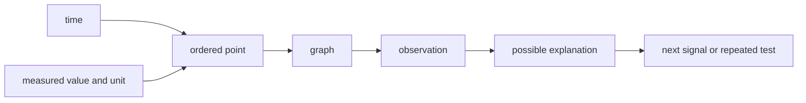

# Read a telemetry graph like a scientist

Telemetry is information a system records while it runs. A graph can show how one value changes
with time. Robot teams use these graphs to find patterns, compare tests, and decide what evidence to
collect next. A graph can show what happened. It cannot prove why it happened by itself.

## Purpose and prerequisites

The purpose is to read time-series data without jumping to a cause. Complete [Use rates and units to
describe motion](/academy/rates-units-and-motion?path=math-for-robotics) first. You should know that
every measurement needs a unit. You should also know that a rate compares two measurements.

By the end, you can read axes, find a trend or unusual point, keep a missing sample visible, and
write an observation before an explanation. You do not need a robot or a real log for this lesson.

## Vocabulary

- **Telemetry:** recorded information about a system while it operates.
- **Time series:** measurements kept in time order.
- **Horizontal axis:** the line that usually shows time from left to right.
- **Vertical axis:** the line that shows the measured value and its unit.
- **Trend:** a pattern of increase, decrease, or little change.
- **Peak:** a local high point.
- **Gap:** a place where no sample was recorded.
- **Observation:** a statement supported directly by visible data.
- **Explanation:** a possible reason for an observation.

## Worked example

A graph shows battery voltage once each second. The values are 13.0, 12.9, 12.7, 11.8, 12.6, and
12.7 volts. The lowest point is 11.8 volts at 3 seconds.

“Voltage reached 11.8 volts at 3 seconds” is an observation. Anyone reading the same values can
check it. “A motor caused the drop” is an explanation. That cause may be reasonable, but the voltage
graph alone does not show which device was active.

A stronger next test records motor command, motor current, and battery voltage on the same clock.
If the signals change together during repeated trials, the cause has better support. It is still
important to check wiring, battery condition, and test setup.

## Visual model

Read a graph from the outside inward. Start with the title. Read both axes and units. Find the range.
Only then study the shape of the line or points.

## Hands-on activity

Use the graph lab below. Choose each data set. Open its value table so you have a text version of the
same evidence. For each graph, write the title, horizontal-axis unit, vertical-axis unit, lowest
value, highest value, and one visible pattern.

<telemetrygraphlab />

Choose the statement that is an observation. If you choose an explanation, read the feedback and
name one extra signal that could test the cause. Do not fill a missing sample with a guess. Keep the
gap visible unless a documented method explains how a value was estimated.

Next, make a paper graph. Record room temperature once each minute for five minutes, or use another
safe measurement. Draw time on the horizontal axis. Draw the measurement and its unit on the
vertical axis. Add a title and one point for every reading.

## Checkpoints

After labeling the graph, cover the title and ask a partner what each axis means. Repair any label
that is unclear. After writing an observation, underline the numbers or shape that support it. If you
cannot point to evidence, rewrite the statement.

After proposing a cause, circle words such as “may,” “could,” or “possible.” These words show that
the cause is not yet proven. Name the next signal or repeated test before you continue.

## Troubleshooting

If the graph looks flat, check the vertical range. A very wide range can hide a small change. Do not
change the range to make a tiny effect look important. State the chosen range with the result.

If a point looks impossible, return to the original record before deleting it. Check the unit,
timestamp, sensor status, and nearby samples. An unusual point may be a data-entry error. It may also
show a short event worth testing again.

If two signals use different clocks, do not claim they happened at the same moment. Align their
timestamps first. If a sample is missing, show a gap. A line across the gap can falsely suggest that
the system measured every value between the two known points.

## Evidence artifact

Submit one marked graph and one evidence note. The graph needs a title, labeled axes, units, points,
and a visible gap if any sample is missing. The note needs three parts: one observation, one possible
explanation, and one next signal or repeated test.

Include the original value table beside the graph. Another student should be able to rebuild your
graph from that table. This artifact shows that you can read data. It does not prove a physical robot
fault or repair.

## Short assessment

1. Which axis usually shows time in a time-series graph?
2. What is the difference between an observation and an explanation?
3. Why should a missing sample remain visible?
4. A voltage graph dips while a robot drives. Write one observation and one possible explanation.
5. Name one extra signal that would help test your explanation.

Check that every observation points to a visible value, range, shape, or gap. Explanations should use
careful words until another source of evidence supports the cause.

## Extension challenge

Create two graphs from the same six values but use different vertical ranges. Ask a partner how the
graphs feel different. Explain why both graphs must show their scale. Then write one sentence that
describes the data without using words such as “huge” or “tiny.”

For another challenge, graph two signals that share the same timestamps. Mark one event and decide
whether the signals only changed together or whether one signal truly supports a cause.

## Related and next

Continue with [Decide whether camera evidence is trustworthy](/academy/camera-evidence-and-uncertainty?path=ai-ml-foundations)
to study uncertainty and rejected measurements. Return to this lesson before telemetry, control, or
commissioning activities. Those lessons all depend on the difference between evidence and a guess.
