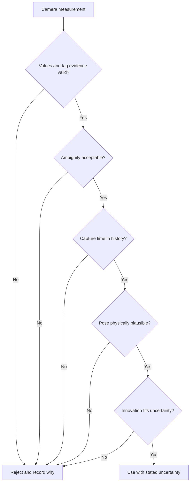

# Decide whether camera evidence is trustworthy

## Purpose and prerequisites

A camera can help a robot estimate where it is, but a camera does not produce perfect truth. This
lesson teaches you to check image evidence, keep uncertainty visible, and explain why a system may
reject a measurement. You do not need an earlier lesson or a robot. You need three privacy-safe
photos of one object, taken from different distances or angles.

The ARES examples describe AprilTag measurements. The same habits also help with charts, photos,
AI results, and other evidence.

## Vocabulary

- **Measurement:** an observation with limits, not perfect truth.
- **Uncertainty:** what is not known exactly about a measurement.
- **Ambiguity:** more than one pose or meaning may fit the same image.
- **Capture time:** when the camera made the image, not when software received it.
- **Outlier:** a result far enough from expected evidence to need review or rejection.
- **Innovation:** the difference between a measurement and the earlier estimate.
- **Rejection reason:** a visible record of why data was not used.
- **AprilTag:** a square coded target whose known ID and position can support pose measurement.

## Worked example

A robot is moving when its camera captures a tag. The result arrives after the robot has traveled
farther. If software treats the result as brand new, it compares two different moments. ARES uses
capture time to find the matching point in pose history. If that time is older than the saved
history, the measurement is rejected as too old.

The system also checks finite values, at least one tag, acceptable ambiguity, and a result that
fits the expected field and motion. A later
statistical check compares the size of the innovation with the uncertainty in both sources. A
large mismatch can be rejected while keeping a named reason for diagnosis.

## Visual model

The order matters because each failure gives a smaller, clearer investigation step.

## Hands-on activity

Choose three photos of the same safe object. Do not use faces, name tags, home addresses, screens,
or anything else that reveals private information.

1. Label each photo A, B, or C.
2. Record the distance, angle, light, and anything blocking the view.
3. List only what each photo directly shows.
4. List one uncertainty for each photo.
5. Rank the photos from strongest to weakest evidence for identifying the object.
6. Write a reason for each rank and ask a partner to check whether the reason follows the evidence.

Use the lab below to explore ordered camera gates. Turn off one check at a time and record the first
rejection reason. This is a code-derived learning model. Its switches stand for evidence calculated
elsewhere. It does not process images, solve AprilTags, run the ARES estimator, or locate a robot.

<visionuncertaintylab />

Reset the lab and confirm every gate returns to its starting state.

## Checkpoints

Separate observation from explanation. “The left edge is blurry” is an observation. “The camera
moved” is one possible explanation that needs more evidence.

Keep time attached to evidence. Receipt time and capture time are not always equal. A moving system
needs the measurement's original moment.

Do not turn rejection into disappearance. Record a reason such as unknown tag, high ambiguity,
old data, impossible geometry, or large innovation. A smooth-looking graph is not worth hiding a
real mismatch.

## Troubleshooting

If every photo seems equally strong, narrow the claim. A photo may be strong evidence for color but
weak evidence for exact size or distance.

If your ranking depends on what you expected to see, return to visible details. Mark any expectation
that the photo itself cannot support.

If the lab rejects a case you expected to pass, read the first rejection reason. Restore earlier
gates before changing a later gate. One failed gate is enough to block the result.

If a robot camera rejects many frames, do not simply raise every threshold. Check target identity,
camera mounting, timing, field map, calibration, lighting, and motion evidence separately.

## Evidence artifact

Submit a three-row photo evidence table. Include source label, claim, visible details, uncertainty,
rank, and reason. Use privacy-safe descriptions instead of attaching photos when sharing is not
approved.

Add a lab table with at least four gate trials. Record changed gate, result, first rejection reason,
and one useful next check. State clearly that the web lab did not inspect your photos or robot data.

## Short assessment

1. Why is a camera result a measurement instead of perfect truth?
2. Why does capture time matter for a moving robot?
3. What is the difference between an observation and an explanation?
4. Why should a rejection reason remain visible?
5. What does a large innovation tell an engineer to investigate?

## Extension challenge

Design a test for one camera uncertainty, such as distance or low light. Change only that factor
when possible. Record what stays constant, what changes, and what result would weaken your idea.

Then compare two rejection orders. Explain why checking valid numbers and identity before a complex
statistical test can make failures easier to understand.

## Related and next

Continue with [Use AprilTags and Reject Bad Vision
Measurements](/academy/controls-vision?path=controls-localization-autonomous) for the advanced ARES
pipeline. Use [Measure, Test, and Improve a
Design](/academy/measure-test-and-improve?path=applied-stem-outdoors) to plan a fair experiment.
