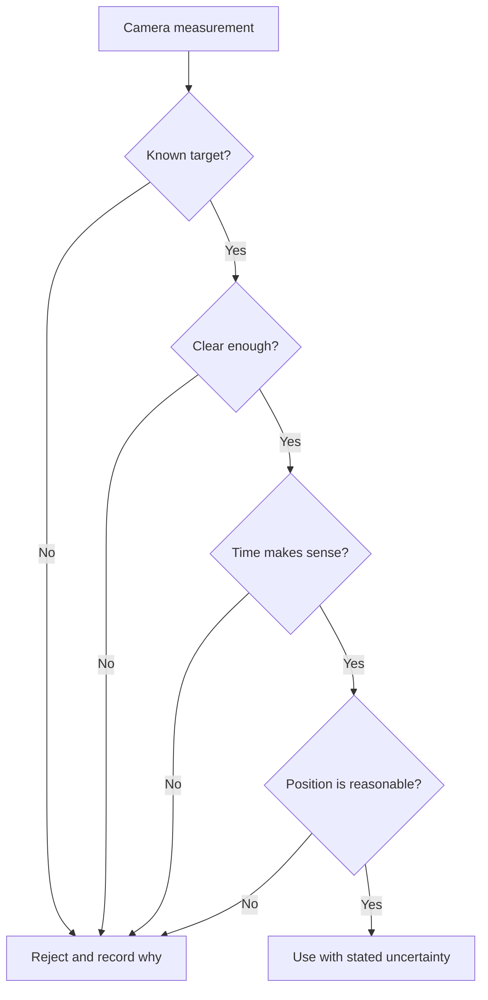

# Decide whether camera evidence is trustworthy

A camera can help a robot estimate where it is. The camera does not produce perfect truth. A good
system checks each measurement before using it. The same habit helps people judge photos, charts,
and other evidence.

## What you will learn

- why a measurement can be uncertain;
- how several checks build confidence; and
- why rejected data should stay visible.

## Sources of uncertainty

An image may be blurry, dark, partly blocked, or taken from a poor angle. A target may be confused
with another shape. The robot may receive the result after it has moved. Each problem changes how
much the system should trust the result.

ARES records capture time so a delayed measurement can update the correct point in pose history.
It rejects unknown tags, high ambiguity, old data, and very large jumps. It does not hide those
rejections just to make the screen look smooth.

## Try it with ordinary photos

Choose three photos of the same safe object from different distances or angles. Do not use photos
that reveal private information.

1. List what you can identify in each photo.
2. List what is blocked or unclear.
3. Rank the photos from strongest to weakest evidence.
4. Write one reason for each rank.
5. Ask a partner whether the stated reasons support the order.

## Check your understanding

1. Why is a camera result a measurement instead of perfect truth?
2. Why does capture time matter for a moving robot?
3. What can engineers learn from rejected measurements?
