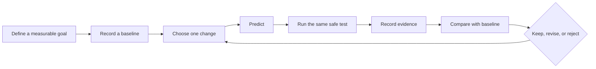

# Measure, test, and improve a design

## Purpose and prerequisites

Engineering is a cycle: name a goal, plan a change, test it, and use evidence to choose the next
step. This lesson uses a paper shade and two ice cubes, so you can practice without a robot or
computer. You do not need an earlier lesson.

You need two similar ice cubes, two plates, paper, tape, a timer, a ruler, and a sunny window or
safe outdoor space. Keep meltwater away from electronics. Wipe spills as soon as they happen.

## Vocabulary

- **Goal:** the result a design is meant to improve.
- **Variable:** a factor that can change during a test.
- **Independent variable:** the one factor you choose to change.
- **Response variable:** the result you measure.
- **Comparison:** a setup used as a fair baseline.
- **Trial:** one complete run of the test.
- **Repeatability:** how close results are when a test is repeated the same way.
- **Revision:** a recorded design change linked to new evidence.

## Worked example

The goal is to slow melting for ten minutes. One ice cube sits under a paper shade. A similar cube
sits on an equal plate without shade. Shade is the independent variable. The measured width or
remaining mass is the response variable. Starting cube size, plate type, place, and start time
should stay as similar as possible.

After ten minutes, the shaded cube measures 24 millimeters across and the comparison measures 19
millimeters. That result supports a narrow claim for this trial: the shaded setup kept a larger
measured width. It does not yet prove every paper shade works in every kind of weather.

## Visual model

The cycle repeats, but the record preserves each version. Do not erase a result because it differs
from your prediction.

## Hands-on activity

1. Write the goal: slow the melting of one ice cube for ten minutes.
2. Choose one response measure. Width in millimeters is simple; mass is better if a safe scale is available.
3. Measure both starting cubes and record any difference.
4. Put one cube on each equal plate in the same place.
5. Build a paper shade over one cube without touching it. Leave the comparison unshaded.
6. Predict which cube will keep the larger response value and explain why.
7. Start both trials at the same time.
8. Measure each cube every two minutes using the same method.
9. Record sun, wind, room or air temperature, and any unexpected change.
10. Compare the final values. Change one part of the shade and repeat with new similar cubes.

Use the evidence lab below to classify claims from your work. It is a conceptual sorter. It does
not observe your experiment, verify measurements, or prove why a result occurred.

<evidencelevelscenarios />

## Checkpoints

Write the measurement method before the test. “Looks smaller” is hard to repeat. “Measure the widest
part in millimeters from the same camera-facing side” gives another student a clearer method.

Change only one planned factor. If you change shade color, height, and paper shape together, the
result cannot show which change mattered.

Keep the comparison useful. Both cubes should start at the same time, on similar plates, in the
same place. Record differences you cannot remove instead of pretending the setups are identical.

Label measured, calculated, and estimated values. A photo can show the setup, but numbers and notes
are needed to explain what happened.

## Troubleshooting

If cubes start at different sizes, measure and record both. Use new cubes for the next trial if the
difference is large enough to weaken the comparison.

If a cube changes shape and width becomes misleading, record a second dimension or use mass in a
later trial. Do not switch methods halfway through without marking the change.

If clouds, wind, or indoor temperature change, note the time. Weather and room conditions are
possible competing causes, so repeat before making a broad claim.

If the result disagrees with your prediction, keep it. Check the setup, units, and method. A
surprising valid result is evidence, not a failure of the experiment.

## Evidence artifact

Submit a test plan with goal, independent variable, response variable, comparison, constants, and
safety notes. Add a data table with time, shaded result, comparison result, units, and observations.

Include a labeled sketch or privacy-safe setup photo. Add a revision record with version, one
change, prediction, result, decision, and next test. Another student should be able to follow the
record without asking what you changed.

## Short assessment

1. Why should the starting ice cubes be similar?
2. What is the independent variable in this test?
3. Why do engineers change one planned factor at a time?
4. What conditions could weaken the comparison?
5. Why should a result remain in the record when it disagrees with a prediction?

## Extension challenge

Repeat the best design at least three times. Find the range of the final shaded measurements. A
small range supports repeatability for this method, while a large range points to uncontrolled
variables or a weak measurement method.

Then write a robot version of the same plan without running it. Choose one safe software or
simulation change, one response signal, one baseline, and one stop condition. State which evidence
would still be needed before making a physical-robot claim.

## Related and next

Continue with [Measure, Sketch, and Record a
Design](/academy/mechanical-measurement-design-notebook?path=mechanical-design-fabrication) for robot
design records. Use [Compare Logs and Replay a
Failure](/academy/testing-logs-replay?path=testing-debugging-commissioning) for the same comparison
cycle with software data.
