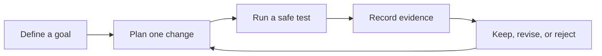

# Measure, test, and improve a design

Engineering is a cycle. You name a goal, make a plan, test it, and use evidence to choose the next
change. This activity works without a robot or computer.

## What you will learn

- how to write a testable goal;
- why changing one thing at a time helps; and
- how to record a result that another student can check.

## Build a paper shade test

You need two equal ice cubes, two plates, paper, tape, a timer, and a safe outdoor or sunny-window
space. Keep water away from electronics and clean spills at once.

1. Write the goal: slow the melting of one ice cube for ten minutes.
2. Put one cube on each plate.
3. Use paper to shade one cube. Leave the other setup unchanged.
4. Predict which cube will keep more mass or size.
5. Start both trials at the same time.
6. Record a simple size measure every two minutes.
7. Compare the final results.
8. Change one part of the shade and repeat with new equal cubes.

The unshaded cube is the **comparison**. It helps show whether the paper shade mattered. Weather can
change between trials, so record sun, wind, and air temperature when possible.

## Make your evidence useful

Record the setup, the one change, each measurement, and any problem. A photo can show the setup, but
numbers and notes explain what happened. Never change or remove a result just because it disagrees
with your prediction.

## Check your understanding

1. Why should the two starting ice cubes be as equal as possible?
2. Why do engineers change one part at a time?
3. What weather facts could affect this test?
