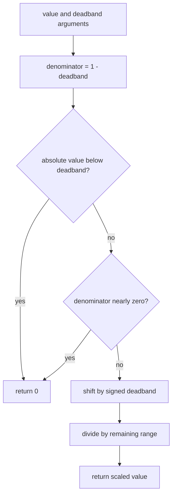

# Read and test a small Kotlin function

## Purpose and prerequisites

ARES robot projects use Kotlin for shared logic and team code. You do not need to memorize the
language before making a useful change. In this lesson, you will read one current ARES function,
predict its result, and check that prediction with a focused unit test.

Complete [The ARES Software Workspace](/academy/ares-workspace-map?path=programming-with-ares)
first. Use a branch or temporary copy for edits. This lesson does not need a powered robot.

The source example is `InputMath.applyDeadband`. A deadband turns tiny joystick values into zero so
small stick drift does not become a drive request. The function works only with numbers. It does not
read a gamepad, change robot state, or command a motor.

## Vocabulary

- **Value:** data with a name, such as `denominator`.
- **`val`:** a name that cannot be assigned a different value later.
- **Type:** the kind of data a value holds. Kotlin's `Double` type stores decimal numbers.
- **Function:** named code that accepts inputs and returns a result.
- **Parameter:** a named input in a function definition.
- **Argument:** a value supplied when the function is called.
- **Expression:** code that produces a value.
- **Branch:** one possible path through a decision.
- **Test:** code that checks an expected result.
- **Tolerance:** a small allowed difference when comparing decimal results.

## Read the current function

Here is the decision shape of the current ARES function. The comments describe each branch.

```kotlin
fun applyDeadband(value: Double, deadband: Double): Double {
    val denominator = 1.0 - deadband
    return when {
        abs(value) < deadband -> 0.0              // inside the quiet area
        abs(denominator) < 1e-6 -> 0.0            // avoid division by nearly zero
        else -> (value - sign(value) * deadband) / denominator
    }
}
```

The function has two parameters. Both use `Double`. The `: Double` after the closing parenthesis is
the return type.

`val denominator = 1.0 - deadband` creates a local value. The name `denominator` cannot be assigned
again inside this call. A later function call creates its own local value.

The `when` block checks branches from top to bottom. It returns the result of the first matching
branch. The valid input contract uses a joystick value from -1.0 through 1.0 and a deadband from 0.0
up to, but not including, 1.0. The function documentation gives that contract; this function does
not clamp or reject every invalid argument for its caller.

## Worked example

Read this call:

```kotlin
val result = InputMath.applyDeadband(value = 0.55, deadband = 0.10)
```

`value` and `deadband` are parameter names. `0.55` and `0.10` are arguments in this call.

Trace the function one expression at a time:

1. `denominator` is `1.0 - 0.10`, which is `0.90`.
2. `abs(0.55) < 0.10` is false, so the first branch does not run.
3. `abs(0.90) < 0.000001` is false, so the guard branch does not run.
4. `sign(0.55)` is positive 1.
5. The last branch becomes `(0.55 - 1 × 0.10) / 0.90`.
6. The result is `0.50`.

The function does more than cut away the quiet area. It rescales the remaining stick travel. That
is why an input of 1.0 can still produce 1.0 after a 0.10 deadband.

Now try `value = -0.55`. The sign is negative 1, so the result is `-0.50`. The current unit test
checks both cases.

## Visual model



This diagram shows software decisions. It does not show a gamepad read, Redux action, controller,
adapter, motor command, or physical motion.

## Hands-on activity

Use the code-derived tracer below. It models the valid input contract of the current function.

<kotlinexpressionlab />

1. Select **Inside deadband test**. Predict the branch and result before reading the trace.
2. Confirm that `0.04` with a `0.05` deadband returns zero.
3. Select **Positive rescale test**. Write the substitution before reading the intermediate values.
4. Confirm that `0.55` with a `0.10` deadband returns `0.50`.
5. Select **Negative rescale test**. Explain which sign changes and which values stay the same.
6. Select **Full positive input**. Explain why the result is still 1.0.
7. Enter another valid pair. Keep the joystick value from -1.0 through 1.0 and the deadband below
   1.0.

The tracer uses decimal numbers like Kotlin `Double`, but it does not compile or execute Kotlin.

## Walk the source and tests

From the ARES monorepo root, find the function and its focused tests:

```powershell
rg -n "fun applyDeadband" `
  ARESLib-Kotlin/core/src/main/kotlin/com/areslib/math/InputMath.kt

rg -n "deadband correctly|deadband rescales" `
  ARESLib-Kotlin/core/src/test/kotlin/com/areslib/math/InputMathTest.kt
```

Open `InputMathTest.kt`. Read one assertion:

```kotlin
assertEquals(0.5, InputMath.applyDeadband(0.55, 0.1), 0.001)
```

The first argument is the expected result. The second argument is the function result. The third is
the tolerance. Decimal math may contain tiny representation differences, so the test accepts a
difference no larger than 0.001.

Run only this test class:

```powershell
Set-Location ARESLib-Kotlin
.\gradlew.bat :core:test --tests "com.areslib.math.InputMathTest"
```

A passing result proves that the checked source passed these software cases. It does not prove that
a gamepad is centered, a control mapping is correct, or a robot is safe to drive.

## Checkpoints

- Can you name the two parameters and their types?
- Can you separate a parameter from an argument?
- Can you identify the first true `when` branch for a given call?
- Can you substitute arguments into the rescale expression?
- Can you explain why the unit test uses a tolerance?
- Can you state what the function and test do not verify?

## Troubleshooting

| Symptom                     | Check                                                                            |
| --------------------------- | -------------------------------------------------------------------------------- |
| Name is unresolved          | Check spelling, imports, and the value's scope.                                  |
| Type mismatch appears       | Confirm that both arguments are `Double`, such as `0.1` instead of a text value. |
| Result is zero              | Check whether the absolute input is smaller than the deadband.                   |
| Negative result looks wrong | Trace `sign(value)` and keep the parentheses around the numerator.               |
| Decimal assertion fails     | Check the expected value and tolerance before changing production math.          |
| Build uses the wrong module | Run the task from `ARESLib-Kotlin` with the `:core:test` task.                   |
| Many files changed          | Stop and inspect generated or formatting changes before committing.              |

Do not remove the denominator guard merely because valid deadbands stay below 1.0. Boundary guards
should be changed only with a source-backed reason and new tests.

## Evidence artifact

Create a four-row trace table using these current test cases:

| Call                         | First matching branch | Substitution | Predicted result | Test result |
| ---------------------------- | --------------------- | ------------ | ---------------- | ----------- |
| `applyDeadband(0.04, 0.05)`  |                       |              |                  |             |
| `applyDeadband(0.55, 0.10)`  |                       |              |                  |             |
| `applyDeadband(-0.55, 0.10)` |                       |              |                  |             |
| `applyDeadband(1.0, 0.10)`   |                       |              |                  |             |

Record the exact focused command, ARES revision, and pass or fail result. Add one sentence that
separates this software evidence from a physical joystick or robot check.

Students can review this evidence and verify robot behavior through the team's normal safety
process. Lead Coach approval is only part of publishing a website post; it is not required to run
this software test or verify robot functionality.

## Short assessment

1. What is the difference between a parameter and an argument?
2. What does `val denominator` prevent inside one function call?
3. Which branch handles an input whose absolute value is smaller than the deadband?
4. Why does the active range divide by `1.0 - deadband`?
5. What does the `0.001` assertion argument mean?
6. Does a passing `InputMathTest` prove that a physical robot moved correctly?

A strong answer names the branch, shows the substitution, includes units or normalized ranges, and
keeps software evidence separate from physical evidence.

## Extension challenge

Read `InputMath.applyCurve` in the same source file. It returns
`sign(value) * abs(value).pow(exponent)`.

Predict the results for `0.5` and `-0.5` with an exponent of 2.0. Then find the two matching
assertions in `InputMathTest`. Explain how the function preserves sign while changing magnitude.

As a larger challenge, write a pure Kotlin function with the same valid input contract as
`applyDeadband`. Add tests for positive, negative, inside-deadband, boundary, and full-scale values.
Do not add hardware reads, files, networks, clocks, or global state to the function.

## Related and next

Continue to [Follow a Robot Request from Input to Output](/academy/robot-input-to-output?path=programming-with-ares).
Then use [State, Actions, and Reducers](/academy/redux-state-actions-reducers?path=programming-with-ares)
to trace typed actions and immutable state. Later lessons add cached I/O and subsystem ownership.
