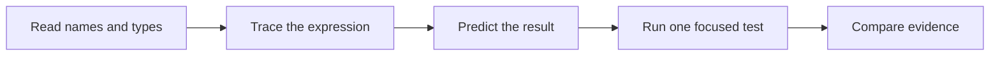

# Read and change small Kotlin programs

## Purpose and prerequisites

ARES robot projects use Kotlin for shared logic and team code. You do not need to memorize the
language before making a useful change. In this lesson, you will read values, function calls, and a
small test. You will predict a result before running it.

Complete [The ARES Software Workspace](/academy/ares-workspace-map?path=robotics-foundations).
Use a branch or temporary copy for edits. This lesson does not require a powered robot.

## Vocabulary

- **Value:** data with a name, such as `initialState`.
- **`val`:** a named reference that cannot be reassigned.
- **Type:** the kind of data a value holds.
- **Function:** named code that accepts inputs and returns a result.
- **Argument:** a value passed into a function call.
- **Expression:** code that produces a value.
- **Test:** code that checks an expected result.
- **Assertion:** a test statement that compares actual and expected values.

## Worked example

Read this expression from left to right:

```kotlin
val adjusted = raw * scale + offset
```

If `raw` is 100, `scale` is 0.01, and `offset` is -0.5, multiplication happens first. The product
is 1.0. Adding -0.5 gives 0.5. The result is stored under the name `adjusted`.

The `val` keyword does not mean the object can never change inside. It means this name cannot be
assigned to a different result later. In beginner robot code, clear names and small expressions make
unit mistakes easier to spot.

## Visual model



The pinned ARES onboarding test follows the same idea with larger values. It creates an initial
`RobotState`, calls `rootReducer` with one action, and stores the result in `step1`. It calls the
reducer again and stores `step2`. Assertions then check the final drive mode and heading target.

## Hands-on activity

1. Open the pinned `StudentOnboardingTest.kt` source.
2. Find every line that begins with `val`.
3. Write the name and the expression on the right side of each equals sign.
4. Find the two `rootReducer` calls.
5. Circle the current state argument in each call.
6. Underline the action argument in each call.
7. Predict which state field each action changes.
8. Find both assertions and write their expected values.
9. Run only the focused onboarding test from the reviewed release snapshot.
10. Compare the output with your prediction before changing code.

Use the calculator below to practice expression order. Change one value at a time. Say the expected
result before checking the displayed value.

<kotlinexpressionlab />

This browser calculator does not compile Kotlin. It only reproduces one fixed arithmetic rule.

## Checkpoints

- Can you separate a value name from the expression that creates it?
- Can you find the arguments inside a function call?
- Can you state which result becomes the next function input?
- Do you predict the assertion result before running the test?
- Did you keep units and value meaning in your notes?

## Troubleshooting

| Symptom | Check |
| --- | --- |
| Name is unresolved | Check spelling, imports, and the value's scope. |
| Type mismatch appears | Compare the expected type with the supplied argument. |
| Test fails after an edit | Read the first failed assertion and compare actual with expected. |
| Decimal math looks wrong | Check operation order, signs, and units. |
| Build uses the wrong module | Run the task from the ARES monorepo root with the named module. |
| Many files changed | Stop and inspect generated or formatting changes before committing. |

## Evidence artifact

Create a trace table for `initialState`, `step1`, and `step2`. Record how each value is created, the
important state field, and the expected assertion. Add the exact focused test command and result.

Then make one safe change in a temporary branch. A good first change is an expected value in a copy
of the expression exercise, not a physical output. Predict the new result, run the test, and save the
before-and-after evidence.

## Short assessment

1. What does `val` prevent?
2. What are the two arguments passed to `rootReducer` in the example?
3. Why should you predict a test result before running it?
4. What happens first in `raw * scale + offset`?
5. Why is a passing unit test not physical robot evidence?

## Extension challenge

Write a pure Kotlin function that accepts `raw`, `scale`, and `offset`, then returns the adjusted
value. Add tests for a positive value, a negative value, zero scale, and a decimal result. Keep the
function free of hardware, files, networks, clocks, and global state.

## Related and next

Continue to [Follow a Robot Request from Input to Output](/academy/robot-input-to-output?path=programming-with-ares).
Then use [State, Actions, and Reducers](/academy/redux-state-actions-reducers?path=programming-with-ares)
to trace pure state changes. Later lessons add cached I/O and subsystem ownership.
