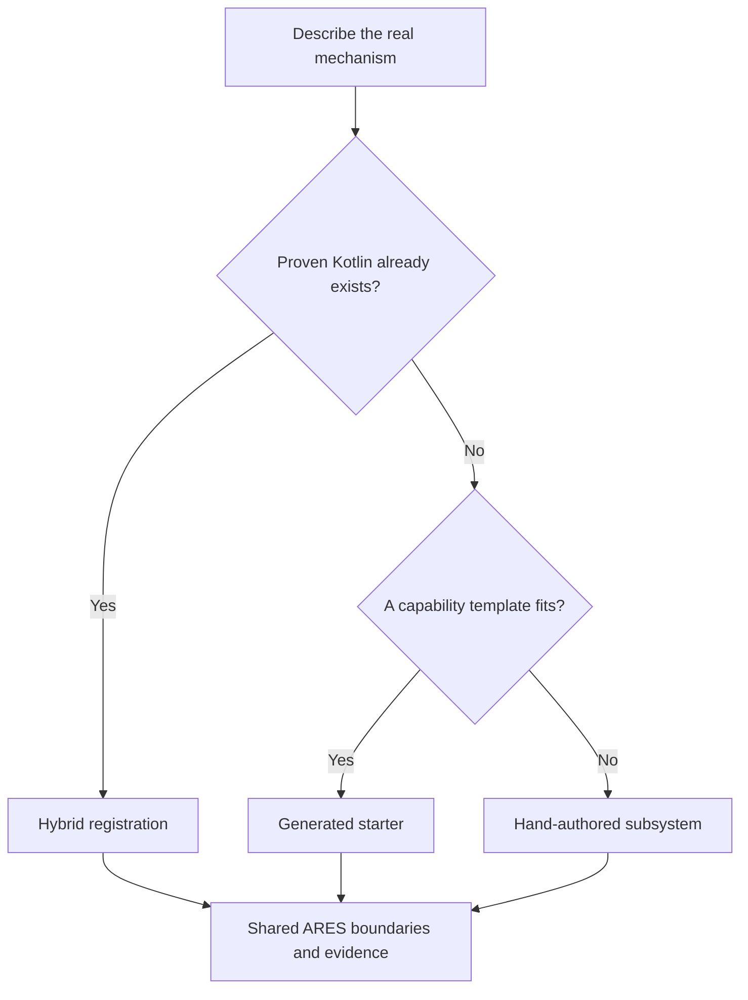

# Author a code-first or hybrid subsystem

## Purpose and prerequisites

ARES supports more than one safe way to start a subsystem. A new, common mechanism often begins
with a generated starter. Old Kotlin may already work well and have good tests. That code can stay
user-owned. A small subsystem file can tell ARES what the code owns. A mechanism that does not fit
a template can be written by hand. It still needs the same clear boundaries.

Complete [Read and Change Small Kotlin Programs](/academy/programming-kotlin-basics?path=programming-with-ares),
[Read Hardware Once and Write Safe Outputs](/academy/programming-io-caching?path=programming-with-ares),
and [Author GUI-Owned FTC Indicator Lights](/academy/ftc-gui-owned-indicator-lights?path=programming-with-ares).
This lesson uses source review and tests. It does not require a powered robot.

## Vocabulary

- **Capability template:** a starting pattern for a common mechanism and its safety needs.
- **Generated starter:** editable Kotlin created once from a reviewed definition.
- **User-owned:** source that generation must never replace.
- **Generated plumbing:** repeatable build output recreated from the subsystem definition.
- **Hybrid registration:** a descriptor that maps existing user-owned Kotlin without replacing it.
- **I/O contract:** the shared units, cached inputs, outputs, safe state, and cleanup rules.
- **Lifecycle:** the ordered read, control, write, stop, and close behavior.
- **Parity:** matching observable rules across a physical adapter and a mock.

## Worked example

Imagine two teams need a subsystem. The first team is starting a new elevator. Its behavior fits the
position template. They complete the safety worksheet first. They preview the file list. Next, they
create editable starters and review each change. Those starter files then belong to the team.

The second team already has tested Prism lighting code. It uses special effects from its maker.
Rewriting it would discard useful evidence. The reviewed ARES example keeps its Kotlin
`USER-OWNED`. It adds a subsystem document and checks its action names. ARES creates only the
needed registration files. That is hybrid registration.

Neither path skips design work. Both must state units and cached inputs. Both need output bounds, a
safe neutral, failure recovery, simulation support, and tests.

## Visual model

The choice changes who owns each file. It does not change the needed safety and test evidence.

## Hands-on activity

1. Choose one real or proposed mechanism. Do not invent team hardware or test results.
2. State its purpose and physical units. Define its positive direction and safe neutral.
3. List any existing Kotlin, actions, mocks, and tests.
4. Decide whether a common capability template describes the behavior.
5. Use the lab below and record its suggested starting path.
6. Compare the result with the pinned subsystem-authoring guide.
7. List the domain state and actions. Keep requested intent separate from observed feedback.
8. Sketch an I/O contract. Include one refresh point, cached values, validity, bounded outputs, `safe`, and `close`.
9. Mark each proposed artifact as user-owned, generated starter, or generated do-not-edit.
10. Write the tests required before any physical attempt.

<subsystemownershiplab />

The lab asks only two questions. Real designs need a full capability and hazard review.

## Checkpoints

- Does the chosen path preserve useful existing evidence?
- Can a reviewer tell which files students may edit?
- Are state, control, I/O, the physical adapter, the mock, the lifecycle, and tests separate?
- Does the I/O contract name units and validity instead of returning mystery numbers?
- Can every output reach a safe neutral after stop, close, or a failed write?
- Does the mock enforce the same bounds and fault rules as the physical adapter?

## Troubleshooting

| Symptom | Check |
| --- | --- |
| Generator wants to replace edited Kotlin | Stop. Check the ownership header and previewed replacement diff. |
| Existing subsystem is invisible in Studio | Add an accurate hand-authored descriptor; do not scan or guess from imports. |
| One file owns state, hardware, and policy | Split responsibilities before adding more behavior. |
| Mock allows behavior hardware blocks | Compare both adapters against one contract-test table. |
| Output fault clears on the next move command | Require explicit neutral recovery before re-arming. |
| Generated registry was edited by hand | Change the canonical descriptor and regenerate instead. |
| Physical behavior differs from simulation | Record the gap; simulation cannot prove wiring, polarity, limits, or motion. |

## Evidence artifact

Create a subsystem ownership map. Include every planned file and its owner. State what each file
does. Mark whether a new build may change it. Add a boundary diagram. Show state, control, the I/O
contract, both adapters, the lifecycle, and tests.

Then create a test plan. Cover safe startup, bad or old feedback, bounded output, failed writes,
neutral recovery, stop, and close. Compare the physical and mock rules. Run only hardware-free
checks in this lesson. Label source review, build results, unit tests, and simulation as different
evidence levels.

Students may later verify physical behavior through the team's normal safety procedure. Start
disabled, restrain or clear the mechanism, reduce output, and keep an accessible stop path. A
physical result belongs in the evidence record only after the student actually observes it.

## Short assessment

1. When is a generated starter usually the best first path?
2. Why can hybrid registration be safer than rewriting proven Kotlin?
3. Which generated files should never be edited directly?
4. What responsibilities stay required in all three paths?
5. Why does matching mock behavior not prove physical behavior?

## Extension challenge

Review one existing subsystem without changing it. Compare its current structure with the
hand-authoring worksheet. Record missing evidence as a question, not a claim. Propose a
descriptor-only registration, a reviewed generated starter, or no move. Support the choice with
pinned source paths and test results.

## Related and next

Return to the indicator-light tutorial to compare a GUI-owned descriptor with this code-first path.
Next, study subsystem coordination in
[Coordinate Subsystems and Fail Safe](/academy/ftc-season-composition-and-safe-lifecycle?path=programming-with-ares).
Then test shared logic across mocks and simulation before any physical claim.
