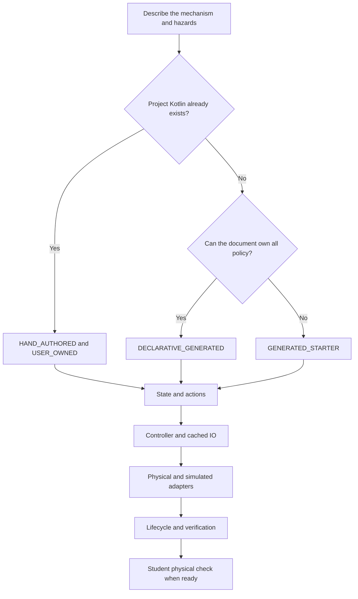

# Author a code-first or hybrid subsystem

## Purpose and prerequisites

A subsystem owns one robot job, such as moving an arm or reading a beam-break sensor. ARES supports
three implementation paths. The path decides who owns the Kotlin files. It does not remove the need
for safe outputs, clear units, cached inputs, simulation, or tests.

Complete [Read and Change Small Kotlin Programs](/academy/programming-kotlin-basics?path=programming-with-ares),
[Read Hardware Once and Write Safe Outputs](/academy/programming-io-caching?path=programming-with-ares),
and [Author GUI-Owned FTC Indicator Lights](/academy/ftc-gui-owned-indicator-lights?path=programming-with-ares).
This lesson uses source review and hardware-free tests. It does not require a powered robot.

## Vocabulary

- **Subsystem document:** the canonical `.aressubsystem` file under `.ares/subsystems/`.
- **Declarative generated:** ARES creates runtime plumbing from the document in generated folders.
- **Generated starter:** ARES creates editable Kotlin once, then protects it behind review rules.
- **Hand-authored:** the project owns existing or custom Kotlin and names its integration points.
- **User-owned:** source that ARES must never replace.
- **Generated plumbing:** repeatable build output that students do not edit or commit.
- **I/O contract:** the units, cached inputs, outputs, safe state, and cleanup rules.
- **Lifecycle:** the ordered refresh, state update, output, stop, and close behavior.
- **Parity:** matching observable rules across a physical adapter and a simulator or mock.

## Worked example

Start with the ownership question, not a file-count goal. The reviewed ARES 11.1.0 source uses
subsystem document schema 11. It names three implementation kinds:

| Starting point | ARES implementation | Source ownership | Normal result |
| --- | --- | --- | --- |
| The document fully describes the behavior | `DECLARATIVE_GENERATED` | `GENERATED_DO_NOT_EDIT` | Runtime, mock, and baseline tests stay in generated folders. |
| A new mechanism needs editable Kotlin | `GENERATED_STARTER` | `GENERATED_STARTER` | Missing editable starter files are created in normal source folders. |
| Proven or custom Kotlin belongs to the project | `HAND_AUTHORED` | `USER_OWNED` | The document records module, source, classes, simulation, and action keys. |

The first path is the GUI-owned path from the indicator-light lesson. It is useful when the
descriptor can express the state, hardware, control, and safety policy. The second path gives
students editable state, controller, I/O, platform, and mock files. The third path is also called a
hybrid registration when it connects proven project Kotlin to ARES.

Suppose a project already has a tested flywheel controller. Replacing it with a starter would throw
away source history and test evidence. A hand-authored document keeps that Kotlin `USER-OWNED`. It
must name the Gradle module, project-relative source files, subsystem class, I/O contract class,
hardware adapter, simulation support, and capability action keys. ARES does not scan arbitrary
Kotlin and guess these facts.

Now suppose a new elevator fits a position-control template but needs custom game logic. A generated
starter may be a good beginning. Students first state the position unit, positive direction, soft
limits, homing rule, safe neutral, feedback age, output bounds, and fault recovery. They preview the
files before writing them. Once created, the editable starters belong to the project.

## Visual model



Every path ends at the same evidence boundary. Generated code can reduce repeated plumbing. It
cannot prove wiring, motor direction, physical clearance, sensor scale, or safe motion.

### Preview and replacement rules

For an FTC project, these tasks expose the current command-line flow:

```powershell
# Report creates, unchanged files, protected files, and starter diffs. This writes nothing.
.\gradlew.bat :TeamCode:previewSubsystemChanges

# Create missing starters and rebuild generated plumbing.
.\gradlew.bat :TeamCode:generateSubsystemStarters

# Generate and then verify the complete ARES project contract.
.\gradlew.bat :TeamCode:generateAresProject
.\gradlew.bat :TeamCode:verifyAresProject
```

The preview classifies each starter as add, unchanged, replace, or protected. A changed file with a
`GENERATED STARTER` header can be replaced only after reviewing its structured diff and supplying
the exact hash-bound confirmation token. A user-owned or unknown file is protected. It is never an
eligible replacement target.

Generated do-not-edit files belong under Gradle `build/generated` folders. A clean build may delete
them. The canonical subsystem document recreates them. Do not copy them into a normal source folder
or commit them as if they were student-owned code.

## Hands-on activity

Choose one real subsystem in a checked-in project. You may also use a real proposed subsystem if the
team has written its requirements. Do not invent hardware, source, or test results.

1. Find its `.aressubsystem` file, or record that the canonical document is missing.
2. State the mechanism purpose, physical units, positive direction, and safe neutral.
3. List existing Kotlin, actions, adapters, mocks, tests, and documentation.
4. Decide whether the descriptor can own all runtime policy.
5. Decide whether useful project Kotlin must stay user-owned.
6. Use the lab below to choose a starting path and expose missing evidence.
7. Compare the result with the pinned source references below the lesson.
8. Trace requested intent separately from observed feedback and validity.
9. Mark each file as user-owned, generated starter, or generated do-not-edit.
10. Preview changes. Do not apply them during this lesson unless your branch and review are ready.
11. Record the checks needed before simulation and before a physical test.

<subsystemownershiplab />

The lab is a planning model. A green result means only that its short checklist is filled in. It
does not validate a descriptor or approve code, simulation, or physical motion.

### Build an evidence ladder

Keep each result at its real strength:

1. **Configuration review:** the document decodes and its typed rules are valid.
2. **Generated behavior tests:** declared startup, limits, faults, recovery, and cleanup behave in a mock.
3. **Platform integration tests:** the project lifecycle and adapters meet their platform contract.
4. **Simulator tests:** an FTC project runs against desktop mocks and its OpMode lifecycle.
5. **Build:** the project package compiles without deployment.
6. **Physical check:** a student observes wiring, direction, neutral, limits, and sensors on the robot.

Passing the first five layers can make a project ready for a physical checklist. It cannot mark the
physical check complete. Students can verify robot functionality using the team's normal safety
process. Website posts follow the separate Lead Coach editorial workflow.

## Checkpoints

- Does the chosen path match the current source ownership?
- Can a reviewer tell which files students may edit?
- Does a hand-authored document name every source file and runtime class instead of guessing?
- Are requested intent and observed feedback separate?
- Does each input have a unit, validity rule, and one refresh owner?
- Can every output reach neutral after disable, stop, close, or a failed write?
- Does fault recovery require an explicit successful neutral when the mechanism declares it?
- Does the mock enforce the same bounds and fault rules as the physical adapter?
- Are generated behavior, simulation, and physical evidence labeled separately?

## Troubleshooting

| Symptom | Check |
| --- | --- |
| The builder proposes editable files for behavior the document already owns | Check whether `DECLARATIVE_GENERATED` is the simpler truthful path. |
| The generator wants to replace edited Kotlin | Stop. Check the ownership header and review the structured diff and current token. |
| A user-owned file appears as replaceable | Treat this as a defect. Do not change the ownership header to bypass protection. |
| Existing Kotlin is invisible in Studio | Add accurate hand-authored metadata; do not scan imports or guess class names. |
| A hand-authored document requests generated tests | Remove the false request and name the project's own test and simulation evidence. |
| A generated action name was typed by hand | Generated paths derive actions from target state fields. Hand-authored paths declare existing catalog keys. |
| The mock allows behavior that hardware blocks | Compare both adapters against one contract-test table. |
| Output fault clears on the next move command | Require an explicit successful neutral before re-arming. |
| The build passes but the robot is untested | Keep the physical layer not run and follow the student safety checklist. |

## Evidence artifact

Create a subsystem ownership map. Include the canonical document and every planned Kotlin file.
State each file's owner, module, destination, and responsibility. Mark whether regeneration may add,
recreate, replace after a token, or never replace it.

Add a boundary diagram that shows state, control, the I/O contract, physical and simulated adapters,
lifecycle registration, and verification. Then write a test table for safe startup, stale or invalid
feedback, command limits, failed writes, neutral recovery, disable, stop, and close. Add homing,
calibration, interlocks, current validity, and followers when the real mechanism uses them.

Attach only evidence you ran or inspected. A source link proves what a reviewed file says. A unit
test proves its tested behavior. A simulator result does not prove a motor's mounting direction or a
sensor's physical scale. Keep unknown items visible as gaps.

## Short assessment

1. When should a subsystem use declarative generated ownership?
2. Why can a hand-authored registration be safer than rewriting proven Kotlin?
3. What is the difference between a generated starter and generated do-not-edit plumbing?
4. Why does starter replacement need a new token after the source or proposal changes?
5. Which facts must a hand-authored descriptor state explicitly?
6. Why can a passing build be ready for physical validation without proving physical behavior?

## Extension challenge

Review one existing subsystem without changing it. Compare its document with the source tree. Check
the implementation kind, ownership, module, files, classes, simulation support, teaching metadata,
and action keys. Then compare its test results with the evidence ladder.

Propose one of four outcomes: keep the current design, improve only the descriptor, adopt a reviewed
generated starter, or plan a hand-authored refactor. Support the choice with pinned source paths and
test evidence. Do not rewrite working code just to reduce file count.

## Related and next

Return to [Author GUI-Owned FTC Indicator Lights](/academy/ftc-gui-owned-indicator-lights?path=programming-with-ares)
to compare a declarative generated subsystem. Continue to
[Coordinate Subsystems and Fail Safe](/academy/ftc-season-composition-and-safe-lifecycle?path=programming-with-ares)
to see multiple mechanisms share interlocks and safe states. Then use
[Prove Shared Logic across Adapters](/academy/programming-tests-parity?path=programming-with-ares)
to build stronger mock, simulator, and platform evidence.
