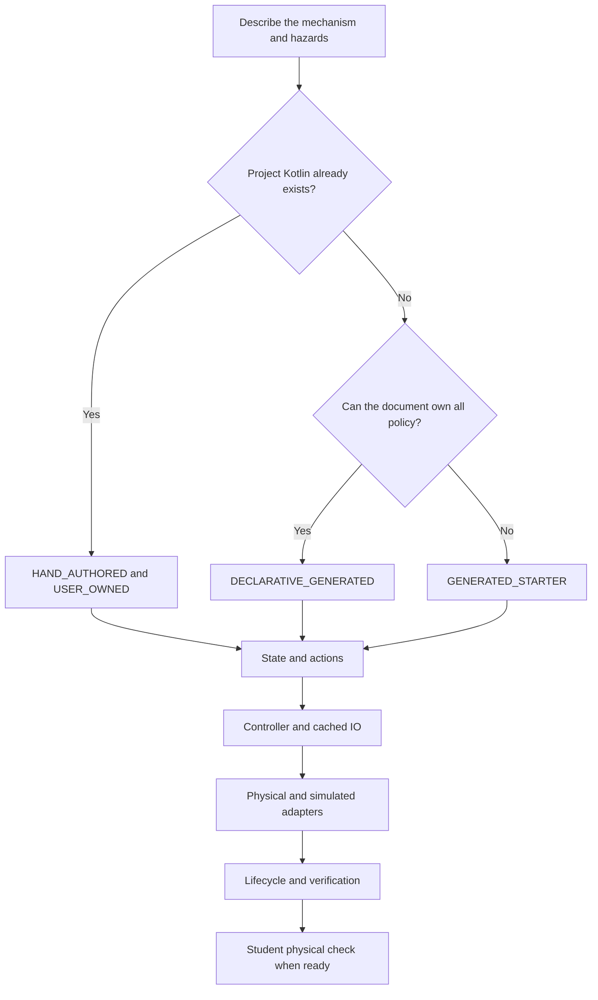

# Choose and author an ARES subsystem

## Purpose and prerequisites

A subsystem owns one robot job, such as moving an arm or reading a beam-break sensor. ARES has three
ways to build one. Each path says who owns the Kotlin and what ARES may create. Every path still
needs safe outputs, clear units, cached inputs, simulation evidence, and tests.

Complete [Read and Change Small Kotlin Programs](/academy/programming-kotlin-basics?path=programming-with-ares),
[Read Hardware Once and Write Safe Outputs](/academy/programming-io-caching?path=programming-with-ares),
and [Author GUI-Owned FTC Indicator Lights](/academy/ftc-gui-owned-indicator-lights?path=programming-with-ares).
This lesson uses source review and hardware-free tests. It does not require a powered robot.

## Vocabulary

- **Subsystem document:** the canonical `.aressubsystem` file under `.ares/subsystems/`.
- **Declarative generated:** ARES creates runtime plumbing from the document in generated folders.
- **Generated starter:** ARES creates editable Kotlin once, then protects it behind review rules.
- **Hand-authored:** the project owns existing or custom Kotlin and names its integration points.
- **User-owned:** source that ARES must never replace.
- **Generated plumbing:** repeatable build output that students do not edit or commit.
- **I/O contract:** the units, cached inputs, outputs, safe state, and cleanup rules.
- **Lifecycle:** the ordered refresh, state update, output, stop, and close behavior.
- **Parity:** matching observable rules across a physical adapter and a simulator or mock.
- **Tuning declaration:** a typed value, unit, range, default, owner, and apply rule named by the
  subsystem document.
- **Tuning profile:** the named `.arestuning` file that holds reviewed values for a robot.
- **Capability action:** a named command that controller bindings or autonomous routines may call.

Think of source ownership as a lock. The header says who may change a file. The preview shows the
exact change ARES wants to make. A review token proves that a person saw that version of the change.
If the file changes again, the old token no longer fits.

## Worked example

Start with the ownership question, not a file-count goal. Current ARES 15.0.0 uses subsystem
document schema 11. It names three implementation kinds:

You do not need to memorize the long names at first. Ask three short questions. Can the document own
the whole job? Do we need new code that students can edit? Or do we already have code that we trust?

| Starting point | ARES implementation | Source ownership | Normal result |
| --- | --- | --- | --- |
| The document fully describes the behavior | `DECLARATIVE_GENERATED` | `GENERATED_DO_NOT_EDIT` | Runtime, mock, and baseline tests stay under Gradle's generated folders. |
| A new mechanism needs editable Kotlin | `GENERATED_STARTER` | `GENERATED_STARTER` | ARES can create missing starter files in normal source folders. |
| Proven or custom Kotlin belongs to the project | `HAND_AUTHORED` | `USER_OWNED` | The document records exact source and integration facts. |

The first path is the GUI-owned path from the indicator-light lesson. It is useful when the
descriptor can express the state, hardware, control, and safety policy. The second path gives
students editable state, controller, I/O, platform, and mock files. The third path connects proven
project Kotlin to ARES. Teams sometimes call that a hybrid registration.

Every schema 11 subsystem document includes a `tuningParameters` list. An empty list is valid. Each
real parameter belongs to one component. It states its type, unit, bounds, default, plain-language
help, and apply rule. Reviewed values belong in a named `.arestuning` profile. A temporary
experiment belongs under `.ares/local/tuning` until the team reviews and promotes it.

Suppose a project already has a tested flywheel controller. Replacing it with a starter would throw
away source history and test evidence. A hand-authored document keeps that Kotlin `USER-OWNED`. It
must name the Gradle module and project-relative source files. It also names the subsystem class,
I/O contract, hardware adapter, simulation support, and teaching notes. It lists each capability key
that it exposes. Each key must already exist in the project action catalog. ARES does not scan
arbitrary Kotlin and guess these facts.

Now suppose a new elevator fits a position-control template but needs custom game logic. A generated
starter may be a good beginning. Students first state the position unit, positive direction, and
soft limits. They also state the homing rule, safe neutral, feedback age, output bounds, and fault
recovery. They preview the
files before writing them. Students may edit a created starter. Its `GENERATED STARTER` header stays
in place so ARES cannot replace it without a new review token.

### Rules that change with the path

The schema rejects path combinations that make ownership unclear:

- A declarative subsystem does not list source files or class names. Its generated mock and baseline
  safety tests must stay enabled. ARES derives its actions from target-state fields.
- A generated starter also lets codegen choose source locations. Mock support follows the
  `generateMockIo` setting. ARES also derives its actions from target-state fields.
- A hand-authored subsystem names its module, source files, runtime classes, and simulation support.
  It cannot request generated mock or test files. It uses existing action-catalog keys for any
  capabilities it exposes.
- All three paths include the required `tuningParameters` list. The list may be empty, but missing
  or ownerless entries are invalid.

These are source-contract rules. They do not prove that a mechanism is wired or safe to move.
When in doubt, stop at preview. A preview does not move a robot or write a starter file.

## Visual model



Every path ends at the same evidence boundary. Generated code can reduce repeated plumbing. It
cannot prove wiring, motor direction, physical clearance, sensor scale, or safe motion.

### Preview and replacement rules

For an FTC project, these tasks expose the current command-line flow:

```powershell
# Report creates, unchanged files, protected files, and starter diffs. This writes nothing.
.\gradlew.bat :TeamCode:previewSubsystemChanges

# Create missing starters and rebuild generated plumbing.
.\gradlew.bat :TeamCode:generateSubsystemStarters

# Replace changed starters only after reviewing preview output.
.\gradlew.bat :TeamCode:replaceSubsystemStarters "-Pares.subsystemReplacementToken=<exact-token>"

# Generate and then verify the complete ARES project contract.
.\gradlew.bat :TeamCode:generateAresProject
.\gradlew.bat :TeamCode:verifyAresProject
```

The preview classifies each starter as add, unchanged, replace, or protected. The normal create task
refuses replacements. A changed file with a `GENERATED STARTER` header can be replaced only by the
separate replace task after you review its diff and supply the exact hash-bound token. The token
changes when the current or proposed file changes. A user-owned or unknown file is protected. It is
never an eligible replacement target.

Generated do-not-edit files belong under Gradle `build/generated` folders. A clean build may delete
them. The canonical subsystem document recreates them. Do not copy them into a normal source folder
or commit them as if they were student-owned code.

## Hands-on activity

Choose one real subsystem in a checked-in project. You may also use a real proposed subsystem if the
team has written its requirements. Do not invent hardware, source, or test results.

1. Find its `.aressubsystem` file, or record that the canonical document is missing.
2. State the mechanism purpose, physical units, positive direction, and safe neutral.
3. List existing Kotlin, actions, adapters, mocks, tests, tuning values, and documentation.
4. Decide whether the descriptor can own all runtime policy.
5. Decide whether useful project Kotlin must stay user-owned.
6. Check the path-specific schema rules for that choice, including tuning and action ownership.
7. Use the lab below to expose missing evidence.
8. Compare the result with the pinned source references below the lesson.
9. Trace requested intent separately from observed feedback and validity.
10. Mark each file as user-owned, generated starter, or generated do-not-edit.
11. Preview changes. Do not apply them during this lesson unless your branch and review are ready.
12. Record the checks needed before simulation and before a physical test.

<subsystemownershiplab />

The lab is a planning model. A cyan result means only that its seven-item checklist is filled in. It
does not validate a descriptor or approve code, simulation, or physical motion.

### Build an evidence ladder

Keep each result at its real strength:

1. **Configuration review:** the document decodes and its typed rules are valid.
2. **Behavior tests:** generated paths use declared tests; hand-authored paths use project-owned tests.
3. **Platform integration tests:** the project lifecycle and adapters meet their platform contract.
4. **Simulator tests:** an FTC project runs against desktop mocks and its OpMode lifecycle.
5. **Build:** the project package compiles without deployment.
6. **Physical check:** a student observes wiring, direction, neutral, limits, and sensors on the robot.

Passing the first five layers can make a project ready for a physical checklist. It cannot mark the
physical check complete. Students can verify robot functionality using the team's normal safety
process. Website posts follow the separate Lead Coach editorial workflow.

## Checkpoints

- Does the chosen path match the current source ownership?
- Can a reviewer tell which files students may edit?
- Does a hand-authored document name every source file and runtime class instead of guessing?
- Is the tuning list present, with each parameter owned by a real component?
- Do generated paths derive actions while hand-authored paths name existing catalog actions?
- Are requested intent and observed feedback separate?
- Does each input have a unit, validity rule, and one refresh owner?
- Can every output reach neutral after disable, stop, close, or a failed write?
- Does fault recovery require an explicit successful neutral when the mechanism declares it?
- Does the mock enforce the same bounds and fault rules as the physical adapter?
- Are generated behavior, simulation, and physical evidence labeled separately?

## Troubleshooting

| Symptom | Check |
| --- | --- |
| The builder proposes editable files for behavior the document already owns | Check whether `DECLARATIVE_GENERATED` is the simpler truthful path. |
| The generator wants to replace edited Kotlin | Stop. Check the ownership header and review the structured diff and current token. |
| A user-owned file appears as replaceable | Treat this as a defect. Do not change the ownership header to bypass protection. |
| Existing Kotlin is invisible in Studio | Add accurate hand-authored metadata; do not scan imports or guess class names. |
| A hand-authored document requests generated tests | Turn off generated mock and test requests. Name the project's own test and simulation evidence. |
| A generated action name was typed by hand | Generated paths derive actions from target state fields. Hand-authored paths declare existing catalog keys. |
| A tuning value changes only on one laptop | Keep temporary experiments in the local overlay, then review and promote accepted values to a named profile. |
| The mock allows behavior that hardware blocks | Compare both adapters against one contract-test table. |
| Output fault clears on the next move command | Require an explicit successful neutral before re-arming. |
| The build passes but the robot is untested | Keep the physical layer not run and follow the student safety checklist. |

## Evidence artifact

Create a subsystem ownership map. Include the canonical document and every planned Kotlin file.
State each file's owner, module, destination, and responsibility. Mark whether regeneration may add,
recreate, replace after a token, or never replace it.

Add a boundary diagram that shows state, control, the I/O contract, physical and simulated adapters,
lifecycle registration, and verification. Then write a test table for safe startup, stale or invalid
feedback, command limits, failed writes, neutral recovery, disable, stop, and close. Add homing,
calibration, interlocks, current validity, and followers when the real mechanism uses them.

Attach only evidence you ran or inspected. A source link proves what a reviewed file says. A unit
test proves its tested behavior. A simulator result does not prove a motor's mounting direction or a
sensor's physical scale. Keep unknown items visible as gaps.

## Short assessment

1. When should a subsystem use declarative generated ownership?
2. Why can a hand-authored registration be safer than rewriting proven Kotlin?
3. What is the difference between a generated starter and generated do-not-edit plumbing?
4. Why does starter replacement need a new token after the source or proposal changes?
5. Which facts must a hand-authored descriptor state explicitly?
6. Which task may replace a changed generated starter, and what proof does it require?
7. Why can a passing build be ready for physical validation without proving physical behavior?
8. Where do reviewed tuning values live, and where should a temporary experiment stay?
9. How does capability-action ownership differ between generated and hand-authored paths?

## Extension challenge

Review one existing subsystem without changing it. Compare its document with the source tree. Check
the implementation kind, ownership, module, files, classes, simulation support, teaching metadata,
and action keys. Then compare its test results with the evidence ladder.

Propose one of four outcomes: keep the current design, improve only the descriptor, adopt a reviewed
generated starter, or plan a hand-authored refactor. Support the choice with pinned source paths and
test evidence. Do not rewrite working code just to reduce file count.

## Related and next

Return to [Author GUI-Owned FTC Indicator Lights](/academy/ftc-gui-owned-indicator-lights?path=programming-with-ares)
to compare a declarative generated subsystem. Continue to
[Coordinate Subsystems and Fail Safe](/academy/ftc-season-composition-and-safe-lifecycle?path=programming-with-ares)
to see multiple mechanisms share interlocks and safe states. Then use
[Prove Shared Logic across Adapters](/academy/programming-tests-parity?path=programming-with-ares)
to build stronger mock, simulator, and platform evidence.
