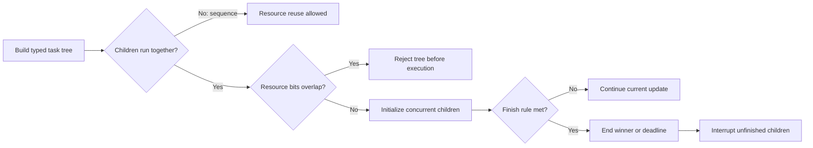
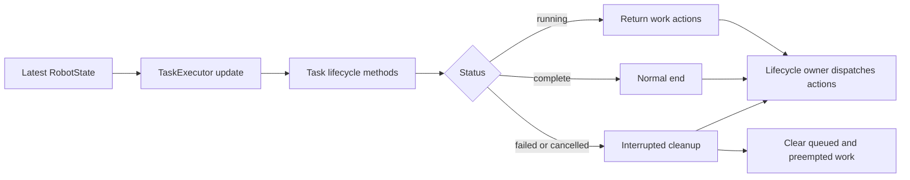

# Build safe task sequences in ARESLib

## Purpose and prerequisites

Robot code often needs several jobs to happen in a safe order. A robot may drive while an intake
runs. It may wait for a sensor. It must still stop if a task fails or the routine is cancelled.
ARESLib describes this work as a tree of `Task` objects. The `robotSequence` builder makes the tree
easier to read before it reaches a robot loop.

Complete [State, Actions, and Reducers](/academy/redux-state-actions-reducers?path=programming-with-ares),
[Coordinate Subsystems and Fail Safe](/academy/ftc-season-composition-and-safe-lifecycle?path=programming-with-ares),
and [Build Your First FTC Autonomous Routine](/academy/ftc-starter-first-autonomous?path=controls-localization-autonomous)
first. This lesson reads source and runs bounded tests. It does not command a physical robot.

## Vocabulary

- **Task:** one job with start, update, finish, and cleanup steps.
- **Sequence:** tasks that run from first to last.
- **Parallel group:** tasks that start together and all must finish.
- **Race group:** tasks that start together and stop when the first one finishes.
- **Deadline group:** one named task decides when the group stops.
- **Resource:** a bit that names owned robot work, such as drive, intake, arm, or lighting.
- **Timeout:** a limit that changes an unfinished task into a failed task.
- **Cancellation:** a stopped task that runs interrupted cleanup without becoming successful.
- **Preemption:** higher-priority work temporarily replaces the executor's active task.

## Four group rules

The group name answers two questions: **what starts together** and **what ends the group**.

| Group | What starts? | What ends the group? | What happens to unfinished children? |
| --- | --- | --- | --- |
| Sequence | One task at a time | The final task finishes | The next task never starts after failure or cancellation |
| Parallel | Every child | Every child finishes | Failure or cancellation interrupts the group |
| Race | Every child | The first child finishes | The remaining children are interrupted |
| Deadline | The deadline and its companions | The deadline finishes | Unfinished companions are interrupted |

A companion in a deadline group may finish early. The group still waits for the deadline. A race is
different: any child can end the group.

## Resources stop unsafe overlap

Each task can expose a `requiredResources` bit mask. A path-following task claims `DRIVE`. A season
intake task may claim `INTAKE`. The current `TaskResources` object also names flywheel, feeder,
floor, elevator, arm, wrist, climber, lighting, and a shared superstructure resource. Generated and
season code have separate custom-bit ranges.

ARESLib checks direct children when it builds a parallel, race, or deadline group. Two children
cannot claim the same nonzero bit. A sequence may reuse the same bit because only one child runs at
a time. This check happens while the tree is built, not in the fast robot tick.

`NONE` means the task does not claim an actuator resource. It does **not** mean “safe.” A task that
commands hardware must advertise the correct resource. A wrong `NONE` can hide a real conflict.

## Visual model



## Worked example

### Collect with a bounded sensor wait

Imagine an intake routine. The light turns blue. The intake runs while the robot waits for a piece
sensor. The wait may not last forever. When the sensor becomes true, the race ends and interrupts
the still-running intake task. Its interrupted cleanup must return a safe stop action.

```kotlin
val collectPiece = robotSequence {
    setIndicator("status", IndicatorLightColor.BLUE)
    race {
        task(runIntakeTask())
        waitUntil(2.seconds) { state -> state.intake.hasPiece }
    }
    task(stopIntakeTask())
    setIndicator("status", IndicatorLightColor.GREEN)
}
```

This is a teaching sketch. The current ARES builder provides `race`, typed waits, indicators, and
existing-task support. The sample factory and state field are placeholders. Use the real season
task, action, and state names from the project.

The intake task needs four behaviors:

1. Claim the intake resource.
2. Return the run action when it starts or updates.
3. Return a safe stop action from `end(state, interrupted = true)`.
4. Have a focused test proving that interrupted cleanup is returned.

If the sensor becomes true, the wait wins normally. If the two-second timeout passes first, the wait
fails. That failure makes the race fail. The executor then aborts queued and preempted work and
collects cleanup actions. The green-light step does not run after failure.

## Follow the lifecycle exactly

`TaskExecutor.update` receives the latest immutable `RobotState` plus a timestamp. It may initialize,
finish, and start several immediate tasks in one update. It limits this to 100 transitions so a bad
queue cannot hold the loop forever.

The executor does **not** dispatch actions into the Redux store. It returns a list to the robot
lifecycle owner. That owner must dispatch every action, including actions returned by interrupted
cleanup. Current ARES exposes `cancelAll(state)` for this job. The lifecycle owner must dispatch its
returned actions instead of clearing task state by hand.



### Failure and cancellation are different

A failed task stays failed for diagnostics and runs its failure callback once. A cancelled task
stays cancelled and does not run success or failure callbacks. Both paths use interrupted cleanup.
Both paths stop the rest of the executor instead of starting the next queued task.

### Suspension preserves execution time

`suspend()` stops executor updates. Time spent suspended does not count against the active task's
elapsed duration or timeout. `resume()` shifts the task start time so the task continues from the
same charged execution time.

### Preemption needs a source review

`preempt()` pauses the executor's active task and later resumes it. At the pinned ARES 13.0.0 source
revision, the group classes do not forward `pause` and `resume` to their active children. A root
sequence therefore must not rely only on a nested child's pause hook to neutralize hardware.

Treat this as a design-review boundary. Before using preemption with actuator tasks, inspect the
actual active task type, define an explicit safe action, and test the exact tree. Do not claim that
preemption stopped a mechanism because a child has a `pause` method.

## Task tree planner

Use the lab to compare the four group rules. Give Task A and Task B the same resource in a sequence.
Then switch to parallel, race, and deadline. Trace normal completion, one child failure, and one
child cancellation.

<tasksequencelab />

The lab is a code-derived two-child model. It does not run the Kotlin executor or prove that cleanup
actions reach a robot.

## Hands-on activity

1. Open `RobotSequence.kt` from the pinned sources.
2. Find `sequence`, `parallel`, `race`, and `deadline`.
3. Write the finish rule beside each builder function.
4. Find both `waitUntil` forms and circle the one with a timeout.
5. Open `TaskResources.kt` and list five built-in bits.
6. Explain why `NONE` cannot repair a missing hardware claim.
7. Open `TaskGroupDispatcher.kt`.
8. Find the constructor checks for concurrent groups.
9. Find where race and deadline groups interrupt unfinished tasks.
10. Open `TaskExecutor.kt`.
11. Trace failure and cancellation to `cancelAll(state)`.
12. Find the comment that says returned actions are caller-owned.
13. Confirm that there is no public `clear(state)` shortcut in the current class.
14. Find `preempt`, then check whether group classes override `pause` or `resume`.
15. Draw your own task tree and label every hardware resource.

Run the focused source tests from the ARES monorepo without robot hardware:

```powershell
cd ARESLib-Kotlin
.\gradlew.bat :core:test --tests "com.areslib.sequencer.RobotSequenceDslTest" --tests "com.areslib.sequencer.TaskLifecycleRegressionTest"
```

Record the revision, command, result, and one fact the tests cannot prove about a physical robot.

## Checkpoints

- Can each task name explain one job?
- Do concurrent children claim different resources?
- Does every sensor wait have a finite timeout?
- Does every actuator task return safe interrupted cleanup?
- Does failure or cancellation prevent the next queued task from starting?
- Does the lifecycle owner dispatch returned cleanup actions?
- Have you tested the exact tree instead of only the child tasks?
- Is simulated evidence kept separate from physical proof?

## Troubleshooting

| Symptom | Check |
| --- | --- |
| Concurrent group will not build | Look for an overlapping resource bit. |
| Sequence never advances | Check the active child's completion rule. |
| Race ends but a mechanism keeps moving | Inspect the losing task's interrupted `end` actions and caller dispatch. |
| Timeout starts the next task | Trace failed status and executor cancellation. |
| Cleanup action is missing | Use `cancelAll`, then dispatch its returned list. |
| Paused time counts against a task | Use executor suspension instead of a separate wall clock. |
| Preempted group does not neutralize a child | Do not assume group pause forwarding; review the exact source and add an explicit safe path. |
| Test changes between runs | Use `RobotClock` and fixed state snapshots. |

Keep the first failing result. It is evidence. Change one rule at a time.

## Evidence artifact

Create a task-sequence review sheet with:

- the routine goal in one sentence;
- a tree showing every group and child;
- one resource label beside each hardware task;
- every wait condition and timeout;
- expected success, failure, cancellation, and cleanup paths;
- the lifecycle owner that dispatches returned actions;
- the focused test command and result; and
- one claim the test cannot prove about a physical robot.

Students may verify robot functionality using the team's normal safety procedure. Record the robot,
software revision, test boundary, stop method, observation, and remaining limits. Website posts use
the separate Lead Coach editorial workflow before publication.

## Short assessment

1. Why may a sequence reuse one resource when a parallel group may not?
2. How is a race different from a deadline group?
3. What should happen when a bounded sensor wait fails?
4. Why must the lifecycle owner dispatch actions returned by `cancelAll`?
5. Why is a nested child `pause` method not enough proof for current group preemption?
6. What does a passing unit test still not prove about the robot?

## Extension challenge

Design **collect a piece, then stow** as a task tree. Add a bounded sensor wait, resource labels,
and a safe interrupted cleanup action. Write one success test and one timeout test.

Next, design a deadline group with one deadline and two companions. Explain why their resources do
not overlap. Predict which children end normally and which are interrupted when the deadline ends.
Do the same prediction for a child failure.

## Related and next

Return to [Build Your First FTC Autonomous Routine](/academy/ftc-starter-first-autonomous?path=controls-localization-autonomous)
to connect a Studio routine to its compiled task graph. Continue to
[Test Robot Logic Across Mocks and Simulation](/academy/programming-tests-parity?path=programming-with-ares)
to compare cleanup across adapters. Use
[Telemetry and Local Log Retrieval](/academy/telemetry-and-local-logs?path=controls-localization-autonomous)
when task status needs an evidence trail.
