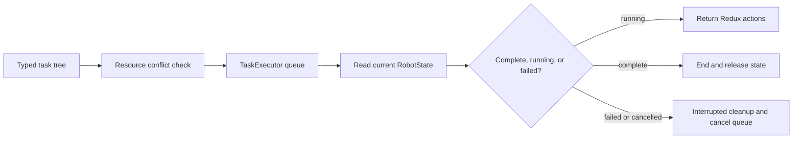

# Build safe task sequences in ARESLib

## Purpose and prerequisites

Robot code often needs several actions to happen in a clear order. One action may wait for a
sensor. Two actions may run together. A stop request may interrupt everything. ARESLib represents
this work as a tree of `Task` objects. The `robotSequence` builder makes that tree easier to read.

Complete [State, Actions, and Reducers](/academy/redux-state-actions-reducers?path=programming-with-ares),
[Coordinate Subsystems and Fail Safe](/academy/ftc-season-composition-and-safe-lifecycle?path=programming-with-ares),
and [Build Your First FTC Autonomous Routine](/academy/ftc-starter-first-autonomous?path=controls-localization-autonomous)
first. This activity reads code and runs bounded tests. It does not command a physical robot.

## Vocabulary

- **Task:** one unit of work with a start, update, completion, and end lifecycle.
- **Sequence:** tasks that run from first to last.
- **Parallel group:** tasks that run at the same time and all finish.
- **Race group:** tasks that run together until the first one finishes.
- **Deadline group:** one main task decides when its companion tasks stop.
- **Resource:** a named robot part, such as drive, intake, arm, or lighting.
- **Timeout:** a time limit that changes an unfinished task into a failure.
- **Preemption:** pausing current work so more urgent work can run.

## Worked example

Imagine an intake routine. The light turns blue. The intake runs while the robot waits for a piece
sensor. The wait has a two-second timeout. Last, the intake stops and the light turns green.

The order is important. The wait should not last forever. The intake task and another intake task
should not run in parallel because both claim the same resource. ARES checks resource conflicts
when the task tree is built. It checks before the robot tick loop starts.

```kotlin
val collectPiece = robotSequence {
    setIndicator("status", IndicatorLightColor.BLUE)
    parallel {
        task(runIntakeTask())
        waitUntil(2.seconds) { state -> state.intake.hasPiece }
    }
    task(stopIntakeTask())
    setIndicator("status", IndicatorLightColor.GREEN)
}
```

This sample is a teaching sketch. Your real state field and task factories may use different names.
The current ARES builder does provide typed waits, groups, paths, named commands, and indicators.

## Visual model



`TaskExecutor` does not dispatch actions into the store. It returns a list of actions to its caller.
That boundary keeps task logic separate from store ownership.

## Hands-on activity

1. Open the pinned `RobotSequence.kt` source from this lesson's source list.
2. Make a table for `sequence`, `parallel`, `race`, and `deadline`.
3. Write what causes each group to finish.
4. Find both forms of `waitUntil`.
5. Circle the form that accepts a timeout.
6. Open `TaskResources.kt` and list three built-in resource names.
7. Sketch a task tree for **collect a piece, then show ready**.
8. Label each task with the robot resource it owns.
9. Check every parallel branch for duplicate resources.
10. Add a finite timeout to every sensor wait.
11. Predict what cleanup should happen after a failure.
12. Open `TaskExecutor.kt` and trace the failed-task path.
13. Write one unit test for a successful sequence.
14. Write one unit test for a timeout or resource conflict.
15. Run the focused test without connecting robot hardware.

Use the concept lab below to explore ordered guards. Step through a healthy score request. Then make
the ports unhealthy and compare the next state.

<superstructurestatelab />

The lab uses an invented three-posture model. It does not create an ARES task tree, measure a real
mechanism, test resource masks, or prove physical clearance. It helps you reason about safe order.

## Checkpoints

- Can every task name explain one job?
- Does each hardware-owning task claim the correct resource?
- Do parallel branches avoid the same resource?
- Does each sensor wait have a finite timeout?
- Does failure stop queued and preempted work?
- Are returned cleanup actions dispatched by the lifecycle owner?
- Does the test keep simulation evidence separate from physical proof?

## Troubleshooting

| Symptom | Check |
| --- | --- |
| Parallel group will not build | Look for two child tasks that claim the same resource bit. |
| Sequence never advances | Check the completion condition and add a bounded timeout. |
| A task finishes at once | Inspect its `isCompleted` result after initialization. |
| Cleanup output is missing | Confirm the caller dispatches actions returned by cancellation. |
| Paused time counts against a task | Use executor suspension and preemption instead of a separate wall clock. |
| A failure starts the next task | Trace status handling and confirm the queue is cancelled. |
| A test changes between runs | Use the shared robot clock and fixed state snapshots. |

Keep the first failing result. It is evidence. Do not change several task rules at once.

## Evidence artifact

Create a task-sequence review sheet with:

- the routine goal in one sentence;
- a tree showing sequence and parallel groups;
- one resource label beside each hardware task;
- every wait condition and timeout;
- the expected completion, failure, cancellation, and preemption paths;
- the focused test command and result; and
- one claim the test cannot prove about a physical robot.

Students may verify robot functionality using the team's normal safety procedure. Record the robot,
software revision, test boundary, stop method, observation, and remaining limits.

## Short assessment

1. How is a sequence different from a parallel group?
2. Why can two intake tasks conflict even if both are valid alone?
3. What should happen when a sensor wait reaches its timeout?
4. Why does `TaskExecutor` return Redux actions instead of dispatching them?
5. What does a passing unit test still not prove about the robot?

## Extension challenge

Add an urgent stow task to your design. Show where preemption pauses the active work. Then show how
the earlier task resumes. Include the elapsed-time rule: paused time does not count against the task.

Next, design a deadline group. Choose one task as the deadline and two as companions. Explain why
those three resources do not conflict. Add a test where the deadline ends first and companions clean
up safely.

## Related and next

Return to [Build Your First FTC Autonomous Routine](/academy/ftc-starter-first-autonomous?path=controls-localization-autonomous)
to connect a Studio routine to its compiled task graph. Continue to
[Test Robot Logic Across Mocks and Simulation](/academy/programming-tests-parity?path=programming-with-ares)
to compare the same safety cases across adapters. Use
[Telemetry and Local Log Retrieval](/academy/telemetry-and-local-logs?path=controls-localization-autonomous)
when task status needs a clear evidence trail.
