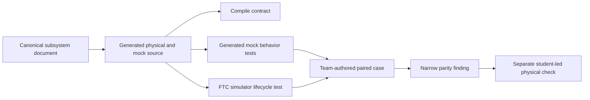

# Test robot logic across mocks and simulation

## Purpose and prerequisites

Two files can use the same interface and still act differently. That is why a compile check is not
the same as a behavior test. In this lesson, you will sort current ARES evidence into the right
level. Then you will design one fair test that can reveal an adapter mismatch.

This lesson matches ARES 15.0.2, FTC SDK 11.1.0, and Studio 5.0.3. Every source link is pinned to
one reviewed commit in the ARES Robotics monorepo. An older lesson named a `simulation-foundation`
contract that is not in the current monorepo. Do not look for that removed file.

Complete [Read Hardware Once and Write Safe Outputs](/academy/programming-io-caching?path=programming-with-ares)
and [Simulation Is Not Hardware Validation](/academy/simulation-is-not-hardware-validation?path=testing-debugging-commissioning).
You should know the subsystem's units, safe output, and cached input fields. FTC students may also
review [Coordinate Subsystems and Fail Safe](/academy/ftc-season-composition-and-safe-lifecycle?path=programming-with-ares)
for the current season composition pattern, but that FTC lesson is not required for an FRC test.

## Vocabulary

- **Mock adapter:** test code with inputs and outputs that the test can control.
- **Platform adapter:** code that connects an ARES contract to the FTC or FRC SDK.
- **Generated behavior test:** a generated test that exercises state, a controller, and mock I/O.
- **Compile evidence:** proof that selected source types fit together. It does not prove behavior.
- **Lifecycle evidence:** proof about call order, instance ownership, or cleanup.
- **Behavioral parity:** the same important rule produces the expected result at two boundaries.
- **Paired test:** one test plan used on both boundaries with the same inputs and checks.
- **Fault injection:** a controlled invalid sample, failed write, stale value, or other test fault.
- **Mismatch:** a visible difference between two results. A mismatch is useful evidence.
- **Claim:** one sentence that says only what the evidence supports.

## Four evidence layers in current ARES

The current source contains four related ideas. They must not be blended into one green check.

| Evidence                   | What current ARES does                                                                                                                                                                                    | What it does not prove                                                                      |
| -------------------------- | --------------------------------------------------------------------------------------------------------------------------------------------------------------------------------------------------------- | ------------------------------------------------------------------------------------------- |
| Generated adapter contract | Marks `HARDWARE_SIMULATION_PARITY` as `COMPILED_GENERATED_CODE`. Physical and mock adapters compile against the same generated I/O, controller, limits, inversion, follower, and safe-output contract.    | It does not run both adapters or compare their outputs.                                     |
| Generated mock behavior    | Generates tests for safe startup, failed writes, independent homing and current permits, output limits, disabled stop, invalid feedback, and idempotent cleanup. Selected safety features add more tests. | These tests use generated `Mock...IO`. They do not execute an FTC motor controller.         |
| FTC simulator lifecycle    | Installs one subsystem instance, then checks the order `readSensors`, `writeOutputs`, and `close`.                                                                                                        | It does not compare a physical adapter with a mock adapter. It does not prove motor motion. |
| Team-authored paired test  | Uses the same case, units, clock, expected result, and assertions on two test boundaries.                                                                                                                 | It still cannot prove wiring, polarity, load, friction, radio timing, or real travel.       |

The first three layers already exist in the current sources. The fourth is the work you design when
a behavior truly needs a two-sided comparison.

## Read the generated contract carefully

`subsystemVerificationContract` creates checks only when generated verification is enabled. Its
base behavior checks cover:

- safe startup;
- failed output writes;
- separate homing and current permits;
- controller output limits;
- disabled or stopped neutral output; and
- invalid feedback plus repeatable cleanup.

The subsystem document can require more checks. Feedback timeouts add stale-feedback rejection.
Homing adds a dwell test. Explicit neutral recovery adds a one-use request test. Calibration adds a
fresh-health and successful-neutral test. Generated target actions add a Redux action-flow test.

The contract also includes the hardware-and-simulation parity item. Its evidence level is
`COMPILED_GENERATED_CODE`. That wording matters. It says both generated adapters share a contract.
It does not say both adapters passed the same runtime case.

ARES 15.0.2 has one more compile-level item when `zeroAllocationPeriodic` is selected. It records
that generated periodic code follows the zero-allocation policy. It does not measure allocated
bytes. The source explains that byte-allocation regression remains a separate ARES platform test.

Generated verification also has an ownership rule. A declarative runtime document cannot turn the
generated checks off. An editable `GENERATED_STARTER` may omit them because students own and revise
that source. In either case, a missing generated test is not evidence that the behavior passed.

## Worked example

### A failed write

Suppose a subsystem commands 0.4 output. The next write fails.

The generated mock behavior test can make `Mock...IO` reject that write. It then checks the declared
safe output and fault policy. A passing result supports this claim:

> The generated controller and mock I/O followed the declared failed-write rule for this case.

It does not support this stronger claim:

> The FTC motor adapter and physical motor will always stop after any write failure.

To compare runtime behavior, build a paired test. Give both test boundaries the same starting
state, 0.4 command, failed-write event, controlled clock, and expected neutral result. Record both
results. If the mock goes neutral but the platform test boundary does not, label the row **adapter
mismatch**. Do not weaken the expected rule to make the row green.

The current FTC test named `GeneratedSubsystemSimulatorParityTest` proves something narrower. It
registers one `RecordingSubsystem`. It verifies `read:1000`, `write:0.5`, then `close` on that same
instance. Treat this as lifecycle integration evidence. The filename does not make it a full
hardware-versus-simulation behavior comparison.

## Visual model



Each arrow adds evidence. No arrow changes an earlier result. A compile result cannot fill a runtime
column. A simulator result cannot fill a physical column.

## Hands-on activity

1. Open the pinned monorepo `SubsystemVerificationContract.kt` source.
2. Find `HARDWARE_SIMULATION_PARITY`.
3. Record its `COMPILED_GENERATED_CODE` evidence level.
4. List the six base generated behavior checks.
5. Pick one optional safety setting. Record which extra check it adds and its evidence level.
6. Find the zero-allocation check. Explain why it is compile evidence, not a byte measurement.
7. Find the rule that lets an editable generated starter omit generated tests but rejects that choice
   for a declarative runtime document.
8. Open the pinned generator source. Find the generated `Mock...IO` tests.
9. Mark which tests use `RobotClock` mock time and restore system time in `finally`.
10. Open the pinned FTC lifecycle test.
11. Record the exact instance and the three events that test observes.
12. Choose one case: startup, failed write, homing/current, output limit, disabled stop, or invalid cleanup.
13. Write one expected result using a number and unit when the case has a numeric value.
14. Choose two real test boundaries. Do not call a compile check a runtime boundary.
15. Give both sides the same input, units, initial state, clock, fault, and assertion.
16. Include `NaN`, infinity, stale data, or a failed write when that fault fits the contract.
17. From the monorepo root, enter `ARESLib-Kotlin` and run the focused current-source checks:

```powershell
.\gradlew.bat :core:test --tests "com.areslib.subsystem.SubsystemVerificationContractTest"
.\gradlew.bat :codegen:test --tests "com.areslib.codegen.SubsystemKotlinGeneratorTest"
```

18. Return to the monorepo root, enter `ARES-FTC`, and run the relevant FTC checks:

```powershell
.\gradlew.bat :TeamCode:testDebugUnitTest
.\gradlew.bat :simulator:test --tests "org.firstinspires.ftc.teamcode.GeneratedSubsystemSimulatorParityTest"
```

19. Save the monorepo commit, Gradle command, test name, result, and time.
20. Classify the evidence in the lab below.

<parityevidencelab />

The lab distinguishes current generated evidence from a team-authored paired runtime test. It does
not read Gradle output. Enter only results you actually observed.

## Build a fair paired case

Use this table before writing test code.

| Field                | Platform boundary       | Mock or simulated boundary |
| -------------------- | ----------------------- | -------------------------- |
| Contract and units   | Same I/O field and unit | Same I/O field and unit    |
| Starting state       | Explicit and recorded   | Same state                 |
| Clock                | Controlled test clock   | Same timestamps and steps  |
| Input or fault       | Exact value or failure  | Same value or failure      |
| Expected safe result | One narrow assertion    | Same assertion             |
| Actual result        | Pass, fail, or not run  | Pass, fail, or not run     |

If one boundary cannot represent the same fault, record **incomplete evidence**. Do not replace the
missing case with a different case and call it parity.

## Checkpoints

- Did you separate compile evidence from behavior evidence?
- Did you name the generated mock tests rather than inventing a generic simulation contract?
- Did you describe the FTC lifecycle test by what it asserts, not by its filename?
- Do both sides of a paired case use the same units and clock?
- Can each side expose the same invalid or failed condition?
- Is a mismatch still visible in the evidence table?
- Is the claim limited to the tested boundary and case?
- Is physical evidence kept in its own column?

## Troubleshooting

| Symptom                                                     | Check                                                                                                              |
| ----------------------------------------------------------- | ------------------------------------------------------------------------------------------------------------------ |
| You cannot find `simulation-foundation`                     | That old module reference is stale. Use the current generated contract, generator tests, and FTC simulator source. |
| `HARDWARE_SIMULATION_PARITY` is treated as a runtime pass   | Read its evidence value. It is `COMPILED_GENERATED_CODE`.                                                          |
| A generated test seems to prove FTC hardware behavior       | Find the constructed I/O class. Current generated behavior tests use `Mock...IO`.                                  |
| A zero-allocation row is treated as a measured pass         | Its evidence is compiled generated code. Find the separate platform allocation test before claiming measured bytes. |
| Generated tests are missing from a declarative runtime      | Check `generateTest`. Only an editable generated starter may omit generated evidence.                              |
| The FTC parity-named test seems broader than its assertions | Read its event list. It checks one instance and lifecycle order.                                                   |
| Same number has a different meaning                         | Check units, sign, range, coordinate frame, and sample time.                                                       |
| A test uses real wall time                                  | Use `RobotClock` mock time where production code uses robot time. Restore system time in `finally`.                |
| Both sides fail                                             | Recheck the expected contract. Keep the shared failure visible.                                                    |
| One side cannot inject the fault                            | Mark the evidence incomplete and create a smaller adapter seam.                                                    |
| Robot behavior differs from both tests                      | Check wiring, polarity, sensor setup, load, friction, travel, and device timing.                                   |

## Evidence artifact

Create one evidence packet with:

1. the canonical subsystem document and source commits;
2. the generated verification checks that apply;
3. the generated mock test result;
4. the FTC simulator lifecycle result;
5. one paired-case table, including any untested cells;
6. a one-sentence claim for each result; and
7. the next focused test for every mismatch or gap.

Do not paste student names, emails, or private robot-network details into a public artifact. Use a
subsystem name, test identifier, source commit, and privacy-safe result.

Students may verify robot functionality through the team's normal safety process. Start disabled.
Clear the mechanism. Use a restrained output and one rule at a time. Keep stop control ready. Record
the real setup and result. A physical observation adds a new evidence row; it does not rewrite a
failed source, unit, or simulator row.

## Short assessment

1. Why is `COMPILED_GENERATED_CODE` weaker than a paired runtime test?
2. Which current generated tests use mock I/O?
3. What does the FTC lifecycle test actually observe?
4. What must stay the same across a fair paired case?
5. How should you label a platform pass and mock failure?
6. Why should a shared failure remain visible?
7. What physical facts remain unknown after every software test passes?
8. Why does selecting the zero-allocation policy not prove that a measured run allocated zero bytes?

## Extension challenge

Choose one current generated behavior rule. Write a small team-owned test harness that can apply the
same case to two adapters without changing production safety behavior. Use a controlled clock. Add
one nominal case and one fitting fault case. Preserve all pass, fail, and not-run results.

If the adapters differ, write a cause tree. Test the smallest likely cause first. Do not change a
limit, neutral output, stale timeout, or fault policy merely to force agreement.

## Related and next

Return to
[Read Hardware Once and Write Safe Outputs](/academy/programming-io-caching?path=programming-with-ares)
for the cached boundary under test. Review
[Build Safe Task Sequences](/academy/programming-safe-task-sequences?path=programming-with-ares)
for timeout and cleanup cases. Library maintainers should use
[Develop, Test, and Validate ARESLib Changes](/docs/development-testing-and-release-validation)
when a shared change must pass through an isolated candidate and every consumer. Continue to
testing, logs, commissioning, and capstone work. Keep software, simulation, and physical claims
separate at every step.
