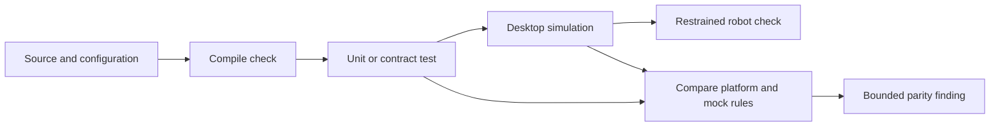

# Test robot logic across mocks and simulation

## Purpose and prerequisites

A mock is useful only when it follows the same important rules as the platform adapter. A matching
interface is not enough. In this lesson, you will compare safe behavior across two adapters and
label exactly what each result proves.

This lesson matches ARES 11.1.0 and Studio 2.0.3. The pinned sources show the generated verification
categories, the shared simulation contract, and the FTC simulator lifecycle test. Keep those exact
sources open while you work.

Complete [Coordinate Subsystems and Fail Safe](/academy/ftc-season-composition-and-safe-lifecycle?path=programming-with-ares)
and [Simulation Is Not Hardware Validation](/academy/simulation-is-not-hardware-validation?path=testing-debugging-commissioning).
You should also know the subsystem's I/O contract and safe neutral.

## Vocabulary

- **Mock:** a test adapter with controlled inputs and outputs.
- **Platform adapter:** code that connects the shared I/O contract to an FTC or FRC SDK.
- **Behavioral parity:** matching observable rules for the same input and expected result.
- **Contract test:** one test design run against more than one implementation.
- **Fault injection:** a controlled test that makes an input or write fail.
- **Deterministic clock:** test time advanced by the test instead of the wall clock.
- **Evidence level:** the narrow claim a result can support.
- **Test ladder:** ordered checks that move from source and compile evidence toward restrained robot evidence.
- **Mismatch:** a useful result showing that two boundaries behave differently.

## Worked example

The generated contract says that bad feedback must block motion. It also keeps homing, current
validity, output limits, failed writes, neutral recovery, and cleanup as separate checks. A
platform-adapter test receives an invalid cached sample and records a neutral output. The simulated
adapter receives the same input and also records neutral. Both tests support one narrow claim: these
test boundaries followed the same invalid-feedback rule for this case.

They do not prove that a sensor wire is correct. They do not prove that the motor stopped. A real
device may have the wrong polarity, a loose connector, a bad limit, or a mechanical load that the
mock does not model.

Now suppose the mock accepts a nonzero command after a failed write, but the platform adapter stays
latched. That mismatch should fail the parity check. Do not weaken the hardware rule to make the
mock pass. Fix the mock or the shared contract, then repeat the same case. The FTC lifecycle test
also checks that the same generated subsystem instance receives `readSensors`, `writeOutputs`, and
`close` in order. That is lifecycle evidence, not proof of a motor response.

## Visual model



Each step answers a different question. A later step adds evidence; it does not erase a mismatch in
an earlier step. Parity is strongest when the input, units, clock, expected result, and assertions
stay the same.

## Hands-on activity

1. Open the pinned subsystem verification contract.
2. List its evidence categories and the claim each one supports.
3. Find the generated hardware/simulation parity check.
4. Open the shared simulation device contract.
5. Record its cached sample, write result, neutral action, fault state, and close action.
6. Open the pinned FTC generated-subsystem parity test.
7. Mark the exact `readSensors`, `writeOutputs`, and `close` order that it checks.
8. Choose one subsystem and write a contract-test table.
9. Include safe startup, invalid feedback, bounded output, failed write, neutral recovery, and close.
10. From the ARES-FTC folder, run the focused unit and simulator tests:

```powershell
.\gradlew.bat :TeamCode:testDebugUnitTest
.\gradlew.bat :simulator:test
```

11. Save the command, source revision, test name, result, and time in your table.
12. Compare one platform-adapter result and one simulated-adapter result in the lab below.

<parityevidencelab />

Choose the evidence stage too. The lab explains what that stage can support and what remains
unknown. Use the same case on both sides. Record a mismatch as evidence, not as an empty or passing
result.

## Checkpoints

- Do both adapters implement the same I/O contract and units?
- Does each test use the same clock and input values?
- Can both sides model bad, old, and missing feedback?
- Can both sides expose rejected writes and safe neutral attempts?
- Are stop and close safe when called more than once?
- Did you save the exact Gradle task and source revision?
- Does the claim fit the selected evidence stage?
- Is the final claim limited to the boundary that was tested?

## Troubleshooting

| Symptom | Check |
| --- | --- |
| Mock passes every case too easily | Add stale data, write faults, bad health, and failed neutral. |
| Platform test uses real wall time | Inject `RobotClock` or a controlled test clock. |
| The Gradle task is missing | Run from the ARES-FTC root and use the current project task names. |
| Same number has different meaning | Check units, sign, range, and frame on both sides. |
| Compile passes but behavior differs | Add shared runtime assertions; interface parity is not behavior parity. |
| Physical robot differs from both tests | Check wiring, polarity, sensor setup, load, friction, and travel. |
| Mismatch is hidden as “not tested” | Preserve the failed result and investigate its cause. |
| Cleanup fails on the second call | Make close and neutral cleanup safe and repeatable. |

## Evidence artifact

Create a parity matrix. Each row should name the input, clock state, expected safe result,
platform-adapter result, simulated-adapter result, evidence stage, and classification. Link the
exact source revision, test command, test name, and result. Keep a failed row in the matrix until a
new test shows the fix.

Add a claim ledger. Separate configuration validation, compilation, generated behavior tests,
platform integration tests, simulator runs, and physical observations. A green check in one column
must not fill a stronger column by itself.

Students may run physical checks through the team's normal safety process. Start disabled. Use low
output, clear the mechanism, and keep a stop control ready. Test one rule at a time and record the
actual result. Do not turn an expected result into a physical claim before the test occurs.

## Short assessment

1. Why is a shared interface weaker than behavioral parity?
2. What must stay the same across a contract-test pair?
3. What should happen when both adapters violate the expected result?
4. Why is an adapter mismatch useful evidence?
5. What does `:TeamCode:testDebugUnitTest` check that compilation alone does not?
6. What physical facts remain unknown after unit and simulator tests pass?

## Extension challenge

Add one fault case to an existing mock without changing production behavior. Use a controlled clock
and a stable expected result. Run the same contract against the platform test boundary. If the two
results differ, write a small cause tree and the next focused test. Do not change safety limits just
to force agreement. Then add the case to the smallest focused test task and explain why its evidence
level fits the claim.

## Related and next

Return to [Read Hardware Once and Write Safe Outputs](/academy/programming-io-caching?path=programming-with-ares)
for the cached boundary under test. Review [Build Safe Task Sequences](/academy/programming-safe-task-sequences?path=programming-with-ares)
for timeout, resource, and cleanup cases. Continue to testing, logs, commissioning, and capstone
work. Use physical evidence only when a student has completed and recorded the real check.
