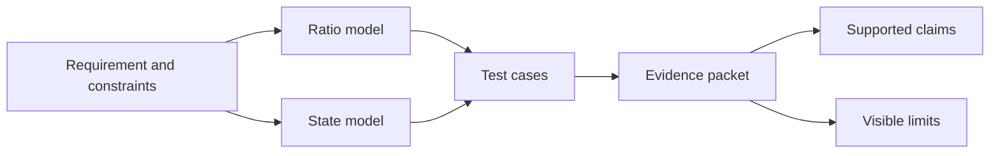

# Capstone 1: model and test a simulated mechanism

A capstone joins several skills in one project. In this project, you will describe a simple
mechanism, calculate an ideal ratio, plan its software behavior, and test a model. You will finish
with an evidence packet that states what the work does and does not prove.

## Purpose and prerequisites

Complete [Gears, Sprockets, Belts, Speed, and
Torque](/academy/mechanical-gears-sprockets-belts?path=mechanical-design-fabrication), [State,
Actions, and Reducers](/academy/redux-state-actions-reducers?path=programming-with-ares), and [Know
What a Simulator Can Prove](/academy/simulation-is-not-hardware-validation?path=testing-debugging-commissioning).

The project stays in math, code review, and local simulation. Do not build or power a physical
mechanism for this lesson. A later capstone may use physical evidence under the team safety
procedure.

## Vocabulary

- **Requirement:** a clear result the project must meet.
- **Constraint:** a limit the project must respect.
- **Mechanism:** connected parts that create useful motion.
- **Ratio:** a comparison between an input and output.
- **State:** a software snapshot of the requested or measured condition.
- **Model:** a limited representation used to answer selected questions.
- **Test case:** one input, expected result, and observed result.
- **Evidence packet:** the saved work that supports each project claim.

## Worked example

Consider an invented intake roller. Its lesson requirement is to turn near 75 RPM when the model
input is 150 RPM. A 20-tooth driver and 40-tooth driven gear give this ideal result:

```text
output speed = 150 RPM × 20 ÷ 40 = 75 RPM
ideal torque multiplier = 40 ÷ 20 = 2
```

The project has two software states: `STOPPED` and `INTAKING`. A paper reducer trace shows that an
`IntakeRequested` action returns `INTAKING`. A `StopRequested` action returns `STOPPED`.

The calculation supports an ideal-ratio claim. The trace supports a state-logic claim. Neither one
supports claims about real speed, strength, current, grip, wiring, or safety.

## Visual model



The project moves from a question to evidence. It does not begin with a favorite part or an
unmeasured hardware claim.

## Hands-on activity

Choose an invented mechanism job such as a roller, arm, elevator, or flywheel. Write one speed or
position goal for the model. Add two constraints, including one explicit simulation limit.

Use the ratio explorer to compare at least three possible ratios. Record every input and output.

<mechanismratioexplorer />

Choose one ratio and explain the tradeoff. Create a two-state paper model for the mechanism. Name
one start action, one stop action, and the expected state after each action.

Make four test cases. Two should test ratio math. Two should test state transitions. Include one bad
or unexpected input. Decide whether the software should reject it, stop safely, or show an error.

If your local ARES project has an approved simulated subsystem, run the matching simulation. If it
does not, keep the work as a concept model. Do not invent a simulator result or claim that a paper
model ran in ARES.

## Checkpoints

Check that the requirement includes a number and unit. Confirm that each ratio input uses the same
kind of units. Name the direction of the speed change and ideal torque change.

For every state action, record the previous state and new state. Check that the stop action has a
clear result from every listed state.

Before saving a claim, ask which tool observed it. Label calculations as calculated, code checks as
tested, and simulation results as simulated. Mark planned work as planned.

## Troubleshooting

If every ratio looks good, return to the requirement. A choice needs a tradeoff. Compare output
speed, ideal torque, size, and facts the model leaves out.

If a state has no safe stop, add a stop transition before adding features. If two actions use the
same name but mean different things, rename them so the evidence is clear.

If the simulation disagrees with the calculation, check units, ratio direction, input values, and
the simulation model. Keep both results visible. Do not change the expected number after seeing the
output unless you record why the model changed.

## Evidence artifact

Create one evidence packet with these parts:

1. requirement and constraints;
2. labeled mechanism sketch or diagram;
3. three ratio trials with units;
4. a two-state action diagram;
5. four test cases with expected and observed results;
6. one failure or mismatch record; and
7. a claim table labeled calculated, tested, simulated, or planned.

Add a final boundary statement. State that the project does not approve real materials, motors,
gearing, wiring, current limits, guards, or physical operation.

Use the evidence board to find the first missing packet section. Its checkboxes are a local
self-check, not proof that the listed evidence exists.

<capstoneevidenceboard />

## Short assessment

1. Why does a capstone begin with a requirement?
2. What tradeoff does an ideal gear ratio show?
3. What should a stop action do from every state?
4. Why must a mismatch stay in the evidence packet?
5. Which claims still need physical evidence?

A strong answer links each claim to the tool that observed it. It does not use simulation as proof
of a physical mechanism.

## Extension challenge

Add one measured signal to the planned simulation, such as modeled speed or position. Draw the
expected graph for start, steady motion, and stop. Mark where an error should appear if the signal
stops updating.

Trade evidence packets with another student. Ask them to find one unsupported claim, one unclear
unit, and one missing stop condition. Revise the packet and record the change.

## Related and next

Continue to the complete ARES subsystem capstone after learning IO caching, subsystem ownership,
and parity tests. Use the physical commissioning capstone only after the model and software evidence
are complete and a bounded physical plan follows the team safety procedure.
