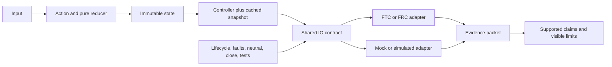

# Capstone 2: build a complete ARES subsystem

## Purpose and prerequisites

This capstone joins state, control, cached input, platform adapters, simulation, safety, and tests in
one subsystem project. The goal is not fewer files. The goal is a complete, reviewable boundary.

Complete [Author a Code-First or Hybrid Subsystem](/academy/programming-code-subsystem?path=programming-with-ares),
[Read Hardware Once and Write Safe Outputs](/academy/programming-io-caching?path=programming-with-ares),
and [Test Robot Logic Across Mocks and Simulation](/academy/programming-tests-parity?path=programming-with-ares).
Build first with reviewed source, generated previews, tests, and simulation. Physical verification
comes later through the team's student-led safety procedure.

## Vocabulary

- **Capability:** a useful behavior with named inputs, outputs, and safety needs.
- **Ownership:** the source that people edit and the generated output they do not edit.
- **Reducer:** a pure function that returns new state from state and an action.
- **Snapshot:** cached inputs collected together during one refresh boundary.
- **Controller:** logic that turns immutable state and cached feedback into bounded commands.
- **IO contract:** the shared units, validity, refresh, output, safe, and close behavior.
- **Adapter:** one FTC, FRC, mock, or simulator implementation of the IO contract.
- **Neutral:** the declared output used to stop or make a system safe.
- **Parity:** matching contract behavior across platform adapters.
- **Evidence packet:** the artifacts that support each limited project claim.

## Worked example

An invented elevator needs a target height in meters. It has a position measurement, current
measurement, upper and lower limits, and a neutral output. The requested height belongs in immutable
state. The cached snapshot records position, current, validity, freshness, and limit state.

The controller reads that snapshot and returns a bounded command. The FTC adapter reads devices once
during refresh. The simulated adapter uses the same units and exposes stale input, failed writes,
and limits to tests. A failed output write latches a fault and attempts neutral.

This design supports a contract claim after tests pass. Simulation can support modeled behavior.
Neither result proves wiring, gearing, travel, current limits, or physical clearance.

## Visual model

Generated plumbing connects reviewed definitions to runtime discovery. Edit the canonical subsystem
document or user-owned source, not disposable generated output.

Read the flow from left to right. State holds intent. Inputs report observations. The controller
decides a command. An adapter handles one platform. Tests compare the shared boundaries.

## Hands-on activity

1. Choose one narrow capability and write a measurable requirement with units.
2. Select the closest capability template. Explain every safety decision it requires.
3. Record motors, servos, sensors, names, connections, units, validity, and neutral behavior.
4. Define immutable target, measurement, status, and configuration state.
5. List explicit actions and trace the reducer without hardware.
6. Design one cached snapshot and identify its single refresh owner.
7. Define the IO contract, including safe and idempotent close behavior.
8. Preview generated files. Record creates, unchanged files, warnings, and ownership labels.
9. Implement or review the controller and both platform and simulated adapters.
10. Add startup, stale input, invalid value, failed write, neutral recovery, parity, and close tests.
11. Run project verification and one deterministic simulation scenario.
12. Complete the evidence board without checking any missing section.

<capstoneevidenceboard />

If your source is not ready, submit the reviewed design and blocked evidence list. Do not invent a
passing build, test, simulation, or physical result.

## Checkpoints

- Does the requirement include a number, unit, and constraint?
- Does one source own each policy while generated plumbing remains disposable?
- Are requested intent and observed feedback separate?
- Is every fallible input valid, fresh, and unit-labeled?
- Does each hardware read happen once per refresh boundary?
- Are commands finite, bounded, and rejected safely?
- Do safe and close attempt neutral after earlier faults?
- Can a successful neutral and healthy evidence recover a latched fault explicitly?
- Does the simulated adapter enforce the same contract and failure cases?
- Are physical claims withheld until physical evidence exists?

## Troubleshooting

| Problem | Better move |
| --- | --- |
| The project starts from an FTC motor call | Start from the capability and shared IO contract. |
| Generated output contains policy edits | Move policy to the canonical document or user-owned source. |
| Telemetry reads hardware again | Publish the cached snapshot and freshness instead. |
| The mock never fails | Add stale, invalid, failed-write, limit, and recovery controls. |
| A nonzero command clears a fault | Require explicit neutral and healthy recovery evidence. |
| FTC and simulation use different units | Fix the shared contract before comparing behavior. |
| A test passes but stop is unclear | Add safe, close, and lifecycle interruption tests. |

## Evidence artifact

Create a subsystem packet with the requirement, ownership map, and canonical descriptor or design
note. Add the state trace, snapshot fields, IO contract, controller bounds, adapter map, and preview
diff. Include build checks, test results, one controlled fault, simulation result, safety boundary,
unsupported claims, and remaining physical plan.

Remove student identity, credentials, private paths, and unrelated operational data. Link immutable
source revisions. Label every claim designed, generated, compiled, tested, simulated, planned, or
physically observed.

Ask a peer to read the packet. Can they find the goal? Can they find each unit? Can they trace one
input to one safe output? Can they find the stop rule? Can they find one fault test? Can they tell
which claim came from code, a test, or a sim? Can they name what the work does not prove? Fix each
gap they find. Keep the old note so the change can be seen.

## Short assessment

1. Why does a subsystem begin with a capability instead of a file count?
2. Why must hardware reads stay inside one refresh boundary?
3. What must a simulated adapter share with the platform adapter?
4. Why should a failed write require explicit neutral recovery?
5. Which subsystem claims still require physical evidence?

## Extension challenge

Add a homing requirement to the design. Name the direction, bounded output, timeout, travel limit,
calibration record, re-home rule, failure state, and tests. Explain why a simulated homing pass cannot
prove switch wiring or physical clearance.

## Related and next

Continue to the simulated autonomous-mission capstone. Use
[Coordinate Subsystems and Fail Safe](/academy/ftc-season-composition-and-safe-lifecycle?path=programming-with-ares)
when several capabilities share interlocks. Physical commissioning remains a separate evidence
boundary and does not begin because this packet says ready for review.
