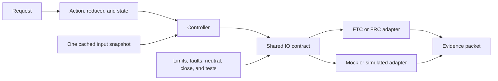

# Capstone 2: build a complete ARES subsystem

## Purpose and prerequisites

Build one robot feature all the way from a goal to tests. A subsystem is complete when each job has
an owner and the jobs connect safely. A smaller file count does not make it complete.

Complete [Author a Code-First or Hybrid Subsystem](/academy/programming-code-subsystem?path=programming-with-ares),
[Read Hardware Once and Write Safe Outputs](/academy/programming-io-caching?path=programming-with-ares),
and [Test Robot Logic Across Mocks and Simulation](/academy/programming-tests-parity?path=programming-with-ares).

Students may review the design, run the tests, and decide whether the code and simulation meet the
written goal. A later robot test follows the team's safety process. Lead Coach review applies only
if the work becomes a website post.

## Vocabulary

- **Capability:** one useful behavior with named inputs, outputs, and safety needs.
- **Ownership:** which source people edit and which generated output they do not edit.
- **Reducer:** a pure function that makes new state from old state and an action.
- **Snapshot:** input values saved together during one loop.
- **Controller:** logic that turns state and a snapshot into a limited command.
- **IO contract:** shared rules for units, input validity, output, safe stop, and close.
- **Adapter:** the FTC, FRC, mock, or simulator code that follows the IO contract.
- **Neutral:** the output used to stop or make the feature safe.
- **Parity:** the same contract behavior on each adapter.
- **Evidence packet:** the files and results that support each limited claim.

## Visual model

Read the map from left to right. State holds the request. The snapshot holds what the robot observed.
The controller decides a command. The IO contract gives every adapter the same rules. Tests check
those rules before anyone makes a physical claim.

Generated plumbing may connect reviewed definitions to the runtime. Edit the canonical subsystem
document or user-owned source. Do not edit disposable files under a generated build folder.

## Study a small, real team example

The current team repository contains an `indicator-lights.aressubsystem` document. It is a useful
beginner example because its limits are easy to see.

This Studio 5.0.3 screenshot shows the real Indicator lights descriptor in the
Subsystem Builder. It supports the descriptor and ownership discussion below.
It does not show the generated preview categories, a successful build, a
simulation result, or physical robot behavior.

| Boundary | What the current descriptor says |
| --- | --- |
| Hardware | Two optional indicator lights use the FTC names `indicator` and `indicator2`. |
| State | `leftColor` and `rightColor` are separate targets from 0 to 1. |
| Control | Each target has its own bounded direct-output rule. |
| Safe output | Both lights use 0 as their safe output. |
| Ownership | The descriptor is canonical. Its runtime code, mock, and test are generated. |
| Startup | The lights are optional and are not required at startup. |

This example has no position sensor, homing step, or moving mechanism. It does not need the feedback
rules that an arm, elevator, or flywheel needs. Use it to study ownership and separate targets. Do
not copy its simple safety settings into a different kind of mechanism.

## Worked example

This is a practice example, not team hardware.

Imagine an elevator with a target height in meters. It reports position, current, top limit, and
bottom limit. The requested height belongs in immutable state. One snapshot holds the current input
values, whether each value is valid, and when it was refreshed.

The controller reads the state and snapshot. It returns a limited command. The hardware adapter
reads each device once per loop. The simulated adapter uses the same units and can model old input,
failed output, and travel limits. A failed output write latches a fault and tries neutral output.

Passing tests can support a code-contract claim. A simulation can support a modeled-behavior claim.
Neither proves real wiring, gearing, travel, current limits, or clear space around a robot.

## Hands-on activity

### Gate 1: choose the capability and ownership

1. Choose one narrow capability. Write one result you can measure, including its unit and limit.
2. Choose the closest capability template. Explain each safety choice it asks you to make.
3. Choose the authoring path: a canonical `.aressubsystem` document or user-owned Kotlin.
4. Mark each planned file as user-owned, generated starter, or generated do-not-edit output.

### Gate 2: design the data and safety rules

5. Define the requested state, observed state, status, and configuration state.
6. List the actions. Trace one action through a pure reducer without using hardware.
7. Design one cached input snapshot. Name the one loop step that refreshes it.
8. Define command bounds, safe output, stale-input behavior, faults, recovery, and close behavior.

### Gate 3: connect adapters and tests

9. Define one shared IO contract with clear units and validity rules.
10. Make the platform and simulated adapters follow that same contract.
11. Preview generated changes. Record new, unchanged, protected, and warning items.
12. Test startup, old or invalid input, failed writes, limits, neutral recovery, parity, and close.

### Gate 4: build an honest evidence packet

13. Run project verification and one repeatable simulation case.
14. Complete the evidence board. Leave every unsupported box clear.

<capstoneevidenceboard />

The board records your review. It does not run code, command hardware, approve a website post, or
prove a physical result. If the project is blocked, record the design and the missing evidence. Do
not invent a passing build, test, simulation, or robot result.

## Checkpoints

- Does the goal include a number, unit, and limit?
- Does one source own each rule?
- Are requested state and observed input separate?
- Is each fallible input marked valid or invalid and fresh or old?
- Does each hardware read happen once per loop?
- Are commands finite, limited, and rejected safely?
- Do safe and close still try neutral after an earlier fault?
- Does recovery require a successful neutral and healthy input?
- Does the simulated adapter use the same rules and units?
- Are physical claims held back until physical evidence exists?

## Troubleshooting

| Problem | Better move |
| --- | --- |
| The project starts with an FTC motor call. | Start with the capability and shared IO contract. |
| Generated output contains hand edits. | Move the rule to the canonical document or user-owned source. |
| Telemetry reads hardware again. | Publish the cached snapshot instead. |
| The mock cannot fail. | Add old input, invalid input, failed write, limit, and recovery controls. |
| A nonzero command clears a fault. | Require successful neutral and healthy evidence first. |
| FTC and simulation use different units. | Fix the shared contract before comparing results. |
| A test passes but stop behavior is unclear. | Add safe, close, disabled, and interrupted-lifecycle tests. |

## Evidence artifact

Create one subsystem packet. Include the goal, ownership map, and canonical descriptor or design
note. Add the state trace, snapshot fields, IO contract, command limits, adapter map, and preview
diff. Include build checks, test results, one controlled fault, one simulation result, unsupported
claims, and the remaining physical-test plan.

Remove student identity, credentials, private paths, and unrelated logs. Link an exact source
revision. Label each claim as designed, generated, compiled, tested, simulated, planned, or
physically observed.

Ask another student to read the packet. Can they find the goal, units, stop rule, fault test, and
unsupported claims? Can they trace one request to one safe output? Fix each gap they find. Keep the
old note so the change is visible.

## Short assessment

1. Why does a subsystem begin with a capability instead of a file count?
2. Why must hardware reads stay inside one refresh step?
3. What must a simulated adapter share with the platform adapter?
4. Why should a failed write require a successful neutral before recovery?
5. Which claims still need a physical robot test?

## Extension challenge

Add homing to the design. Name its direction, limited output, timeout, travel limit, saved zero,
re-home rule, failure state, and tests. Explain why a simulated homing pass cannot prove switch
wiring or clear space around the mechanism.

## Related and next

Continue to the simulated autonomous-mission capstone. Use
[Coordinate Subsystems and Fail Safe](/academy/ftc-season-composition-and-safe-lifecycle?path=programming-with-ares)
when several capabilities share safety rules. Physical commissioning remains a separate evidence
gate. A complete code packet does not start a robot test by itself.
