# Capstone 3: complete a simulated autonomous mission

## Purpose and prerequisites

This capstone joins a starting pose, bounded drive goals, typed robot actions, conditions, failure
paths, generation, and Local Sim evidence in one mission. The mission must fail closed when a named
step, action, field check, or runtime boundary is invalid.

Complete [Build and Verify Your First FTC Autonomous Routine](/academy/ftc-starter-first-autonomous?path=controls-localization-autonomous),
[Plan Smooth Motion with Limits](/academy/controls-motion-profiles?path=controls-localization-autonomous),
and [Capstone 2: Build a Complete ARES Subsystem](/academy/capstone-subsystem?path=robotics-capstones).
This project ends with simulation evidence. It does not deploy code or approve a physical field run.

## Vocabulary

- **Routine:** an ordered or grouped set of robot steps.
- **Drive goal:** one field pose inside a routine.
- **Starting pose:** the declared position and heading before the first step.
- **Action catalog:** the typed actions and conditions available to a project.
- **Preflight:** checks that must pass before any routine output begins.
- **Footprint:** the full robot boundary used for field checks.
- **Mirroring:** the reviewed transform from the authored alliance to the other alliance.
- **Deadline group:** parallel work that ends when its named main step ends.
- **Safe default:** the do-nothing choice used when a requested routine is invalid.
- **Blocked:** a result that stops the routine and returns outputs to neutral.

## Worked example

An invented mission starts at `(1.0 m, 1.0 m, 0°)`. It drives to a pickup point, runs one typed
intake action during motion, waits for a valid condition, then drives to a scoring point. An arrival
action stops the mechanism.

The project file owns field size, coordinate convention, and robot footprint. The routine owns drive
goals, waits, conditions, groups, calls, and actions. The autonomous catalog owns the selectable
name, starting pose, alliance policy, order, and enabled state.

A passing preview means the data is shaped well enough for that check. Generation proves that the
canonical files produced current typed source. Local Sim can show modeled execution. None proves
traction, wheel direction, mechanism clearance, game-piece behavior, or a safe physical path.

## Visual model

```mermaid
%% aria: A project and action catalog lead to one routine and autonomous entry. Field and footprint checks lead to generated code. Local Sim runs Blue and Red cases plus blocked cases. The evidence packet records results and physical limits.
flowchart LR
  P["Project and typed action catalog"] --> R["Routine steps and groups"]
  R --> A["Autonomous entry and starting pose"]
  A --> F["Field, footprint, reference, and resource checks"]
  F --> G["Generate and verify"]
  G --> S["Local Sim: Blue, Red, and blocked cases"]
  S --> E["Evidence packet with visible limits"]
```

There is no second path file. A drive goal is one routine step. Keep the routine and its generated
source tied to the same canonical revision.

## Hands-on activity

1. Write one measurable mission goal and one stop condition.
2. Choose a reviewed field, robot footprint, coordinate convention, and authored alliance.
3. Record the starting pose and each bounded drive goal with meters and degrees.
4. Use the path lab to test footprint boundaries and one blocked obstacle case.

<autonomouspathlab />

5. Use the profile lab to compare conservative speed and acceleration limits.

<motionprofilelab />

6. Add only typed actions from the project catalog. Mark during-motion and arrival ownership.
7. Add one condition or deadline group. Record timeout and neutral behavior.
8. Preview the full tree, called routines, resources, references, and both alliance transforms.
9. Save canonical files and run generation plus project verification.
10. Run the mission in Local Sim for Blue and Red.
11. Test a missing action, invalid field goal, or timed-out condition. Confirm the run blocks safely.
12. Complete the evidence board and leave missing physical facts unchecked.

<capstoneevidenceboard />

Use an invented mission if approved team mission details are not public. Never present practice data
as a current competition routine.

## Checkpoints

- Does every pose use the project coordinate convention and units?
- Does the full footprint stay inside the field for each drive sweep?
- Are all action and condition keys present in the typed catalog?
- Are mechanism actions placed during motion or on arrival on purpose?
- Are parallel groups, deadlines, calls, repeats, and resources bounded?
- Does a missing reference block save or generation instead of disappearing?
- Does the other-alliance transform run exactly once?
- Does every failure cancel work, neutral outputs, and report the blocked reason?
- Are canonical files and generated source from the same revision?
- Are simulation claims kept separate from physical claims?

## Troubleshooting

| Problem | Better move |
| --- | --- |
| The action browser is empty | Open the repository root and verify the typed action catalog. |
| A routine saves but generated code is stale | Run project generation and verification again. |
| Red follows the wrong side | Inspect the one reviewed alliance transform and starting pose. |
| A goal center is inside but a corner crosses the wall | Check the full footprint and complete drive sweep. |
| A mechanism action vanishes | Resolve the missing typed reference; never drop it silently. |
| A timeout leaves output active | Fix cancellation and neutral behavior before another run. |
| Blue passes but Red was not tested | Record both modeled cases before review. |

## Evidence artifact

Create a mission packet with the requirement, project revision, field, footprint, coordinate
contract, autonomous entry, and routine tree. Add typed references, resource ownership, preview
findings, generated diff, build checks, and verification results. Include Blue and Red Local Sim
runs, one blocked case, telemetry timestamps, neutral result, unsupported claims, and physical plan.

Remove student identity, credentials, private paths, and unpublished strategy. Label every claim
designed, generated, compiled, simulated, blocked, planned, or physically observed.

## Short assessment

1. Why is a drive goal part of the routine instead of a second path file?
2. What belongs in the autonomous catalog rather than the routine?
3. Why must the full robot footprint be checked?
4. What should happen when a typed action is missing?
5. Which mission claims still require physical evidence?

## Extension challenge

Add one called routine and one deadline group. Draw resource ownership over time. Predict one
deadlock or conflict that validation must reject. Add a test that proves cancellation returns every
owned output to neutral.

## Related and next

Continue to the physical-feature commissioning capstone only after the simulated mission packet is
complete. Use [Compare Logs and Replay a Failure](/academy/testing-logs-replay?path=testing-debugging-commissioning)
to compare modeled runs. Local Sim does not certify physical clearance or match readiness.
