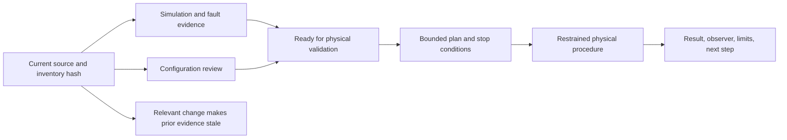

# Capstone 4: commission a physical robot feature

## Purpose and prerequisites

This capstone carries one tested subsystem from simulation evidence to a small physical procedure.
Students can run and document the team safety process. Website publication remains a separate Lead
Coach review step.

Complete [Capstone 2: Build a Complete ARES Subsystem](/academy/capstone-subsystem?path=robotics-capstones),
[Build a Fault Tree and Isolate a Cause](/academy/testing-fault-tree?path=testing-debugging-commissioning),
and [Commission an FTC Starter Robot Safely](/academy/ftc-starter-physical-commissioning?path=testing-debugging-commissioning).
Use only an approved current robot, current inventory hash, and the team's normal safety procedure.

## Vocabulary

- **Commissioning:** a staged process that gathers evidence before wider use.
- **Inventory hash:** an identity for the exact reviewed hardware configuration.
- **Configuration reviewed:** wiring, names, addresses, directions, limits, and neutral were checked.
- **Ready for physical validation:** current simulation and configuration evidence have no blocker.
- **Physical procedure:** one named, bounded real-robot test.
- **Observer:** the person who records what happened and the limits of that observation.
- **Stop condition:** a result that ends the test at once.
- **Neutral:** the declared output used to stop the feature.
- **Stale evidence:** an old result tied to a different configuration or source revision.
- **Limitation:** a behavior the recorded procedure did not test.

## Worked example

An invented elevator passed reducer, controller, stale-input, failed-write, neutral-recovery, and
simulated limit tests. The current inventory was reviewed. That makes it ready for a planned physical
check, not physically validated.

The first procedure keeps the robot restrained. It confirms the exact device names, powers the
control system with outputs neutral, reads a fresh position, and checks the stop control. A later
step uses the smallest allowed output for a short time. The observer records direction, position,
current, stop result, and any unexpected sound or motion.

If the descriptor changes, the inventory hash changes. The old review and physical result become
stale. They stay in history, but they cannot prove the new configuration.

## Visual model

Studio separates these evidence levels. One green result must not hide a missing physical boundary.

## Hands-on activity

1. Name one feature and one measurable behavior with units.
2. Record the source revision and exact inventory hash.
3. Attach current simulation, fault, parity, and neutral-recovery results.
4. Review names, ports, buses, addresses, directions, units, limits, homing, and clearance.
5. Use the checklist. Leave a box clear when its evidence is missing.

<commissioningchecklistlab />

6. Write the restrained setup, smallest output, time limit, expected result, and stop conditions.
7. Identify the accessible stop control and the person who will watch it.
8. Run only the approved first physical step under the team safety process.
9. Stop on any unexpected result. Preserve the evidence before changing the system.
10. Record observed values, timestamps, units, result, limitations, and next safe step.
11. Use the evidence board. Do not mark the packet complete without real student evidence.

<capstoneevidenceboard />

This repository does not include an authentic student commissioning result for this capstone. The
request remains open. A student packet must supply the physical evidence before that claim exists.

## Checkpoints

- Do source revision and inventory hash match the robot being tested?
- Are simulation and configuration review current?
- Are outputs neutral before enable and after stop?
- Are feedback values finite, valid, fresh, and unit-labeled?
- Are direction, polarity, soft limits, current limits, and clearance reviewed?
- Is the first output small, short, and restrained?
- Can the stop control be reached without delay?
- Does any unexpected result stop the procedure?
- Are observer, result, limitations, and remaining unknowns recorded?
- Will a relevant change mark the evidence stale?

## Troubleshooting

| Problem | Better move |
| --- | --- |
| Simulation is green but configuration is unknown | Stop at simulation verified. |
| The inventory changed after review | Review the new hash before a physical step. |
| A sensor has no unit or freshness | Fix the evidence contract first. |
| Direction is uncertain | Use a restrained, smallest-output direction check. |
| Stop does not produce neutral | Treat it as a critical fault and end testing. |
| A result differs from the prediction | Preserve it and return to the fault tree. |
| The packet has no authentic physical record | Keep the physical claim unfulfilled. |

## Evidence artifact

Create a physical-feature packet with the requirement, source revision, inventory hash, simulation
results, and configuration review. Add the risk and stop plan, restrained setup, exact procedure,
observer, timestamps, units, and expected and observed values. Record the neutral result, unexpected
events, limits, repair, retest, and next step.

Remove student names from public material unless an approved public identity policy applies. Remove
emails, account IDs, credentials, private paths, and unrelated logs. Keep the private team record in
the approved system and publish only a reviewed, privacy-safe summary.

## Short assessment

1. What does ready for physical validation prove?
2. Why does an inventory change make old evidence stale?
3. What belongs in the first physical procedure?
4. What should happen after unexpected motion?
5. Why can simulation never fill the authentic physical-evidence request?

## Extension challenge

Plan a second test that expands only one boundary, such as load, speed, range, or time. Name the
baseline, one changed condition, metric, limit, stop condition, and result that would send the team
back to fault isolation. Do not run it until the first packet supports that next step.

## Related and next

Continue to competition-readiness evidence only after each required feature has a current bounded
record. Use [Run SysId and a Bounded Tuning Experiment](/academy/testing-sysid-tuning?path=testing-debugging-commissioning)
only for a healthy suitable system. Publication still requires Lead Coach review.
