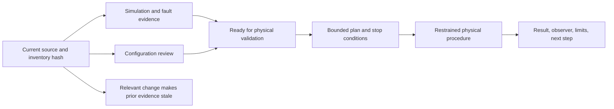

# Capstone 4: commission a physical robot feature

## Purpose and prerequisites

This capstone takes one tested subsystem from a screen to a small robot test. Students can run and
record the team's safety process. Lead Coach review is needed only if the work becomes a website
post.

Complete [Capstone 2: Build a Complete ARES Subsystem](/academy/capstone-subsystem?path=robotics-capstones),
[Build a Fault Tree and Isolate a Cause](/academy/testing-fault-tree?path=testing-debugging-commissioning),
and [Commission an FTC Starter Robot Safely](/academy/ftc-starter-physical-commissioning?path=testing-debugging-commissioning).
Use the current robot, its current inventory hash, and the team's normal safety steps.

## Your four gates

Do not jump from a green screen to robot motion. Move through four gates in order:

1. **Code and simulation:** build the code and run the right fault tests.
2. **Robot setup:** check names, wires, limits, direction, fresh sensor data, and neutral output.
3. **One small test:** write the stop rule, restrain the robot, and use the smallest allowed output.
4. **Record the result:** save what you saw, what you did not test, and what should happen next.

A missing gate means stop. An old gate must be checked again after a related change.

## Vocabulary

- **Commissioning:** a set of small checks before wider use.
- **Inventory hash:** an identity for the exact reviewed hardware configuration.
- **Configuration reviewed:** wiring, names, addresses, directions, limits, and neutral were checked.
- **Ready for physical validation:** the current screen tests and setup review have no blocker.
- **Physical procedure:** one named, bounded real-robot test.
- **Observer:** the person who records what happened and the limits of that observation.
- **Stop condition:** a result that ends the test at once.
- **Neutral:** the declared output used to stop the feature.
- **Stale evidence:** an old result tied to a different configuration or source revision.
- **Limitation:** a behavior the recorded procedure did not test.

## Worked example

Imagine an elevator that passed its code and screen tests. These tests covered old sensor data,
failed output, stop recovery, and travel limits. The team also checked the current parts list. The
elevator is now ready for one planned robot check. It is not yet proven on the robot.

The first plan keeps the robot restrained. The student checks each device name and powers the control
system with all outputs neutral. The student reads a fresh position and tests the stop control. Only
then does the plan use the smallest allowed output for a short time. The observer records direction,
position, current, the stop result, and any odd sound or motion.

If the descriptor changes, the inventory hash changes. The old review and physical result become
stale. They stay in history, but they cannot prove the new configuration.

## Visual model

Studio separates these evidence levels. One green result must not hide a missing physical boundary.

## Hands-on activity

### Gate 1: code and screen tests

1. Name one feature and one behavior you can measure. Include the unit.
2. Record the source revision and exact inventory hash.
3. Attach current build, simulation, fault, parity, and stop-recovery results.

### Gate 2: robot setup

4. Check names, ports, buses, addresses, direction, units, limits, homing, and clear space.
5. Use the checklist. Leave a box clear when proof is missing.

<commissioningchecklistlab />

### Gate 3: one small robot test

6. Write the restrained setup, smallest output, time limit, expected result, and stop rules.
7. Name the easy-to-reach stop control. Name the person who will watch it.
8. Run only the first small step under the team safety process.
9. Stop for any result you did not expect. Save the evidence before you change the system.

### Gate 4: record the result

10. Record values, times, units, the result, limits of the test, and the next safe step.
11. Use the evidence board. Do not mark the packet complete without real student evidence.

<capstoneevidenceboard />

This repository does not include an authentic student commissioning result for this capstone. The
request remains open. A student packet must supply the physical evidence before that claim exists.

## Checkpoints

- Do source revision and inventory hash match the robot being tested?
- Are simulation and configuration review current?
- Are outputs neutral before enable and after stop?
- Are feedback values finite, valid, fresh, and unit-labeled?
- Are direction, polarity, soft limits, current limits, and clearance reviewed?
- Is the first output small, short, and restrained?
- Can the stop control be reached without delay?
- Does any unexpected result stop the procedure?
- Are observer, result, limitations, and remaining unknowns recorded?
- Will a relevant change mark the evidence stale?

## Troubleshooting

| Problem | Better move |
| --- | --- |
| Simulation is green but configuration is unknown | Stop at simulation verified. |
| The inventory changed after review | Review the new hash before a physical step. |
| A sensor has no unit or freshness | Fix the evidence contract first. |
| Direction is uncertain | Use a restrained, smallest-output direction check. |
| Stop does not produce neutral | Treat it as a critical fault and end testing. |
| A result differs from the prediction | Preserve it and return to the fault tree. |
| The packet has no authentic physical record | Keep the physical claim unfulfilled. |

## Evidence artifact

Create one physical-feature packet. Start with the goal, source revision, inventory hash, screen-test
results, and robot setup review. Add the risk and stop plan. Include the restrained setup, exact
steps, observer, times, units, and expected and observed values. Record the neutral result, any odd
event, each limit of the test, any repair, the retest, and the next step.

Remove student names from public material unless an approved public identity policy applies. Remove
emails, account IDs, credentials, private paths, and unrelated logs. Keep the private team record in
the approved system and publish only a reviewed, privacy-safe summary.

## Short assessment

1. What does ready for physical validation prove?
2. Why does an inventory change make old evidence stale?
3. What belongs in the first physical procedure?
4. What should happen after unexpected motion?
5. Why can simulation never fill the authentic physical-evidence request?

## Extension challenge

Plan a second test that changes only one limit, such as load, speed, range, or time. Name the first
result. Name the one change, what you will measure, the allowed limit, and the stop rule. State what
result would send the team back to fault finding. Do not run it until the first packet supports the
next step.

## Related and next

Continue to competition-readiness evidence only after each required feature has a current bounded
record. Use [Run SysId and a Bounded Tuning Experiment](/academy/testing-sysid-tuning?path=testing-debugging-commissioning)
only for a healthy suitable system. Publication still requires Lead Coach review.
