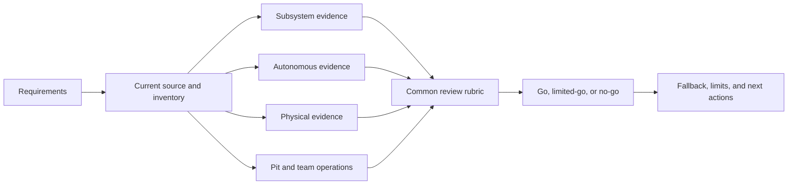

# Capstone 5: present competition-readiness evidence

## Purpose and prerequisites

This capstone turns the earlier project packets into one honest readiness review. Readiness is not a
badge from one test. It is a set of current claims, each tied to the evidence level that supports it.

Complete [Capstone 3: Complete a Simulated Autonomous Mission](/academy/capstone-autonomous-mission?path=robotics-capstones),
[Capstone 4: Commission a Physical Robot Feature](/academy/capstone-physical-commissioning?path=robotics-capstones),
and [Run a Drive-Team Match Cycle](/academy/competition-drive-team?path=competition-operations).
Current official event rules and an approved team process still govern a real event.

## Vocabulary

- **Readiness claim:** a specific statement that a team expects to remain true at an event.
- **Evidence level:** designed, generated, compiled, tested, simulated, reviewed, or observed.
- **Traceability:** a path from a claim to its exact source and result.
- **Current:** tied to the same source revision, inventory, robot, and procedure now in use.
- **Regression:** a behavior that became worse after a change.
- **Fallback:** the safe action used when a planned feature is unavailable.
- **Handoff:** a clear transfer of robot state, evidence, and next action.
- **Limitation:** a behavior the evidence did not test.
- **Go/no-go rule:** a stated result that allows or blocks the next operation.
- **Review rubric:** the same questions used to judge every packet.

## Worked example

A team says, “Our autonomous mission is ready.” That is too broad. A stronger packet separates the
claims. The routine may be generated and compiled. Blue and Red Local Sim runs may pass. A physical
starting pose and one bounded motion may be observed. Mechanism actions may still lack current
physical evidence.

The packet marks the mission available only for the boundaries that passed. It also names the safe
do-nothing fallback. If the inventory or routine changes, affected evidence becomes stale. The team
does not hide the gap or move an old result to the new revision.

## Visual model

One blocked feature does not require hiding the rest of the robot. It requires a clear limit,
fallback, owner, and go/no-go decision.

## Hands-on activity

1. List five to eight narrow readiness claims. Give each a number, unit, or visible outcome.
2. Record the current source revision, generated state, inventory hash, and robot identity.
3. Link one subsystem packet to each mechanism claim.
4. Link Blue, Red, blocked, cancellation, and neutral evidence to each autonomous claim.
5. Link current bounded physical records. Mark missing evidence rather than copying simulation.
6. Record current configuration review, stop controls, safe-zero or homing state, and known faults.
7. Add pit handoff, battery or power checks, spares, tools, and recovery notes from approved team records.
8. Add drive-team roles, communication, fallback choices, and post-run debrief steps.
9. Apply the draft team rubric below to every claim.
10. Use the evidence board to locate the first incomplete packet section.

<capstoneevidenceboard />

### Draft team review rubric

| Gate | Passing evidence |
| --- | --- |
| Identity | Claim points to current source, generated output, inventory, robot, and procedure. |
| Traceability | A reviewer can open the exact test, run, timestamp, or observation. |
| Safety | Neutral, stop, limits, stale-input response, faults, and recovery are explicit. |
| Coverage | Normal, blocked, failure, cancellation, and fallback cases are represented. |
| Freshness | Relevant changes mark old review or physical results stale. |
| Operations | Owner, handoff, go/no-go rule, and next action are clear. |
| Privacy | Shared artifacts contain no private student or account data. |
| Honesty | Unsupported behavior and missing physical evidence stay visible. |

This rubric is a review draft. Students and the team can review, test, and adopt their robot process.
Publishing this lesson or a readiness claim on the website follows the existing editorial review gate.

## Checkpoints

- Is each claim narrow enough to test?
- Can a reviewer open the exact source and evidence?
- Do source, inventory, robot, and procedure identities match?
- Are physical claims supported by physical observations?
- Are stop, neutral, cancellation, and fallback results current?
- Are blocked and timed-out cases retained?
- Are pit and drive-team handoffs based on approved team records?
- Does every no-go item have an owner and next action?
- Are student identity and private notes removed from public artifacts?
- Did a relevant change make any evidence stale?

## Troubleshooting

| Problem | Better move |
| --- | --- |
| The packet says “all systems ready” | Split it into testable claims and evidence levels. |
| Simulation fills a physical gap | Mark the physical claim missing. |
| A screenshot has no revision or timestamp | Link the source record and preserve its identity. |
| One failure blocks the whole review | Define the safe fallback and limited-go boundary. |
| Old evidence looks current | Compare hashes and mark affected claims stale. |
| A pit note contains student details | Keep private records in the approved system and redact the shared packet. |
| The rubric was never reviewed | Keep it a draft and request team review. Use the editorial gate only for website publication. |

## Evidence artifact

Create a readiness packet with the rubric version, reviewer status, source and inventory identity,
claim table, and exact evidence links. Add subsystem, autonomous, and bounded physical packets.
Record pit and operations handoffs, regressions, open faults, fallbacks, go/no-go decisions, limits,
owners, and next actions.

Do not add student names, emails, phone numbers, account IDs, credentials, private strategy, or
unrelated logs to a public packet. Use approved public labels where identity is needed.

## Short assessment

1. Why is “the robot is ready” too broad?
2. What makes evidence current?
3. Why must a fallback appear beside a limited-go decision?
4. When does a change make old evidence stale?
5. What remains required before this draft rubric supports a real team process?

## Extension challenge

Run a paper review in which one critical feature becomes unavailable. Revise the claim table,
fallback, match plan, pit handoff, and go/no-go result. Keep supported work visible while removing
only the claims that no longer have evidence.

## Related and next

Return to the specific learning path for every no-go item. Use
[Compare Logs and Replay a Failure](/academy/testing-logs-replay?path=testing-debugging-commissioning)
for evidence gaps and the competition-operations path for approved event procedures. This draft
does not replace current official rules or the team's own process review.
