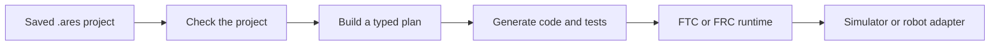

# Find your way around the ARES workspace

ARES keeps its main software in one large folder called a **monorepo**. A monorepo lets one change
update the library, robot code, and Studio together. Each part still has its own build so an FTC
app does not get mixed with an FRC app or a desktop app.

## What you will learn

- Name the main parts of the ARES workspace.
- Pick the right place for a code change.
- Tell source files apart from generated files.

## Key words

- **Monorepo:** one Git repository that holds several related projects.
- **Shared library:** code that more than one robot can use.
- **Generated file:** a file made by a tool from a saved project plan.
- **Runtime:** the code that runs on a robot, simulator, or computer.

## Meet the main folders

| Folder | What it owns |
| --- | --- |
| `ARESLib-Kotlin/` | Shared math, state, controls, hardware rules, logging, and simulation tools |
| `ARES-FTC/` | Team 23247 FTC robot code and the FTC simulator |
| `ARES-FRC/` | FRC robot code and the FRC simulator |
| `ARES-Analytics/` | ARES Robotics Studio, local data tools, and optional cloud tools |
| `ARES-FTC-Starter/` and `ARES-FRC-Starter/` | Clean starter projects with no team robot tuning |
| `templates/` | Templates used to create generated robot files |
| `build-logic/` and `release/` | Shared build and release rules |

## Choose where a change belongs

Ask, “Should more than one robot use this?” If yes, the change may belong in `ARESLib-Kotlin/`.
A mechanism used by one season robot belongs in `ARES-FTC/` or `ARES-FRC/`. A screen or desktop
workflow belongs in `ARES-Analytics/`.

Studio saves the robot plan in `.ares` documents. It then makes code and tests in build folders.
Edit the saved plan or an approved extension point. Do not hand-edit a generated file, because the
next build will replace it.

## Check your understanding

For each idea below, name the owning folder and one project that should be retested.

1. A geometry fix used by FTC and FRC.
2. A new intake for this season's FTC robot.
3. A change to the Studio telemetry screen.
4. A change to a clean FTC starter template.

**Answer check:** shared geometry belongs in ARESLib. The intake belongs in FTC. The screen belongs
in Analytics. The starter change begins in its monorepo starter or template source.
