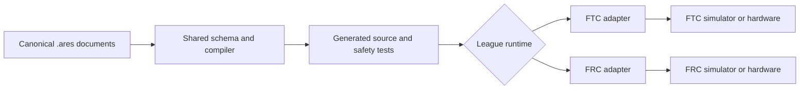

# Find your way around the ARES workspace

## Purpose and prerequisites

ARES keeps its authoritative source in one **monorepo**, which means one Git repository holds
several related products. This lesson helps you find the right home for a change before you edit
code. You do not need an earlier lesson. You only need the current ARES Robotics source tree or its
GitHub page and a place to record your answers.

The protected release manifest currently names ARES 15.0.4 and Studio 5.0.6. Each product still has
its own Gradle build because FTC, FRC, the shared library, and the desktop app use different tools
and run in different places. One source repository does not mean one program or one runtime.

## Vocabulary

- **Monorepo:** one Git repository that holds several related projects.
- **Owner:** the project responsible for a behavior or file.
- **Shared library:** code designed for more than one robot product.
- **Canonical document:** the saved source that people and tools agree to edit.
- **Generated file:** a result made by a tool from a canonical source.
- **Runtime:** code that runs in a robot, simulator, or desktop app.
- **Adapter:** code that connects a shared idea to one league or device.
- **Release identity:** one version name tied to one exact source tree and set of artifacts.

## Worked example

Suppose both FTC and FRC show the same wrong geometry result. Start by asking where that shared
math lives. `ARESLib-Kotlin/` owns shared math, project models, controls, hardware contracts, code
generation, and simulation foundations. The first investigation belongs there. After a fix, both
league consumers should be checked because both use that shared behavior.

Now suppose one screen in ARES Robotics Studio has the wrong label. That work belongs in
`ARES-Analytics/`, which owns Studio, local analytics, replay, and its optional gateway. There is no
reason to put a screen-only change in the robot library.

A third example is a version shared by every product. That does not belong in one consumer's Gradle
file. `release/ares-versions.properties` owns the release identity. `build.ps1` then tests the
library first and the consumers against that same version. A changed library tree needs a new
version; a packaging retry must not put different bytes under an old version.

## Visual model

The source monorepo does not turn FTC and FRC into one runtime. Their device adapters, lifecycle,
build, and simulator remain separate. The shared library points inward; league products consume it.

## Hands-on activity

Open the workspace and find these owners:

| Folder | What it owns |
| --- | --- |
| `ARESLib-Kotlin/` | Shared schema, controls, hardware rules, code generation, and simulation foundations |
| `ARES-FTC/` | Team 23247 FTC robot code and the FTC simulator product |
| `ARES-FRC/` | FRC robot code and the FRC simulator product |
| `ARES-Analytics/` | ARES Robotics Studio, local data tools, replay, and the gateway |
| `ARES-FTC-Starter/` | Canonical source for the clean FTC starter release mirror |
| `ARES-FRC-Starter/` | Canonical source for the clean FRC starter release mirror |
| `templates/` | Monorepo-owned runtime templates, not normal student source files |
| `build-logic/` and `release/` | Shared build rules and immutable release identity |

Use the ownership lab below. Sort each proposed change by the product that should own it. The lab
uses the reviewed monorepo map, but it does not inspect your branch or prove a file is correct.

<workspaceownershiplab />

Try every scenario, including FRC, a starter, and release tooling. Then choose three real files from
the workspace. For each file, record its path, likely owner, and one consumer that could be affected
by a change.

## Checkpoints

Before editing, ask three questions:

1. Is this behavior shared across leagues or limited to one product?
2. Am I looking at a canonical source or at generated output under a build folder?
3. Which isolated Gradle build and consumer tests could detect a mistake?

If a file was created from a `.ares` document, edit the document or an approved extension point.
Do not hand-edit generated output because the next generation step can replace it.

## Troubleshooting

If two folders appear to contain similar code, check which one is the canonical source. The starter
folders own the clean starter source, while public starter repositories are release mirrors.

If a local folder contains older standalone component checkouts, do not assume they are current.
Check the repository root and branch before editing. The protected monorepo is the source authority;
legacy repositories remain readable for history and immutable releases during the transition.

If a change seems to need edits in every product, pause and look for a shared contract. Copying the
same fix into FTC, FRC, and Studio can hide a missing shared owner.

If you cannot find a project, confirm that you are viewing the current ARES Robotics monorepo. Old
component repositories may remain for history, but they are not the current source of truth.

## Evidence artifact

Create a workspace map with at least six folders. For each folder, write one owned responsibility
and one thing it does not own. Add three file examples with their paths. Mark each example as
canonical source, generated output, or adapter code.

Finish with one short change plan. Name the proposed change, its owner, the build you would run,
and one consumer you would retest. This artifact shows your reasoning; it does not show that the
change is already correct.

## Short assessment

1. Why can one monorepo still contain several Gradle builds?
2. Where should shared FTC and FRC math usually live?
3. Which folder owns the ARES Robotics Studio user interface?
4. Why should generated files not be edited by hand?
5. What is the difference between a starter source and a public release mirror?
6. Why must a changed source tree receive a new release identity?

## Extension challenge

Trace one `.ares` document from saved project data to generated code, then to an FTC or FRC
adapter. Name each boundary. Explain which step is shared and which step depends on the league.

Next, inspect `release/ares-versions.properties`. Explain why one version identity should point to
one exact source tree instead of changing its contents after release.

## Related and next

Continue with [Follow a Robot Request from Input to
Output](/academy/robot-input-to-output?path=robotics-foundations). If you want to create a clean FTC
workspace, use [Start an FTC Project Without Inherited Robot
Assumptions](/academy/ftc-starter-project-identity?path=ftc-robot-with-ares). Library maintainers
can continue with [Develop, Test, and Validate ARESLib
Changes](/docs/development-testing-and-release-validation) before assigning any release identity.
