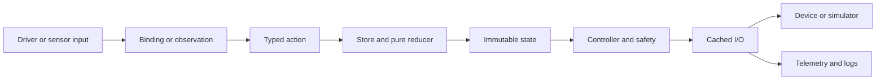

# Follow a robot request from input to output

## Purpose and prerequisites

Pressing a gamepad button does not write to a motor at once. ARES moves the request through small,
named steps. This structure makes robot behavior easier to test, explain, and stop safely.

Complete [The ARES Software Workspace](/academy/ares-workspace-map?path=robotics-foundations) first.
You need a local copy of an ARES FTC or FRC project. This lesson can be completed from source and
simulation without powering a robot.

## Vocabulary

- **Input:** a driver control or sensor sample entering the loop.
- **Binding:** a rule that connects a named control to an action.
- **Action:** a typed message that describes an event or requested change.
- **State:** the robot data visible at one point in time.
- **Reducer:** a pure function that calculates the next state.
- **Controller:** logic that turns state and cached inputs into a checked output.
- **Cached I/O:** the boundary that stores fresh inputs and applies approved outputs.
- **Telemetry:** named evidence shown or saved for later review.

## Worked example

Suppose a driver pushes a stick forward. The platform adapter reports a control value. A binding
turns that value into a typed action. The store sends the action through the reducer. The reducer
returns the next state without reading a motor or sensor.

A controller then reads that state and the loop's cached sensor values. Safety logic checks the
result before a platform adapter writes an output. Telemetry records useful signals after the loop
work. An action is therefore not a motor voltage. It is one message near the start of the flow.

## Visual model

At the start of each robot loop, ARES refreshes hardware inputs once. Controllers use those cached
samples. This prevents two controllers from making decisions with sensor values from different
times in the same loop.

## Hands-on activity

Choose one drive control or simple mechanism request in a checked-in project. Trace these items:

1. Find the gamepad control, routine step, or sensor observation.
2. Find the binding or code that creates the action.
3. Write the action type and the data it carries.
4. Find the reducer that handles the action.
5. Record the state field that changes.
6. Find the controller that reads that state.
7. Find the cached input or output contract used by the controller.
8. Find one telemetry signal that can show the result.
9. Mark each step as source evidence, test evidence, simulator evidence, or physical evidence.
10. Stop and record a gap if one link cannot be found. Do not invent a class or signal name.

Use the tracer below to compare a driver request with a sensor observation. Move through every step.
For each scenario, name the first place that state changes and the first place an output can occur.

<robotflowtracer />

The tracer is a fixed teaching model. It does not inspect your repository or run the robot loop.
Use your source trace and tests as the project evidence.

## Checkpoints

- Can you explain why an action is not a hardware command?
- Does the reducer avoid device, network, file, and clock access?
- Do controllers use cached inputs instead of making surprise device reads?
- Is the output checked before it reaches the platform adapter?
- Can another student follow your evidence without guessing?

## Troubleshooting

| Symptom | Check |
| --- | --- |
| Action name cannot be found | Search the generated capability catalog and project sources. |
| Reducer changes the wrong slice | Trace the root reducer and the season reducer together. |
| Getter performs bus I/O | Move the read to the loop refresh boundary and return cached data. |
| Output skips safety logic | Find the controller or lifecycle owner before the adapter write. |
| Simulator and robot differ | Compare the mock and physical adapters against the same I/O contract. |
| Trace ends at telemetry | Telemetry reports evidence; it should not become a second control loop. |

## Evidence artifact

Create a one-page flow record. Include the input, binding, action, reducer, state field, controller,
I/O method, and telemetry signal. Add a source path for every item. Label any missing link as a gap.

Then add one test result. A reducer unit test can prove a state transition. A simulator test can show
the project executes against mocks. Neither result proves physical wiring, direction, encoder scale,
current limit, loop timing, or device health.

Students may verify physical robot functionality using the team's normal safety procedure. Website
posts use a separate Lead Coach editorial workflow before publication.

## Short assessment

1. Why should a reducer never read an encoder?
2. What is the difference between state and a controller output?
3. Why does ARES refresh sensor inputs once per loop?
4. Where should a non-finite output be rejected?
5. What evidence would show that a physical adapter matches its simulator mock?

## Extension challenge

Trace the same action on FTC and FRC, or compare a physical adapter with its simulator mock. List the
shared contract and the platform-specific code. Write one automated test that catches a mismatch at
the earliest useful boundary.

## Related and next

Continue to [State, Actions, and Reducers](/academy/redux-state-actions-reducers?path=programming-with-ares)
for a deeper state exercise. Then study cached I/O and subsystem ownership before authoring a new
mechanism. Keep each claim tied to source, test, simulator, or physical evidence.
