# Run your first FTC simulation

## Purpose and prerequisites

A simulator lets you test robot software without moving a physical robot. This lab teaches you to
verify an FTC workspace, launch its simulator, start a TeleOp, and collect evidence of movement.
Complete [The ARES Software Workspace](/academy/ares-workspace-map?path=robotics-foundations) first.
Use a clean ARES FTC Starter project. Keep **Live Robot** unselected for this entire lesson.

Simulation evidence is useful for software behavior. It does not prove that motors are wired,
sensors are mounted, or a physical robot is safe.

## Vocabulary

- **Local Sim:** the Studio target that connects only to a simulator on this computer.
- **Loopback:** a network address such as `127.0.0.1` that points back to the same computer.
- **OpMode:** an FTC program with INIT, START, loop, and STOP stages.
- **Telemetry:** values sent from the running program to a display.
- **NT4:** the live-data protocol used by ARES on port `5810`.
- **True pose:** the simulator's ground-truth position, separate from the robot's estimate.
- **Arm control:** the Studio step that allows local driver input to reach the simulator.

## Worked example

A student selects **Launch Simulator** and sees “build successful.” The Local Sim dot turns green,
but the field does not move. The build result only proves that the selected workspace compiled.
The green dot only proves that Studio connected to a running local process. The student must still
select the generated TeleOp, send INIT and START, arm control, and provide an input.

A complete movement claim needs a changing value. For example, write down true pose X, press the
forward control briefly, release it, and write down true pose X again. A changed value supports the
claim that this simulated model moved.

Use five checkpoints instead of treating one green message as the whole result:

| Checkpoint | Evidence | What it supports |
| --- | --- | --- |
| Build | The selected workspace compiles and its checks pass. | The source was accepted by the build. |
| Process | The simulator starts and stays running. | A local simulator process exists. |
| Connection | Local Sim and one expected topic update. | Studio receives live simulator data. |
| Mode | The chosen OpMode reaches INIT and START. | The intended robot lifecycle is active. |
| Movement | A pose or other expected value changes after input. | The simulated model responded. |

No single row proves the rows below it. None of these rows proves physical wiring or safe motion.

## Use the simulator that owns your robot code

For normal FTC work, launch the simulator from the ARES-FTC project through Studio. Its
`:TeamCode:runSim` task includes the editable TeamCode sources and generated ARES registration.
The ARESLib `:simulator:run` task starts the shared launcher, but a season OpMode works there only
when that season code is on its runtime classpath.

This difference matters when a generic simulator starts but cannot find the OpMode you expected.
Check the active workspace and task before changing robot code or launching another process.

## Visual model

```mermaid
%% aria: The student verifies and builds the selected project, launches the local simulator, waits for a local connection, selects a TeleOp, sends INIT and START, arms local control, and checks changing simulator evidence before stopping.
flowchart LR
  A["Verify and build"] --> B["Launch Local Sim"]
  B --> C["Wait for local connection"]
  C --> D["Choose TeleOp"]
  D --> E["INIT"]
  E --> F["START"]
  F --> G["Arm local control"]
  G --> H["Move and record evidence"]
  H --> I["STOP"]
```

Each arrow is a separate checkpoint. Skipping a checkpoint can leave a healthy simulator waiting
for the next command.

*Studio 5.0.1 before connection. Use the target selector and the visible connection state instead
of treating an empty field or graph as an error.*

## Hands-on activity

1. Open the FTC Starter workspace in ARES Robotics Studio.
2. Select **Verify & build**. Keep the terminal drawer open until the build and tests finish.
3. In the target selector, choose **Local Sim**.
4. Select the monitor-shaped **Launch Simulator** control.
5. Wait for both the green Local Sim dot and the connected message.
6. Open one live widget. True pose or a telemetry chart is a useful first choice.
7. Select the generated TeleOp, then send INIT and START.
8. Arm local control. Press one drive input briefly, then release it.
9. Record one pose value before input, during movement, and after release.
10. Select STOP for the OpMode. Use Studio's square Stop control to end the simulator process.

Use the evidence lab below before you call the run complete. It asks for the lowest test level that
can support a claim. It does not launch Studio, run your build, send controls, or inspect a robot.

<evidencelevelscenarios />

## Checkpoints

Confirm the active workspace is the FTC project you meant to run. A valid project has the Gradle
wrapper and the expected simulator task.

Confirm **Local Sim** is selected before launch. Studio switches its live NT4 address to loopback
for this target, so you do not need to replace the saved live-robot address.

Confirm both process and data evidence. A running process without changing expected telemetry is
not yet a successful run. State your mode clearly: “This is live simulator data. It is not replay,
and it cannot move the physical robot.”

Keep the data sources separate. **True pose** is the physics world's ground truth. **Estimated
pose** is the robot's Redux estimator result. A difference is evidence to investigate, not a reason
to replace one value with the other. The simulator advances `RobotClock` in fixed steps so robot
timeouts and logs remain repeatable.

Studio exchanges live simulator data over local NT4 port `5810`. The simulator also exposes its
local log page and API on port `5002`. An open port shows that a service is listening; it does not
prove that the right workspace, OpMode, or control flow is active.

## Troubleshooting

If port `5810` is already in use, stop older simulator or NT4 processes. Launch only one new process.

If the process runs but the dot stays gray, confirm Local Sim is selected. Read the terminal for an
NT4 server startup line and check whether loopback traffic is blocked.

If Studio connects but pose stays at zero, confirm the OpMode received INIT and START. Check a
second known-changing topic before deciding that the connection failed.

If controls do nothing, confirm the TeleOp is active and local control is armed. Release every
input before retrying. Do not switch to Live Robot as a shortcut.

If the terminal reports an unknown task, confirm Studio opened ARES-FTC rather than ARESLib alone.
League simulator tasks are separate, and a saved workspace may use an explicit simulator command.

## Evidence artifact

Submit a run record with the workspace name, selected target, OpMode, build result, process state,
connection state, INIT state, START state, and armed state. Mark each of the five evidence
checkpoints above. Add a three-row table for pose before input, during movement, and after release.
Include the topic name and units.

Write one sentence stating what the run supports and one stating what it cannot support. A good
limit is: “This run supports simulated control flow and motion; it does not validate wiring or
physical hardware.”

## Short assessment

1. What does a successful build prove?
2. What does a green Local Sim dot prove?
3. Which stages must occur before driver input can move the model?
4. What value can show that the simulated robot moved?
5. Why must Live Robot stay unselected in this lesson?

## Extension challenge

Repeat the run with one intentional missing step, such as waiting after INIT without sending START.
Record the visible evidence. Restore the step and explain what changed.

Then compare true pose with estimated pose during one short movement. Do not expect exact equality.
List two software or model reasons the estimate might differ from simulator ground truth.

## Related and next

Continue with [Robot Coordinates Without
Guesswork](/academy/robot-coordinate-contracts?path=robotics-foundations). To save and compare the
run, continue with [Telemetry and Local Log
Retrieval](/academy/telemetry-and-local-logs?path=robotics-foundations).
