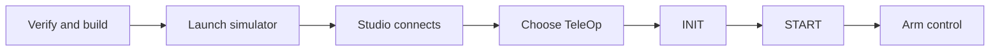

# Run your first FTC simulation

A simulator lets you test robot code without moving a physical robot. A green connection light is
not enough, though. You must also choose an OpMode, start it, and arm local controls.

## What you will learn

- Check and build an FTC starter project.
- Start a TeleOp in the right order.
- Prove that the simulated robot moved.

## Before you start

Use a clean FTC Starter project. In **Project Identity**, check the drive motors `fl`, `fr`, `rl`,
and `rr`. Also check the Control Hub IMU named `imu`. These are project settings for generation and
simulation. They are not measurements from a real robot.

From the project root, run:

```powershell
.\gradlew.bat generateAresProject verifyAresProject :TeamCode:testDebugUnitTest :simulator:test :TeamCode:assembleDebug
```



## Start the simulation

1. Open the project in ARES Robotics Studio.
2. Choose **Local Simulator**. Use `127.0.0.1`, `localhost`, or another loopback name.
3. Select **Launch simulator**. Keep the terminal drawer open while the build runs.
4. Wait for the green Local Sim target and the connected message.
5. Choose the generated TeleOp.
6. Send **INIT**, then **START**.
7. Arm local control.
8. Press one drive control for a moment, then release it.
9. Stop the OpMode and the simulator before closing Studio.

Port `5810` being online only means the NT4 server is listening. It does not mean an OpMode is
running or the robot can move.

## Check your work

Record the OpMode name, INIT message, START message, armed state, and connection state. Also record
the true simulated pose before and after the input. The pose should change, then stop changing when
you release the control.

A successful build or moving chart is not proof by itself. The true simulated pose is the evidence
that the simulated robot moved.
