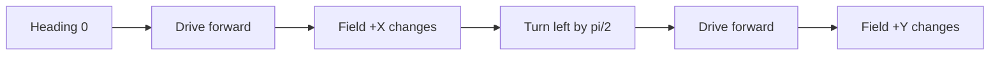

# Understand robot and field directions

Robots need one shared way to describe distance and turning. ARES uses meters for distance,
seconds for time, and radians for angles. A positive turn goes counter-clockwise.

## What you will learn

- Tell robot directions from field directions.
- Read a heading in radians.
- Find the correct place for a sign or screen change.

## Key words

- **Robot frame:** directions that move with the robot.
- **Field frame:** directions that stay fixed on the playing field.
- **Heading:** the direction the front of the robot points.
- **Odometry:** a motion estimate made from sensors.

At heading zero, the robot faces field `+X`. A heading of `+pi/2` is a quarter turn to the left, so
the robot faces field `+Y`.

## Try it in simulation

1. Start the robot at a known pose.
2. Drive forward without turning. Write down the robot and field movement.
3. Turn left by about `pi/2`.
4. Drive forward again.
5. Explain why the same robot command now changes a different field axis.
6. Compare true pose with estimated pose. Keep both values visible when they differ.

Robot odometry uses `deltaX` for forward motion, `deltaY` for left motion, and
`deltaHeadingRad` for a left turn. The estimator moves that local change into the field frame. Do
not rotate it a second time.

## Where changes belong

- The Pinpoint adapter fixes its heading direction once.
- A Limelight uses a different camera axis at its adapter boundary.
- Studio changes field coordinates to screen coordinates only while drawing.
- Alliance mirroring happens at one named control boundary.

## Check your understanding

If the robot points along field `+Y`, which field axis changes when it drives straight forward?
The answer is `+Y`. Do not add another negative sign just because one picture looks reversed.
