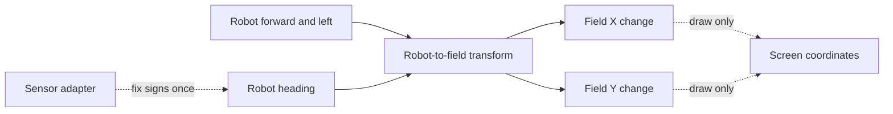

# Robot coordinates without guesswork

Robots need one shared way to describe distance and turning. ARES uses meters for distance,
seconds for time, and radians for angles. A positive turn goes counter-clockwise. These rules let
control, localization, simulation, and displays share the same meaning.

## Purpose and prerequisites

This lesson teaches you to move one vector between robot and field frames. Complete [Use Rates and
Units to Describe Motion](/academy/rates-units-and-motion?path=math-for-robotics) first. You should
know how to label a measurement with its unit.

The interactive model follows the ARES 11 coordinate contract. It does not model a drivetrain or
prove that sensors are installed correctly.

## Vocabulary

- **Robot frame:** directions that move with the robot.
- **Field frame:** directions that stay fixed on the playing field.
- **Heading:** the direction the front of the robot points.
- **Vector:** a value with both size and direction.
- **Transform:** move a value from one coordinate frame to another.
- **Radian:** an angle unit used by ARES math.
- **Counter-clockwise:** the positive turning direction in the ARES field frame.
- **Odometry:** a motion estimate made from sensor changes.

## Worked example

At heading zero, the robot faces field `+X`. The robot moves forward by one meter. Its field change
is one meter in X and zero meters in Y.

Now turn the robot left by 90 degrees, which is about `pi/2` radians. The same one-meter local
forward vector now points along field `+Y`.

```text
heading = 90 degrees = pi/2 radians
local motion = (forward 1 m, left 0 m)
field motion = (X 0 m, Y 1 m)
```

The local command did not change. The robot's heading changed how that command points on the field.
This is why a field-relative controller needs the current heading.

ARES odometry accepts each motion sample in the robot frame: forward, left, and counter-clockwise
turn. The estimator forms the local curved motion and rotates it into the field frame. Sending an
already rotated sample would apply the transform twice and produce a believable but wrong path.

## Visual model



The transform happens once. A screen may flip or scale values only while drawing. Those display
changes must not be written back as robot coordinates.


*Archived Studio screenshot: Studio keeps the field axes visible beside the drawing tools. Read the units and axis arrows
before placing a waypoint; the screen view does not create a second robot coordinate system.*

## Hands-on activity

Open the lab below. Keep the default one-meter forward motion and zero heading. Record field X and
Y. Change heading to 90 degrees and record the new result.

<coordinatetransformlab />

Next, set forward motion to zero and left motion to one meter. Test headings of 0, 90, 180, and
-90 degrees. Predict each field result before moving the heading control.

Create a final trial with both local values above zero. Draw the robot, its local axes, and its
heading on paper. Draw the field result shown by the lab. Label every value with meters or degrees.

Reset the lab. Confirm that it returns to one meter forward, zero meters left, and zero heading.

### Optional calibration connection

Use the odometry lab below after you understand the frame transform. Start with zero error. Then
change only heading bias and explain why a straight estimate gains a field-Y component.

<odometryerrorlab />

This model does not run the ARES estimator. Continue to the full odometry lesson before planning a
surveyed calibration route.

## Checkpoints

Check the axis names before doing math. Robot X is forward. Robot Y is left. Field X and Y stay
fixed when the robot turns.

Check the angle sign. A positive heading turns counter-clockwise. At positive 90 degrees, robot
forward points along field positive Y.

Keep degrees and radians labeled. The lab accepts degrees for easier exploration and shows the
radian value. ARES runtime math uses radians unless an API says otherwise.

Keep position and time frames together. A delayed camera pose uses the field frame and the moment
the image was captured. Receipt time is later and must not replace capture time. A pose reset must
also begin a matching estimator history instead of joining a new pose to old motion.

## Troubleshooting

If a 90-degree forward move points toward field negative Y, check whether the angle sign was
reversed. Do not add a second negative sign in another layer to hide the mismatch.

If robot-left and robot-forward appear swapped, return to the local axes. Draw X through the front
of the robot and Y through its left side.

If a dashboard looks mirrored but the robot math is correct, inspect the display transform. Alliance
mirroring and field-to-pixel drawing belong at named boundaries. They should not silently change the
stored pose.

If odometry bends or rotates twice, inspect the estimator input. ARES expects robot-local motion and
performs the field rotation itself. Do not pre-rotate the sample in the hardware adapter.

## Evidence artifact

Submit a table with at least six trials. Include local forward, local left, heading in degrees,
heading in radians, field X, and field Y. Mark two predictions before recording the lab result.

Add one labeled coordinate drawing. Write a sentence that explains why the same local vector can
produce a different field vector. Write another sentence that names one effect missing from the
ideal model.

## Short assessment

1. Which directions move with the robot?
2. What is the positive heading direction?
3. Where does robot forward point at a positive 90-degree heading?
4. Why should a screen transform not change stored robot pose?
5. What physical effects are missing from this vector model?
6. Why does a delayed camera measurement need capture time instead of receipt time?

A strong answer names both the source and destination frame. It does not add a sign change without
a named boundary.

## Extension challenge

Find the field result for a one-meter forward vector at 45 degrees. Use the lab, then check the
answer with sine and cosine. Explain why the X and Y values have the same size.

Design a test that would catch a second rotation. Choose one local vector and heading. Write the
correct result and the result after the same transform is applied twice.

## Related and next

Continue in Controls, Localization, and Autonomous with odometry, sensor fusion, paths, and vision.
Use this contract again in [Add and Verify Your First FTC Autonomous
Routine](/academy/ftc-starter-first-autonomous?path=ftc-robot-with-ares). Keep the field frame fixed
and perform alliance mirroring only at its named control boundary.
