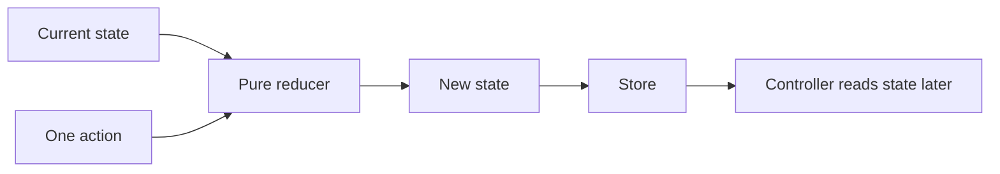

# State, actions, and reducers

Robot software must remember what the robot knows and what the team wants it to do. ARES uses a
Redux pattern for that job. Redux gives each decision a visible input and result. That makes the
logic easier to test before a controller sends an output.

## Purpose and prerequisites

This lesson teaches you to trace one state change at a time. Complete [From Driver Input to Motor
Output](/academy/robot-input-to-output?path=robotics-foundations) first. You should know that a
driver request travels through software before an output reaches hardware.

You will use the released ARES 11 action names in a small code-derived model. You will not connect
to a robot or command a motor. The model focuses only on state, actions, and a reducer.

## Vocabulary

- **State:** one snapshot of what the robot knows and wants.
- **Action:** a message that describes an event or request.
- **Reducer:** a pure function that returns the next state.
- **Pure function:** code that gives the same result for the same inputs.
- **Immutable:** replaced with a new value instead of changed in place.
- **Dispatch:** send one action to the store.
- **Store:** the object that keeps the current state.
- **Controller:** code that may read state and calculate an output later.

## Worked example

Imagine that the current drive mode is `OPEN_LOOP` and there is no heading target. The first action
stores a target of 90 degrees. The reducer returns a new state with that target.

```kotlin
val withTarget = rootReducer(
    RobotState(),
    RobotAction.SetHeadingLockTarget(Math.PI / 2.0)
)
```

The next action changes the drive mode. It does not need to repeat the target because the target is
already in state.

```kotlin
val holding = rootReducer(
    withTarget,
    RobotAction.SetDriveMode(DriveMode.HEADING_HOLD)
)
```

The reducer gets two inputs: the current state and one action. It returns a new state. It does not
read an encoder, wait for time, use a network request, or set motor voltage.

## Visual model



The arrows show data flow, not electrical flow. State is a software record. An action is a software
message. Neither item is proof that a mechanism moved.

## Hands-on activity

Use the tracer below. Select **Set target to 90°**. Compare the previous and new state cards. Only
the target should change. Next, select **Enable heading hold**. The target should stay at 90 degrees
while the drive mode changes.

<reduxstatetracer />

Reset the tracer. Enable heading hold before setting a target. Record the state, but do not call it a
good robot command. Redux can store an incomplete request. Other code must decide whether the state
is ready and safe to use.

Now clear the target. Explain why the lesson reducer also returns to open-loop drive. That is a rule
of this small model. Find the matching action in the displayed trace and name both fields that
changed.

## Checkpoints

After each button press, name the current state, the action, and the new state. Use those three
labels in that order. If you skip the current state, you cannot fully explain the result.

Check that the earlier state card does not change after a new action. This is the main idea behind
immutable state. A new snapshot lets tests compare what happened before and after one action.

Run the released onboarding test from `ARESLib-Kotlin` when you have the ARES source workspace:

```powershell
.\gradlew.bat :core:test --tests "com.areslib.student.StudentOnboardingTest"
```

Passing that test confirms the checked source follows its tested Redux behavior. It does not prove
a physical robot is ready.

## Troubleshooting

If you think the action moved a motor, return to the visual model. There is no hardware arrow from
the reducer. A controller and hardware adapter belong later in the flow.

If the same action seems to give two results, compare the starting state for each case. A reducer
may return different results from different state inputs. A pure reducer must match when both the
state and action match.

If you changed an old object instead of making a new one, tests may lose the before snapshot. Use a
copy operation that changes only the named field. Do not put a clock, random value, device read, or
network call inside a reducer.

## Evidence artifact

Create a four-row trace table. Include these columns: step, previous state, action, and new state.
Use the actions that set the target, enable heading hold, return to open loop, and clear the target.

Below the table, write one sentence that explains why state is not a motor output. Write a second
sentence that explains why pure reducers are easier to test. Include a screenshot of the tracer only
if your class process allows it. The table is the required evidence.

## Short assessment

1. What are the two inputs to a reducer?
2. What does a reducer return?
3. Why should a reducer not read an encoder?
4. Is a target angle the same as motor voltage?
5. What does immutable state help a test compare?

A strong answer says that state describes a request or fact. It also says that another part of the
software may use that state later. Do not claim that an action alone controls hardware.

## Extension challenge

Add a paper action named `CancelHeadingHold`. Write the current state before the action and the state
you expect after it. Decide whether the target should be kept or cleared. Explain your choice as a
rule that another student could test.

Then write two test cases. One should start in heading hold. The other should start in open-loop
drive. Use the same cancel action in both cases and predict each result.

## Related and next

Continue with input, state, and output tracing in the Programming with ARES path. Then learn how
cached hardware reads stay outside reducers. Revisit [Telemetry and Local Log
Retrieval](/academy/telemetry-and-local-logs?path=robotics-foundations) when you want to observe
state changes during a simulation.
