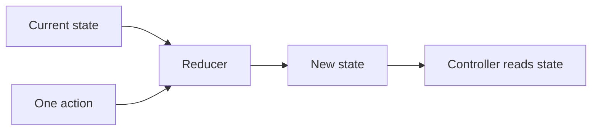

# Learn state, actions, and reducers

ARES uses Redux to keep robot decisions easy to follow. Redux has three main parts: state, actions,
and reducers. None of these parts writes to a motor by itself.

## What you will learn

- Explain state, actions, and reducers in your own words.
- Follow two actions that set heading hold.
- Run the student onboarding test.

## Key words

- **State:** one snapshot of what the robot knows and wants.
- **Action:** a message about an event or request.
- **Reducer:** a pure function that makes the next state.
- **Immutable:** replaced with a new value instead of changed in place.



## Read a small example

The first action saves a target angle. The second action turns on heading hold.

```kotlin
val withTarget = rootReducer(
    RobotState(),
    RobotAction.SetHeadingLockTarget(Math.PI / 2.0)
)
val holding = rootReducer(
    withTarget,
    RobotAction.SetDriveMode(DriveMode.HEADING_HOLD)
)
```

The target angle and drive mode are separate state fields. A motor controller may use them later,
but the reducer does not touch hardware.

## Run the test

From `ARESLib-Kotlin`, run:

```powershell
.\gradlew.bat :core:test --tests "com.areslib.student.StudentOnboardingTest"
```

## Check your understanding

1. Which field changes after each action?
2. Why is a target angle not a motor voltage?
3. What could go wrong if a reducer read an encoder or the wall clock?
4. Where should an action for one season mechanism be handled?

A reducer must give the same answer for the same state and action. Keep device reads, network calls,
and robot control loops outside it.
