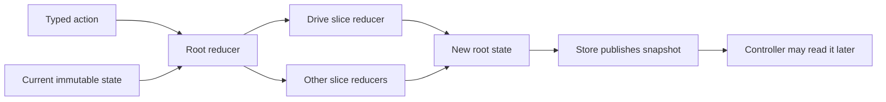

# State, actions, and reducers

Robot software must remember facts and requests. ARES uses a Redux pattern for this job. Each
change starts with an action and produces a new state snapshot. That makes a decision easier to
trace and test before any controller can request an output.

## Purpose and prerequisites

This lesson teaches you to trace current ARES state changes one action at a time. Complete [Follow a
Robot Request from Input to Output](/academy/robot-input-to-output?path=robotics-foundations) first.
You should know that software state is not a motor command.

You will use action names and reducer rules from ARES 11.1. The activity does not connect to a
robot, run an OpMode, or command hardware. Students can verify the software transitions with the
current unit test. A physical robot still needs the team's normal safety and testing process.

## Vocabulary

- **State:** one snapshot of what the software knows and requests.
- **Action:** a typed message that describes an event or request.
- **Reducer:** a pure function that returns the next state.
- **Pure function:** code that gives the same result for the same inputs.
- **Immutable:** replaced by a new value instead of changed in place.
- **Dispatch:** send an action to the store.
- **Store:** the object that owns and publishes the current state.
- **Slice:** one focused part of the root state, such as drive state.
- **Controller:** later code that may turn valid state into an output request.

## Read the current source boundary

The current source separates five jobs:

| Source            | What it proves                                                                                      |
| ----------------- | --------------------------------------------------------------------------------------------------- |
| `RobotState.kt`   | The default drive mode is `TELEOP`. The heading target starts as `null`.                            |
| `RobotAction.kt`  | `SetHeadingLockTarget` accepts radians or `null`. `SetDriveMode` carries a drive mode.              |
| `DriveReducer.kt` | Each of those actions copies one drive field. Clearing the target does not change the mode.         |
| `RootReducer.kt`  | The root reducer combines slice results and copies the action time into root state.                 |
| `Store.kt`        | Dispatches are serialized, state is published as a new snapshot, and listeners run after reduction. |

The current modes are `TELEOP`, `HEADING_HOLD`, `POSITION_HOLD`, and `X_BRAKE`. There is no
`OPEN_LOOP` mode. There is also no action named `ClearHeadingLockTarget`. Current code clears the
target by dispatching `SetHeadingLockTarget(null)`.

That detail matters. A tutorial must not invent an action or silently join two independent state
changes.

## Worked example

Trace four real transitions from the current reducer.

Start with this reduced view of `RobotState`:

```text
driveMode = TELEOP
headingLockTargetRadians = null
timestampMs = 0
```

First, set a target of positive 90 degrees. ARES stores headings in radians, so the real action uses
`Math.PI / 2.0`.

```kotlin
val withTarget = rootReducer(
    RobotState(),
    RobotAction.SetHeadingLockTarget(
        targetRadians = Math.PI / 2.0,
        timestampMs = 20L
    )
)
```

The drive mode stays `TELEOP`. The target becomes `Math.PI / 2.0`. The root timestamp becomes 20.
The drive reducer does not enable heading hold as a side effect.

Next, select heading hold.

```kotlin
val holding = rootReducer(
    withTarget,
    RobotAction.SetDriveMode(
        mode = DriveMode.HEADING_HOLD,
        timestampMs = 40L
    )
)
```

The mode becomes `HEADING_HOLD`, and the target stays at positive 90 degrees. The root timestamp
becomes 40.

Now clear only the target.

```kotlin
val targetCleared = rootReducer(
    holding,
    RobotAction.SetHeadingLockTarget(
        targetRadians = null,
        timestampMs = 60L
    )
)
```

The target becomes `null`, but the mode remains `HEADING_HOLD`. This may be an incomplete request
for later control code. The reducer reports the exact requested state. It does not invent a second
action or decide whether hardware can move.

Finally, return the mode to `TELEOP` with a separate `SetDriveMode` action. If you want both changes,
dispatch both actions. `Store.dispatchAll` can reduce a group without another dispatch entering
between them. The reducer still handles the actions in order.

## Visual model



The arrows show software data flow. They do not show electrical current or motor motion. A state
request can be incomplete, stale, unsafe, or blocked by later code.

## Hands-on activity

Use the tracer below. It models only the current drive mode, heading target, and root timestamp.

<reduxstatetracer />

1. Select **Set target to 90°**.
2. Confirm that the target changes while the mode remains `TELEOP`.
3. Select **Enable heading hold**.
4. Confirm that the target stays at 90 degrees.
5. Select **Clear target**.
6. Confirm that the mode remains `HEADING_HOLD`.
7. Read the incomplete-request message. Explain why the reducer does not fix the state for you.
8. Select **Use teleop drive**.
9. Reset the lab and try the actions in another order.

After each action, compare the previous and new cards. The previous card must not change. That is
the evidence for an immutable transition in this small model.

## Walk the source

Open the ARES monorepo. Run these searches from its root:

```powershell
rg -n "data class SetHeadingLockTarget|data class SetDriveMode" `
  ARESLib-Kotlin/core/src/main/kotlin/com/areslib/action/RobotAction.kt

rg -n "driveMode: DriveMode|headingLockTargetRadians" `
  ARESLib-Kotlin/core/src/main/kotlin/com/areslib/state/RobotState.kt

rg -n "SetHeadingLockTarget|SetDriveMode" `
  ARESLib-Kotlin/core/src/main/kotlin/com/areslib/reducer/DriveReducer.kt
```

Record the exact property names and units. The target is radians in production source. The lab
shows degrees because students can read them quickly. The conversion is a display boundary, not a
change to the robot contract.

Then run the current onboarding test:

```powershell
Set-Location ARESLib-Kotlin
.\gradlew.bat :core:test --tests "com.areslib.student.StudentOnboardingTest"
```

That test checks the target and mode transition in source. Passing it verifies the tested software
behavior. It does not prove that a controller, adapter, wire, motor, or robot is ready.

## Store and reducer are not identical

The onboarding test calls `rootReducer` directly for simple control actions. The real robot usually
dispatches through `Store`.

The current store serializes dispatches and publishes the new immutable snapshot. It also owns
mutable estimator history. Drive and vision observations must go through the store so its estimator
runtime can prepare the correct reducer actions.

After reduction, listeners run outside the store lock against a captured
subscriber array. Adding or removing a subscription does not change that captured
notification pass. Duplicate subscriptions remain separate registrations, and
each unsubscribe callback removes only its own registration.

Do not use a direct reducer call as a replacement for the store when testing pose estimation. This
lesson uses direct calls only because the two heading actions are stateless reducer transitions.

## Checkpoints

After every lab action, name these items in order:

1. previous state;
2. action and its data;
3. new state;
4. fields that changed;
5. fields that stayed the same.

Include the root timestamp in your comparison. A drive-slice field may stay the same while root
state still receives the action time.

Ask one more question: does this state prove that the robot moved? The answer is no. There is no
controller output, adapter result, sensor reading, or physical observation in this activity.

## Troubleshooting

If you see `OPEN_LOOP`, you are reading an old example. Use `TELEOP` for the current default and
normal driver-controlled mode.

If you look for `ClearHeadingLockTarget`, search for `SetHeadingLockTarget` instead. A `null` target
is the current clear request.

If clearing the target also changes the mode in your code, check whether you added a policy outside
the current drive reducer. Name that policy and test it. Do not describe it as built-in reducer
behavior.

If the same action gives two results, compare both starting states and action data. Pure behavior
requires the same state and the same action. An action timestamp is part of the action data.

If an earlier card changes after a later action, you mutated the old snapshot. Current ARES reducers
normally use Kotlin data-class `copy` to create the next value.

## Evidence artifact

Create a four-row trace table with these columns:

| Step | Previous mode and target | Exact action | New mode and target | Root time | What did not change? |
| ---- | ------------------------ | ------------ | ------------------- | --------- | -------------------- |

Use the four actions from the worked trace. Write radians in the exact-action column. You may add
degrees in parentheses for display.

Below the table, write three short claims:

- why clearing a target does not select `TELEOP`;
- why a Redux action is not a motor output;
- why the previous snapshot must remain unchanged.

Link each claim to one current source file. A screenshot of the tracer is optional. The source-backed
table and claims are the required evidence.

## Short assessment

1. What are the two inputs to a reducer?
2. What does a reducer return?
3. What is the current default drive mode?
4. How does current ARES code clear the heading target?
5. Does clearing the target also change the drive mode?
6. Why should a reducer not read an encoder?
7. When must a pose observation go through `Store` instead of only `rootReducer`?
8. What does immutable state help a test compare?

A strong answer separates an action, a state transition, a controller decision, and physical proof.
It uses `TELEOP`, `SetHeadingLockTarget(null)`, and radians when describing current source.

## Extension challenge

Compare two calls to `Store.dispatch` with one call to `Store.dispatchAll`. Use a target action and a
mode action. Predict the final state in both cases.

Then predict how many times a subscriber is notified. Check `Store.kt` before answering. Explain why
`dispatchAll` can publish one final snapshot while each action still gets reduced in order.

This is a software concurrency exercise. It does not approve a combined action policy for a robot.

## Related and next

Continue with [Read Hardware Once and Write Safe
Outputs](/academy/programming-io-caching?path=programming-with-ares). That lesson keeps device reads
and writes outside reducers. Use [Telemetry and Local Log
Retrieval](/academy/telemetry-and-local-logs?path=robotics-foundations) when you want to observe
published state during a simulation.
